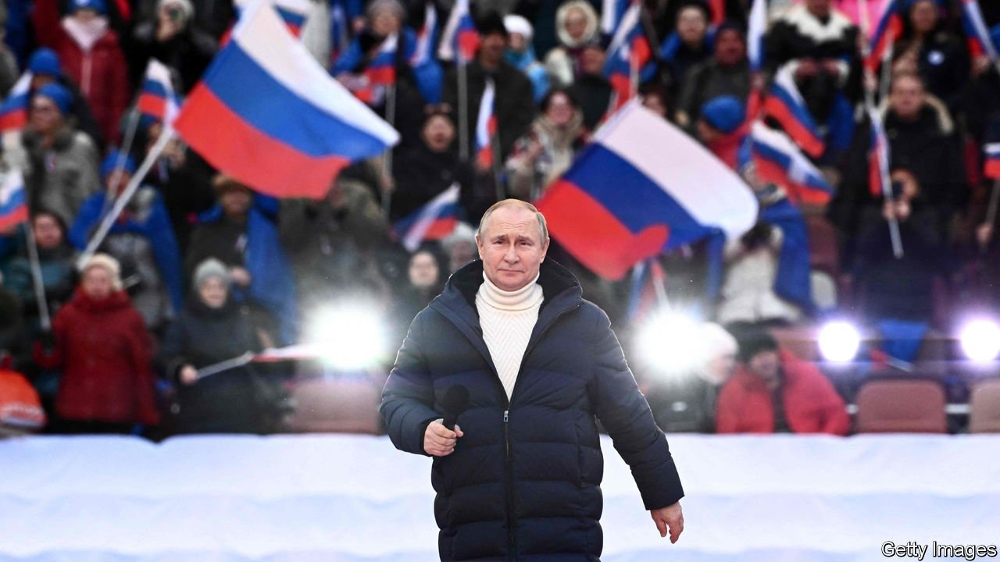

###### Reactionary, obscurantist and having a day in the sun

# The new Russian cult of war 

##### It has been growing unnoticed for some time 

 

> Mar 26th 2022 

ON MARCH 22ND, in a penal colony 1,000km north-east of the front lines around Kyiv, Alexei Navalny, the jailed leader of Russia’s opposition, was sentenced to another nine years imprisonment. To serve them he will probably be moved from Vladimir, where he has been kept for more than a year, to a yet harsher maximum-security jail elsewhere.

The crime for which he was sentenced is fraud. His true crime is one of common enterprise with that for which the people of Ukraine are now suffering collective punishment. The Ukrainians want to embrace many, if not all, the values held dear by other European nations. Mr Navalny wants the same for Russia. Vladimir Putin cannot countenance either desire. As Dmytro Kuleba, Ukraine’s foreign minister, told The Economist, “If Russia wins, there will be no Ukraine; if Ukraine wins, there will be a new Russia.” That new Russia is as much a target of Mr Putin’s war as Ukraine is. Its potential must be crushed as surely as Mr Navalny’s.


This crusade against a liberal European future is being fought in the name of Russkiy mir—“the Russian world”, a previously obscure historical term for a Slavic civilisation based on shared ethnicity, religion and heritage. The Putin regime has revived, promulgated and debased this idea into an obscurantist anti-Western mixture of Orthodox dogma, nationalism, conspiracy theory and security-state Stalinism.

The war is the latest and most striking manifestation of this revanchist ideological movement. And it has brought to the fore a dark and mystical component within it, one a bit in love with death. As Andrei Kurilkin, a publisher, puts it, “The substance of the myth is less important than its sacred nature…The legitimacy of the state is now grounded not in its public good, but in a quasi-religious cult.”

The cult was on proud display at Mr Putin’s first public appearance since the invasion—a rally at the Luzhniki stadium packed with 95,000 flag-waving people, mostly young, some bused in, many, presumably, there of their own volition. An open octagonal structure set up in the middle of the stadium served as an altar. Standing at it Mr Putin praised Russia’s army with words from St John’s gospel: “Greater love hath no man than this, that a man lay down his life for his friends.”

His oration, delivered in a $14,000 Loro Piana coat, made much of Fyodor Ushakov, a deeply religious admiral who, in the 18th century, helped win Crimea back from the Ottomans. In 2001 he was canonised by the Orthodox church; he later became the patron saint of nuclear-armed long-distance bombers. “He once said that the storms of war would glorify Russia,” Mr Putin told the crowd. “That is how it was in his time; that is how it is today and will always be!”

A cathedral dome 19.45 metres across

In both his broad appeals to religion and his specific focus on the saintly Ushakov Mr Putin was cleaving to Stalin’s example. After the Soviet Union was attacked by Germany in 1941, the sometime seminarian turned communist dictator rehabilitated and co-opted the previously persecuted Orthodox church as a way of rallying the people. He also created a medal for outstanding service by naval officers called the order of Ushakov and arranged for his remains to be reburied.

This was not a mere echo or emulation; there is a strand of history which leads quite directly from then to now. Links between the church and the security forces, first fostered under Stalin, grew stronger after the fall of Communism. Whereas various western European churches repented and reflected after providing support for Hitler, the Moscow Patriarchate has never repented for its collusion with Stalin in such matters as the repression of Ukrainian Catholics after 1945.

The allegiance of its leaders, if not of all its clergy, has now been transferred to Mr Putin. Kirill, the patriarch of the Russian Orthodox church, has called his presidency “a miracle of God”; he and others have become willing supporters of the cult of war. An early indication of this possibility was seen in 2005, when the orange and black ribbons of the Order of St George, a military saint venerated by the Orthodox church, were given a new pre-eminence in commemorations of the 1941-45 struggle against Germany, known in Russia as the “great patriotic war”. Its garish culmination can be seen in the Main Cathedral of the Russian Armed Forces in Kubinka, 70km west of Moscow, which was inaugurated on June 22nd (the day Hitler launched his invasion) in 2020 (the 75th anniversary of the war’s end) with Mr Putin and Kirill in attendance.

The cathedral is a Byzantine monstrosity in khaki, its floor made from melted-down German tanks. But it is not devoted solely to the wars of the previous century. A mosaic commemorates the invasion of Georgia in 2008, the annexation of Crimea in 2014 and the country’s role in Syria’s civil war: angels smile down on the soldiers going about their holy work.

In keeping with this attitude Kirill has declared the current war a Godly affair and praised the role it will play in keeping Russia safe from the horrors of gay-pride marches. More zealous churchmen have gone further. Elizbar Orlov, a priest in Rostov, a city close to the border with Ukraine, said the Russian army “was cleaning the world of a diabolic infection”.

As the cathedral shows, the Russian people’s sacrifice and victories in the great patriotic war, which saw both the loss of 20m Soviet citizens and the creation of an empire greater in extent than any of the Tsars’, are central to Mr Putin’s new ideology of the Russian world. Today, though, the foes and allies of the 1940s have been shuffled around, allowing the war to be reframed as part of an assault on Russia’s civilisation in which the West has been engaged for centuries. The main culprits in this aggression are Britain and America—no longer remembered as allies in the fight against Nazis, but cast instead as backers of the imaginary Nazis from which Ukraine must be saved.

Project Russia

More important to the cult even than the priests are the siloviki of the security services, from whose ranks Mr Putin himself emerged. Officers of the FSB, one of the successors to the KGB, have been at the heart of Russian politics for 20 years. Like many inhabitants of closed, tightly knit and powerful organisations, they have a tendency to see themselves as members of a secret order with access to revealed truths denied to lesser folk. Anti-Westernism and a siege mentality are central to their beliefs. Mr Putin relies on the briefs with which they supply him, always contained in distinctive red folders, for his information about the world

In this realm, too, a turn towards the ideology now being promulgated was first seen in 2005, when a faction within the FSB produced an anonymous book called “Project Russia”. It was delivered by courier services to various ministries dealing with security and Russia’s relationship with the world, warning them that democracy was a threat and the West an enemy.

Few paid much heed. Though Mr Putin’s ascension to the presidency in 2000 was helped by his willingness to wage war in Chechnya, his mandate was to stabilise an economy still reeling from the debt crisis of 1998 and to consolidate the gains, mostly pocketed by oligarchs, of the first post-Soviet decade. His contract with the Russian people was based not on religion or ideology, but on improving incomes. Only dedicated Kremlin watchers, astute artists such as  and a few political activists paid much attention to the new ideology of isolationism appearing in some of the darker corners of the power structure. At a time of postmodernist irony, glamour and hedonism it seemed marginal at best.

Two years later the new way of thinking became much more obvious to the outside world. In his Munich speech in 2007 Mr Putin formally rejected the idea of Russia’s integration into the West. In the same year he told a press conference in Moscow that nuclear weapons and Orthodox Christianity were the two pillars of Russian society, the one guaranteeing the country’s external security, the other its moral health.

After tens of thousands of middle-class city dwellers marched through Moscow and St Petersburg in 2011-12 demanding “Russia without Putin” the securocrats and clerics started to expand their dogma into daily life. A regime which sustained, and was sustained by, networks of corruption, rent extraction and extortion required religion and an ideology of national greatness to restore the legitimacy lost during the looting. As Mr Navalny remarked in a video which revealed Mr Putin’s palace in Sochi, covering up things of such size requires a lot of ideology.

Broken destinies

At that point it was still possible to see the ideology as a smokescreen rather than a product of real belief. Perhaps that was a mistake; perhaps the underlying reality changed. Either way, the onset of the covid-19 pandemic two years ago brought a raising of the ideological stakes. At the time, the most discussed aspect of the constitutional changes that Mr Putin finagled in July 2020 was that they effectively removed all limits on his term in office. But they also installed new ideological norms: gay marriage was banned, Russian enshrined as the “language of the state-forming people” and God given an official place in the nation’s heritage.

Mr Putin’s long subsequent periods of isolation seem to have firmed up the transformation. He is said to have lost much of his interest in current affairs and become preoccupied instead with history, paying particular heed to figures like Konstantin Leontyev, an ultra-reactionary 19th-century visionary who admired hierarchy and monarchy, cringed at democratic uniformity and believed in the freezing of time. One of the few people he appears to have spent time with is Yuri Kovalchuk, a close friend who controls a vast media group. According to Russian journalists they discussed Mr Putin’s mission to restore unity between Russia and Ukraine.

Hence a war against Ukraine which is also a war against Russia’s future—or at least the future as it has been conceived of by the Russia’s sometimes small but frequently dominant Westernising faction for the past 350 years. As in Ukraine, the war is intended to wipe out the possibility of any future that looks towards Europe and some form of liberating modernity. In Ukraine there would be no coherent future left in its place. In Russia the modernisers would leave as their already diminished world was replaced by something fiercely reactionary and inward looking.

The Russian-backed “republics” in Donetsk and Luhansk may be a model. There, crooks and thugs were elevated to unaccustomed status, armed with new weapons and fitted with allegedly glorious purpose: to fight against Ukraine’s European dream. In Russia they would be tasked with keeping any such dream from returning, whether from abroad, or from a cell. ■

Read more of our recent coverage of the 

