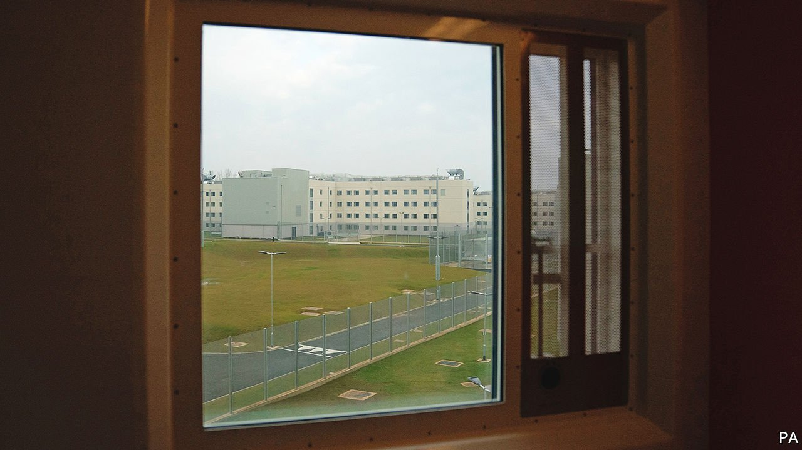

###### Close quarters

# Anti-infection measures kept British prisoners safe during the pandemic 

##### But as the country reopens, many are still spending too long in their cells 

 

> Mar 26th 2022 

WHEN COVID hit, Britain’s ageing prisons could have been sites of mass infection and death. Many of the 118 in England and Wales were built during the Victorian era and are poorly ventilated. Seventy-two were holding more prisoners than their theoretical maximum capacity. Prisoners were often doubled up in cells meant for one—typically three metres by two metres. A trend towards longer sentences meant a growing number of inmates were older, and therefore more at risk of severe illness. Officials estimated that without rigid anti-infection measures, most of the 83,000 they held might catch the disease, and more than 2,000 could die.

Prisons immediately locked down. For the early months of the pandemic, prisoners spent an average of 22 and a half hours per day in their cells. Gym sessions, in-person education, worship and libraries were halted. Family visits were suspended.


As far as limiting infections and deaths was concerned, the lockdowns worked. The most recent figures, published in February, show that only 189 prisoners died for reasons related to covid. Over 35,000 had tested positive. But even as Britain re-opens, prisoners’ lives are not back to their pre-pandemic normal. In some facilities, says Charlie Taylor, Chief Inspector of Prisons, they are still in their cells for up to 22 hours each day.

The Ministry of Justice now permits prisons to remove all but the least intrusive covid restrictions—quarantining new arrivals, separating the most vulnerable inmates from the rest of the population and limiting mixing in large groups. But by March 7th just two adult prisons had done so. The rest were still operating restrictions that complicated access to education, gyms, worship, libraries or family visits, either because some facilities were closed or because of limits on how many prisoners could use them at one time.

Many prisoners without a cellmate have just spent two years in de facto solitary confinement. The harm done to mental health can be permanent after just two weeks locked up alone, says Peter Dawson of the Prison Reform Trust, a campaigning charity. And the continuing restrictions make it less likely that prisoners will receive family visits, which are known to reduce recidivism. According to research by the Ministry of Justice, prisoners who are visited by their family are 39% less likely to offend again.

Many prisons installed in-cell telephones and provided video calls for inmates during the pandemic—both welcome upgrades. But they are no substitute for an in-person visit, says Mr Taylor. And where restrictions make visits more inconvenient—some prisons allow them only on weekdays, when working family members or schoolchildren cannot come—prisoners have missed out. A troubling pattern is developing of visitor slots going empty, says Mr Taylor, possibly because of inconvenience or because families have lost the habit of visiting.

Austerity measures under the coalition government of 2010-15 saw the number of prison staff fall from nearly 25,000 to a total of just 18,000. That has since rebounded to just over 22,000. But the number will have to rise further if prison life is to return to something closer to normal. Moving prisoners around in smaller groups requires extra supervision, as does keeping gyms, libraries and chapels open for longer so that anti-crowding measures do not reduce access overall.

Another difficulty is high staff turnover. Nearly a third of officers have less than three years’ experience, and a substantial number have never worked in a prison without covid restrictions. A report from the prisons inspectorate in September 2021 on Wandsworth Prison found that a quarter of officers had been there for less than a year. The facility was so short-staffed and prisoners allowed so briefly out of their cells that they needed to choose between showering, ordering necessities and getting some exercise.

The Ministry of Justice has launched a recruiting scheme at short-staffed sites. But on top of high turnover and continuing covid restrictions, a further problem is that the prison population is expected to rise—to 98,500 by 2026, according to official predictions. As criminal trials came to a halt during the pandemic, the flow of new prisoners slowed and the total behind bars fell: in February it stood at around 80,000. Courts are now working through a massive backlog in hearings, which is sure to lead to more custodial sentences. A government plan to hire 20,000 new police officers may also lead to an increase in criminal charges—and convictions. ■

Dig deeper

All our stories relating to the pandemic can be found on our . You can also find trackers showing ,  and the virus’s spread across .

