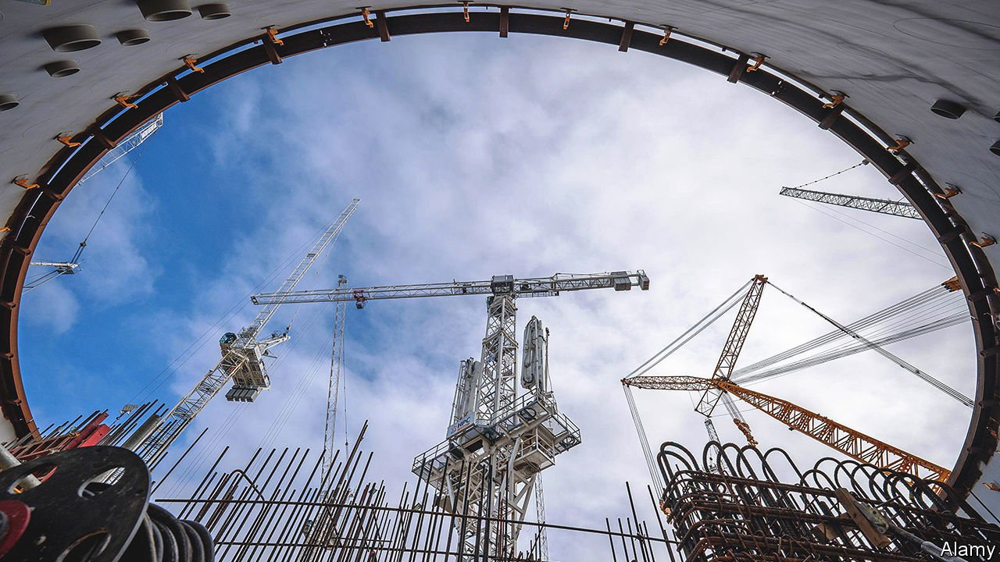

###### Copy, paste, repeat

# Britain’s next nuclear plant will be identical to one under construction 

##### Standardisation should bring the cost and time of construction down 

 

> Mar 26th 2022 

BRITAIN’S FIRST new nuclear plant in 30 years, by the Bristol Channel in Somerset, is one of Europe’s largest construction sites. With accommodation for 7,000 workers who run shifts around the clock, it is an open-air factory for making one of the most complex objects on the planet. When Hinkley Point C is switched on in 2026, its two identical reactors will produce 3,200 megawatts of electricity, making it capable of supplying 7% of Britain’s needs.

Overseeing it all is Sarah Williamson, the lead engineer for BYLOR, a joint venture between Bouygues Travaux Publics and Laing O’Rourke, French and British construction firms respectively. Her immediate task is to keep the Hinkley “delivery machine” running at peak capacity. Her next will be to copy it for Britain’s next planned nuclear plant, Sizewell C in Suffolk.


The government already regarded nuclear power as an important element of Britain’s energy mix before Russia invaded Ukraine, and oil and gas prices soared. When the prime minister, Boris Johnson, met industry bosses on March 21st, he talked of the need for a “thriving pipeline” of nuclear plants. Whether he gets his wish will depend, in part, on how successful Ms Williamson and her team are in copying Hinkley at Sizewell—and, perhaps, beyond.

Nuclear plants are pricey, and much more so if they are bespoke. Reusing plans, suppliers and people to crank out identical ones should make construction cheaper. One way forward is to design so-called , which can be made in factories and then assembled on site. Rolls-Royce, a British engineering firm, is among those interested in doing this, and the government seems keen. But, at the moment, this is unproven technology.

In the meantime, EDF, the French utility with ultimate responsibility for both Hinkley Point C and Sizewell C, says that making construction more predictable will cut the cost of financing—which at Hinkley accounted for 60% of the total. Investors are more likely to offer capital at reasonable rates if they believe a plant will start pumping out electricity on schedule.

Three other plants of the same kind have already been built, in Finland, France and China. Ms Williamson has visited all three, and brought what she learned back to Britain. At Flamanville in France, for instance, the metal casing that shields the nuclear-reactor vessel was assembled outdoors, which meant poor-quality welds and hold-ups during bad weather. So welders at Hinkley manoeuvre components inside vast temporary structures, something like tents crossed with cathedrals, with the help of the world’s largest crane.

The copy-paste process between Hinkley’s reactors similarly yielded incremental improvements. The average time saved on each task has been 20-30%, says Nigel Cann of EDF. Ms Williamson says she and her team think of Sizewell C’s two reactors as “Unit 3 and Unit 4”—not merely identical to those at Hinkley, but a continuation of the same build. Efficiency gains are kicking in even before construction starts, as most of the paperwork is the same. She hopes for time savings at least as great as those between the Hinkley reactors.

Just how much money all this will save is as yet unclear, since financing for Sizewell C is still under discussion between EDF and the government. Currently, consumers are supposed to foot the bill as soon as construction starts—an attractive proposition for investors, since it offloads the risk of delay. The government is looking for ways to enhance energy security by pushing out Chinese investment, perhaps by taking a stake in the plant itself. Russia’s invasion of Ukraine has made reliance on authoritarian states for energy look even more untenable, both politically and in terms of guaranteeing supply.

Regardless of whose money is spent, Ms Williamson’s efforts are crucial to ensuring that both Hinkley and Sizewell go to plan, and that consumers pay as little as possible for Sizewell before the electricity starts flowing. New nuclear plants are central to weaning Britain off Russian oil and gas and reducing carbon emissions. Making construction faster, cheaper and more predictable will be the difference between success and failure. ■

