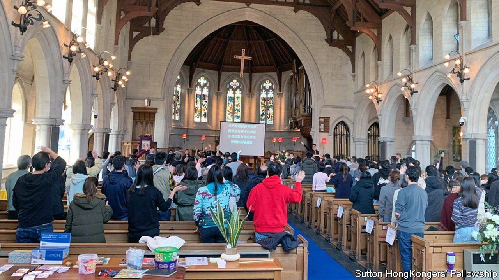

###### Prayers answered

# Hong Kongers are boosting Britain’s church numbers 

##### Many congregations have doubled in size 

 

> Mar 26th 2022 

WHEN INHABITANTS of Sutton, then a parish of Surrey, gathered for the opening of Trinity Wesleyan Church in 1907, they surely never imagined that a century later its pews would be filled by colonial subjects from the Far East. They would have been baffled by sermons in a strange tongue, and texts in a foreign script. But “everything is guided by God”, says Jimmy, one of the new worshippers. “He led us to settle down here.”

Jimmy is one of around 300 Hong Kongers who have recently joined the congregation of what is now called Trinity Church Sutton. Last year nearly 100,000 visas were granted for the British National Overseas (BNO) immigration route for residents of the territory opened in January 2021. Sutton, now a London suburb, has been a popular destination: Hong Kongers are attracted by the low crime rates and local schools. Although only 16% of Hong Kongers are Christians, the share among BNO arrivals seems to be higher. One survey by UKHK, a faith-based project set up to welcome them, suggests that nearly half are Christians, mostly Protestants (the sample, reached via UKHK’s website, may have been biased towards believers).


The new arrivals have been a boon for Britain’s churches, which were struggling to recruit new members. Between 2009 and 2019 attendance at Church of England services fell by 15-20%. But most Cantonese-speaking congregations in Britain doubled or trebled in size last year, according to the Chinese Overseas Christian Mission, a charity based in Milton Keynes. One congregation, the Manchester Chinese Alliance Church, has quadrupled in size to 600 worshippers.

Christians are particularly likely to feel persecuted in Hong Kong. Although there is still more religious freedom than in mainland China, restrictions on worship are only likely to tighten. Many Christians were vocal in support of the pro-democracy movement that preceded the Chinese Communist Party’s crackdown on the city. After the introduction in June 2020 of a draconian national-security law, which has been used to punish people retrospectively for their involvement in the pro-democracy protests, they feared that they would be in trouble, says Richard Choi, a community organiser in Sutton.

Churches are hoping that their embrace of Hong Kongers can make the new arrivals feel more welcome than previous cohorts of immigrants. UKHK has worked with hundreds of churches to help make them “Hong Kong ready”, for example by recruiting Cantonese-speaking volunteers. This was in part motivated by a desire not to repeat the “terrible job” that churches did in welcoming the Windrush generation—people from the Caribbean who came to Britain from the late 1940s—says Krish Kandiah, UKHK’s director. The influx of former colonial subjects from Hong Kong was a chance to ensure that, when it came to offering help, Christians would be “at the front of the queue”.

That help has manifested in various ways. Trinity Church now holds services in Cantonese once a fortnight; nearby Hope Church is offering English-language lessons specifically for Hong Kongers. Segregated services mean that the Trinity worshippers have yet to integrate fully with the wider Christian community. But services in their own tongue are much needed, says Stephen Lam, another Trinity member who arrived from Hong Kong last year. “You use your heart’s language to pray.” ■

