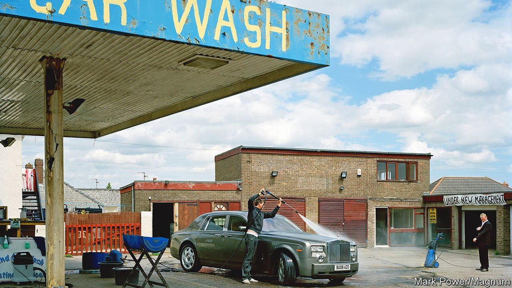

###### All in a lather

# Machines are once again doing the car-washing in Britain 

##### Blame (or credit) Brexit and covid 

 

> Mar 26th 2022 

WHAT WARM weather is to ice-cream vans and popcorn is to dentists, Saharan dust storms are to car washes. A big dust cloud like the one that reached Britain on March 16th boosts revenues by about a quarter, according to Kevin Pay of Wilcomatic, which runs about 800 automatic car washes in Britain. “You love to see it,” he says, as a dusty red Ford Ka joins the queue in Hove in East Sussex, on the south coast.

Until recently Britain’s drivers usually took their dirty motors to car parks and disused petrol stations, where eastern European immigrants had at them with sponges. In 2018 a parliamentary committee was informed that Britain had 10,000-20,000 hand car washes, compared with 2,000 automatic “rollover” machines and about 4,000 do-it-yourself jet washes. Hand car washes were more convenient—drivers simply handed money through the window rather than traipsing into a petrol station to buy a six-digit code—and often cheaper than machines. The industry was a rare example of de-automation.


It is now re-automating. Mr Pay says that Wilcomatic’s car-washing revenues in 2021 were 15% higher than in 2019, before covid-19 arrived. “It’s starting to turn,” agrees Chris Scott of Istobal, another car-washing firm, who says that sales of the chemicals used by machines are higher than they were before the pandemic. At Parkfoot Garage in Kent, David Charman says his four jet washes have been “absolutely flat out” since the dust storm. He has acquired another car-wash site and is seeking a third.

Automatic car washes and jet washes have improved, with contactless payment, superior brushes and theatrical foam. But the main reason for their popularity is that hand car washes are disappearing. The informal ones can be lousy employers: in 2016 a study of Leicester by two academics, Ian Clark and Trevor Colling, found that many paid less than the legal minimum wage. Car washing is a typical first job for an unskilled immigrant. And Brexit means that Britain has fewer newly arrived unskilled immigrants these days.

Covid-19 further tilted the market towards machines. The government shut down hand car washes for longer than automated ones, on the ground that they posed a higher infection risk. The pandemic also discouraged drivers (and everyone else) from paying with cash. That hurt informal car washes, which love cash in part because it allows them to dodge tax.

Alexander Russell of the Car Wash Association, a trade group, says that the industry has gone in a circle. Some petrol stations are now putting automatic car-washing machines into bays that were originally built for them, but were then occupied by hand car washes. Car washing has been in a lather, but it is emerging cleaner.

