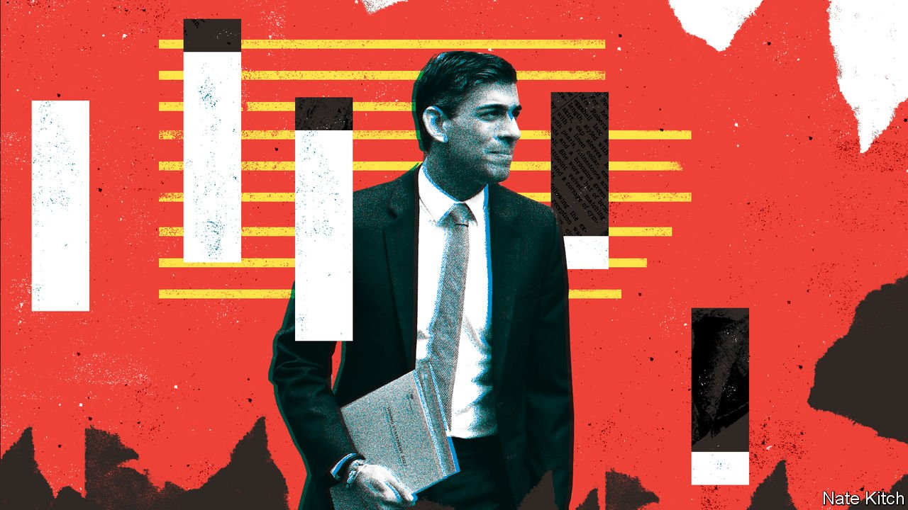
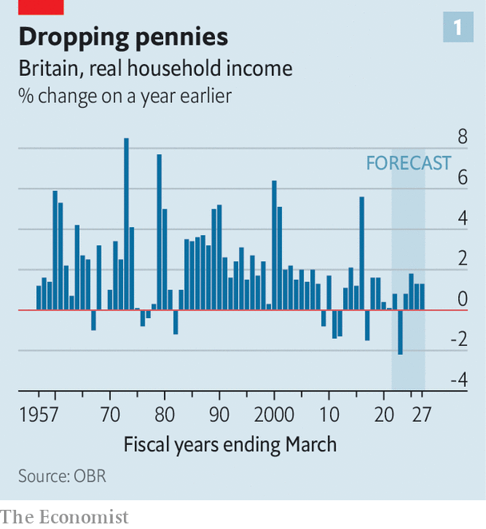
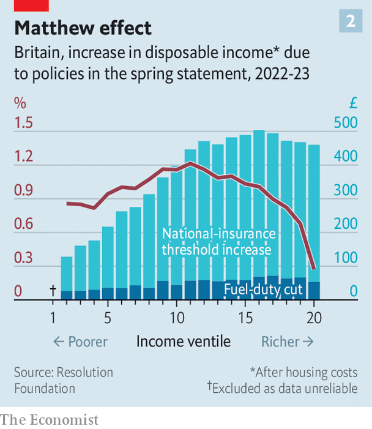

###### The spring statement

# Rishi Sunak wants to be known as a tax-cutting chancellor 

##### He does not merit that title 

 

> Mar 26th 2022 

WITH BRITISH households facing a cost-of-living crunch, the “spring statement” on March 23rd, an occasion for the chancellor to course-correct between autumn budgets, offered several eye-catching giveaways. Fuel duty will be cut immediately. From July national insurance, a payroll tax, will kick in at a higher income threshold. And in 2024 the standard rate of income tax, paid by 30m Britons, will fall by one percentage point. As Rishi Sunak spoke at the despatch box, Conservatives brayed their support. But the measures add up to less than billed.

Alongside the spring statement came a new set of forecasts for the public finances, produced by the Office for Budget Responsibility (OBR), an official fiscal watchdog. Those supported the case for some kind of relief for hard-pressed households. Since October, when such figures were last published, inflation had increased by more than expected, eating into household budgets. As incomes fell behind rising prices, the OBR predicted that disposable income per person would fall by over 3% in real terms over the coming year, unless policies changed to mitigate the impact. That would have constituted the biggest annual drop since records began in 1956.


The worsening economic outlook has not pinched the public finances, however. Revenues from taxes on incomes and corporate profits have been buoyant. This is partly because in March 2021 Mr Sunak froze income-tax thresholds. Since then earnings have risen faster than expected in cash terms. The resulting fiscal drag means that more people are paying tax, and at higher rates. Last October the OBR expected that 0.9m more people would be caught by the higher 40% marginal rate in the 2023-24 fiscal year; it now thinks that 1.3m will.

As revenues have risen, public spending has not kept pace. Economic developments such as higher inflation have pushed up projected spending at the end of this parliament by only about two-thirds of the expected rise of £37bn in revenues. Most of that is higher benefits and debt-interest payments. (More than a fifth of government gilts are linked to the retail-price index, a measure of inflation.) A change to the terms for student loans announced in February will save around £5bn in the same year. Costs have also been contained by Mr Sunak’s refusal to increase the budgets of government departments beyond what was agreed last October, even though they will be pummelled by rising energy costs, just as households will. In times of high inflation, chancellors are able to make stiff spending cuts by stealth.

 


Had Mr Sunak chosen to do nothing, then, expected borrowing would have been about £20bn lower in 2024-25 than previously forecast. Instead he opted to cut taxes—compared with what had previously been pencilled in, that is. He soothed motorists upset about rising petrol prices by lowering fuel duty from £0.58 to £0.53 per litre. In three months’ time the threshold for starting to pay national-insurance contributions will be aligned with that for paying income tax—a welcome simplification and a political promise fulfilled. The marginal standard rate of income tax will fall from 20% to 19% in April 2024. The more immediate of these measures should offset around a third of the expected hit to incomes in the fiscal year starting in April 2022, limiting it to a drop of 2.2% (see chart 1).

The moves placated the right wing of the Conservative Party, which has fretted about Mr Sunak’s tax-and-spend ways, such as a big planned increase in the rate at which workers and employers pay national insurance, which is intended to help fund social and health care. But if what matters politically is the gap between voters’ incomes and outgoings, they should wait before cheering. In 2024 the fact that income-tax thresholds have been frozen for years will offset the gains of a lower income-tax rate for anyone earning less than £49,000 a year. More broadly, the policies revealed on March 23rd offset only around a sixth of previously announced increases in tax as a share of GDP between 2019-20 and 2026-27. Even after taking them into account, the tax take as a share of GDP is expected to increase by 3.3 percentage points, bringing it to 40.1% by the end of that period, the highest in four decades.

Mr Sunak will doubtless face further calls to keep shaving away at planned tax increases. But some caution is warranted when it comes to the public finances. Fallout from the conflict in Ukraine could start to erode tax revenues, if a sustained increase in energy prices drags down GDP. The OBR noted that a new vaccine-resistant strain of covid-19 could yet emerge, which could damage the economy and push borrowing higher.

 


The decision not to do more to soften the blow of rising living costs for the poorest voters is itself a gamble, however. Of every £3 in extra support the chancellor announced, £2 will go to the richest half of households, according to analysis by the Resolution Foundation, a think-tank (see chart 2). Households reliant on benefits will be pinched by incomes that increase by just 3.1%, even as inflation rips above 7%. The real value of benefits is expected to fall by £11bn in the coming year, meaning that an extra £500m in the Household Support Fund, a pot of money from central government that councils can use to help people who are struggling, will not go far.

Mr Sunak appeared resolute, making it clear that any further giveaways would go on lower taxes, not higher spending. He promised that this autumn he would increase incentives for business investment. Perhaps he is hoping to fight the next election (one is due in 2024) vindicated, and crowned the king of tax reliefs. But with such a large hit to incomes looming—and such big tax increases still to come—that seems optimistic. ■

