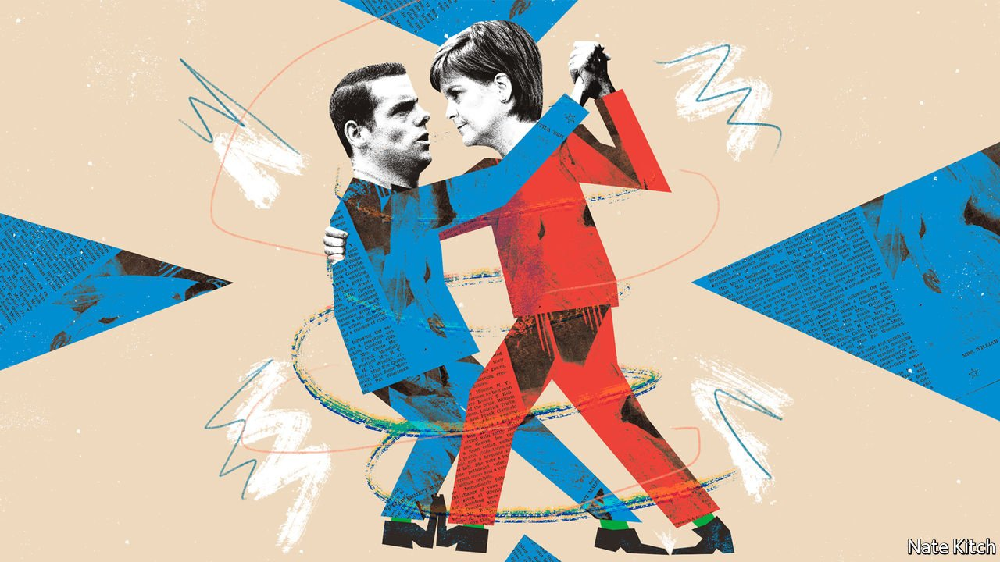

###### Bagehot

# To appreciate the SNP’s dominance, look at what it has done to the Tories 

##### The Scottish Conservatives have come to resemble their opponents 

 

> Mar 26th 2022 

TALK TO A Scottish Conservative for five minutes, and you will hear that he or she lives in a one-party state, gripped by what their leader, Douglas Ross, terms the “dead hand of nationalism”. Nicola Sturgeon, the first minister, has been in office for seven years; her Scottish National Party (SNP) has been in power continuously for nearly 15. On the sidelines of the Scottish Conservative Party’s annual conference in Aberdeen on March 18th and 19th, Tories warned darkly that universities, charities and businesses are either run by nationalists or too cowed to dissent. They lament expansive new laws inhibiting free speech and meddling in family life. It is a vision of East Germany without the naturists.

There is a crumb of truth in these complaints. Yet if nationalists dominate Scotland, nowhere is that more obvious than in the Scottish Conservative Party. Just as securing independence has been the SNP’s purpose since its founding in the 1930s, so stopping it has become the raison d’être of the Scottish Conservative and Unionist Party, to give its full name.


Scottish unionism has a long history: before 1965 the country’s Tories had a separate Unionist Party, with the union flag as its symbol. Yet a decade ago Scottish Conservatives were a marginal force, mocked and loathed. Their recovery is thanks to the 2014 referendum in which Scots voted to stay in the United Kingdom, and the polarisation that followed as the SNP pursued a second vote. Scots vote according to their constitutional preference: 96% of Scottish Tory voters say they would vote against independence, while 90% of SNP voters would back it. The Conservatives have scooped up unionist voters with a simple slogan: “No to Indyref2”.

Publicly, senior figures decry the constitutional stalemate. Privately, they admit they must prolong it. In his speech in Aberdeen Mr Ross declared that Scotland needed to junk the “referendum obsession” and “move on from this toxic debate”. Afterwards he declared he would continue to speak out for the union. Any decision to hold a second referendum lies with the prime minister—and the incumbent, Boris Johnson, has found nationalism a useful bogeyman, warning that voting Labour in England will result in a repeat vote. Just as spy agencies can sometimes inflate threats to sustain their budgets, the party of the union has an interest in warning of break-up. The SNP could not ask for better propaganda.

Scottish Tories used to deride the monomania of nationalists, for whom no issue was too grave or too trivial to serve as a proxy for independence. Now they imitate it. Nationalists saw covid-19 as evidence that Scotland is better governed alone; Tories cite it as proof of the union’s might. Ludicrously, the SNP’s president drew parallels between Russia’s invasion of Ukraine and Scotland’s quest for self-determination; Tories exult that the war showcases the importance of Britain’s nuclear weapons, NATO membership and oil reserves, all of which would be thrown into flux by separation. If Russian missiles obliterated Edinburgh, the survivors would crawl from the rubble to explain why it proved them right.

The SNP and Tories have feasted on the Scottish Labour Party, which has seen its voters split on the constitution. That has transformed both. SNP members, once known as the Tartan Tories for their stuffy small-statism, have embraced left-wing economics and social liberalism. Scottish Tories, once a genteel bunch in tweeds and red corduroys, court working-class unionists in former mining and steel towns battered by Thatcherism. Like Brexit, the constitutional question has become a gateway for unlikely new voters: less Range Rovers, more Rangers Football Club.

In his recent book “Standing up for Scotland”, David Torrance, an academic, argues that for more than a century the Scottish Tories have practised “nationalist unionism”, according to which the union can be defended only by those who are proudly Scottish and stick up for the country. Under the SNP’s dominance the Tories’ Scottishness has become more ostentatious, but the strategy harder to execute. They must demonstrate that they are no mere branch office of the national party and can be relied upon to stand up to Mr Johnson’s unpopular government. But that inevitably lends credence to the notion that Scotland is a land apart in which London has no legitimate role. Either way, the SNP wins.

The result is endless, fruitless debate about rebranding and restructuring—and, on occasion, farce. The Scottish Tories disliked Brexit, but now must defend it. Mr Ross called for Mr Johnson to resign over parties in Downing Street, then declared he should stay during the war in Ukraine, but now refuses to say whether he should fight the next election. It is hard to defend your country’s territorial settlement when your party is a mess.

In elections, competition for voters is supposed to force parties to produce better candidates and policies. But when communities vote as blocks, that process fails. If nationalists can continue to hold half the electorate, no matter what, there is no punishment for Scotland’s failing schools or hospitals. And because nothing can be allowed to undermine the cause of independence, risky reforms are avoided.

Market failure

At his party’s conference, Mr Ross lamented how the promise of an independence referendum was enough to sustain a “hollowed-out shell of a government”, bereft of ideas and lacking ambition. He hopes to widen the Tories’ appeal with social-care reforms and tough measures against sex offenders. But privately his colleagues admit that the permanent campaign against independence has squeezed out any distinctive policy agenda. Nationalist policies—free university tuition and “shooting galleries” for heroin addicts—have been embraced. The result is a party that is wholly unionist, but with precious little conservatism. If Ms Sturgeon were suddenly to announce that the SNP had abandoned the idea of a referendum, says a senior Scottish Tory, “we’d say, my God, what do we do now?” ■

Read more from Bagehot, our columnist on British politics: (Mar 19th) (Mar 12th)

 (Mar 5th)

