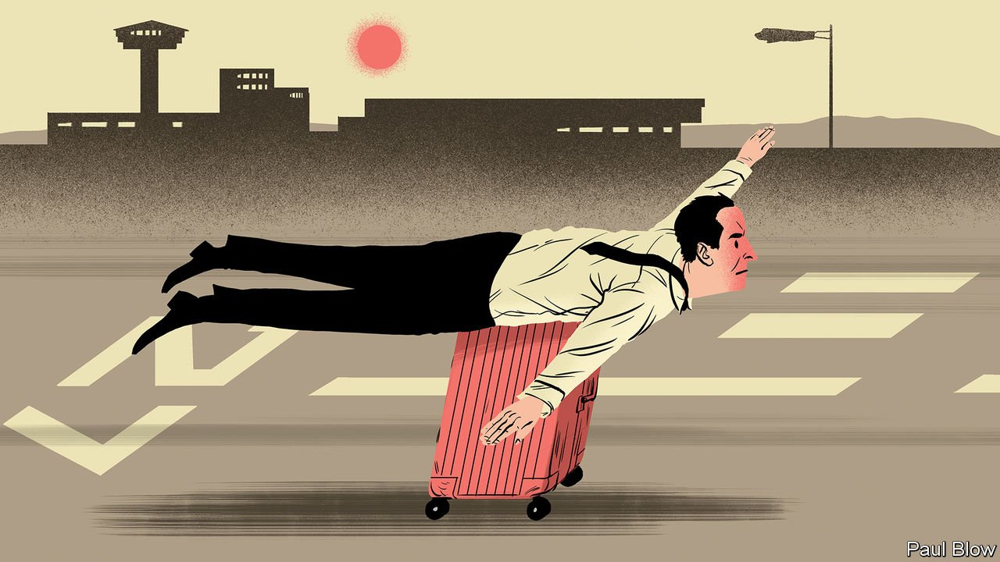
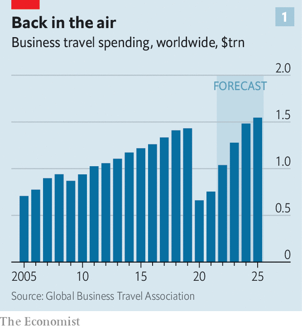
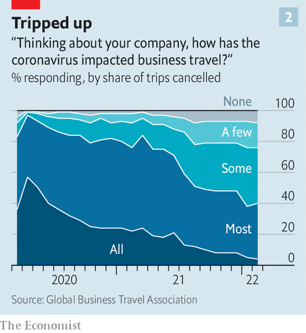

###### The future of business travel

# A guide to your next business trip 

##### Corporate road-warriors are back. Pre-pandemic business travel isn’t 

 

> Mar 26th 2022 

SHARP ATTIRE and a purposeful stride. The left-hand turn on the plane away from the cheap seats. Skipping the in-flight film to refine a presentation. Over the past two pandemic years these obvious giveaways of the globetrotting executive became a rare sight. According to the Global Business Travel Association (GBTA), a trade body, worldwide spending on flights, hotels, car hire, restaurants and other expensable services fell from $1.4trn in 2019 to $660bn in 2020 as a result of covid-19 lockdowns and tough limits on cross-border movement.

 


Despite fresh disruptions, from coronavirus outbreaks and a tragic plane crash in China to Russia’s war in Ukraine, many places are relaxing travel restrictions. America and Europe are mostly open for business. On March 21st Hong Kong said it would admit vaccinated arrivals from nine countries, including America and Britain, from April 1st and relax onerous hotel-quarantine requirements. Business travellers are once again visible at airports, on aeroplanes and in hotels. The GBTA expects corporate travel to rebound sharply this year and return to its pre-pandemic peak by 2024 (see chart 1).


That is a relief to full-service airlines, which counted on business travellers for 30% of revenues and a higher proportion of profits, and big global hotel chains, which earned two-thirds of their sales from executive guests. For corporate road-warriors the news is more mixed. Remaining covid-19 measures, readjusted travel budgets, changing work patterns, heightened risk awareness by companies and individuals: all are changing business travel in profound ways. Some of the changes will make travelling for work a more pleasant experience. Others will not.

 


Throwing your laptop, mini-toiletries and clothes into a wheelie bag used to be a pretty universal corporate ritual. Henceforth whether or not you do will depend more on whom you work for, your role, where you are going and the purpose of your trip. Scott Davies, boss of the Institute of Travel Management, another industry body, explains that overall travel budgets used to be set annually, often against broad commercial objectives. As they are rebuilt after the covid lull, he expects many trips to be considered on a case-by-case basis. Many marginal jaunts won’t clear the hurdle (see chart 2), especially as companies get serious about reducing their carbon footprints, which swell with every air mile.

Some trips will be quick to return. Indeed, even at the height of the pandemic essential business travel continued; managing and maintaining remote oil wells, large infrastructure or factories far from the head office is impossible over the internet. The share of travel spending by manufacturing, utilities or construction firms edged up from 48% in 2019 to 51% in 2020, according to the GBTA. Companies for which face-to-face client meetings are desirable to maintain relationships and vital to drum up new business, such as finance and professional-services firms, have been swift to get workers back on the road. Anecdotal evidence suggests that as soon as one company heard that a competitor was out pressing the flesh (or at least bumping fists) it followed suit.

If you do pack that suitcase, your destination is likelier to be domestic. As with leisure travel, long-haul trips for work are recovering more slowly. A poll of over 450 companies by the GBTA in February found that two in three had restarted domestic trips but fewer than one in three had done so for cross-border journeys.

Domestic trips in America, which accounted for nine in ten American corporate excursions in 2019, according to Bernstein, a broker, will increasingly go ahead. So will short-haul hops between European cities, which in 2018 made up two-thirds of EU business trips. Until the latest covid flare-ups the same looked true for flying in China, where business-travel spending fell by far less than the global average in 2020 and was recently forecast to grow by double the global average in 2021 (though Chinese borders remain impregnable to most outsiders).

Your fellow passengers will disproportionately work for smaller companies. American Airlines reckons that travellers from smaller firms are back to 80% of their pre-covid numbers. The comparable figure for big firms is 40%. One reason is that small businesses mostly send people on those popular domestic routes. Another is that they may be a bit more relaxed about their workers’ wellbeing. Vik Krishnan of McKinsey, a consultancy, says that the pandemic has prompted travel managers at big companies to feel a heightened sense of their duty of care to employees.

Fight for flight

Getting a trip approved is, then, getting harder than before. A recent survey of 170 North American corporate-travel managers by Morgan Stanley, a bank, shows that budgets in 2022 are expected to be 31% below the level of 2019. In the short run approval may get harder still. On March 15th Ed Bastian, chief executive of Delta Air Lines, told the Financial Times that the war-induced spike in the oil price “will no question” raise ticket prices on both domestic and international routes. Other airline bosses doubtless have similar designs.

Even if your supervisor signs off on your trip, you will find it harder to plan. The world’s airlines are running at around two-thirds of their pre-covid capacity. That means less choice on times and fewer direct flights, notes Richard Clarke of Bernstein. The problem is not confined to flying. The scrapping of the 5.40am Eurostar train from London to Paris forces executives to arrive the night before in order to strike that morning deal over a croissant and café au lait.

Once on the road, the experience isn’t what it used to be, either. With many executive lounges yet to reopen, the weary manager must seek refuge at a noisy restaurant—or worse, since plenty of eateries, too, remain shut, on a bench in the concourse within earshot of a disaffected infant. At many airports you will also still need to wear a mask. Although London’s Heathrow and a few other airports have lifted mask requirements, America’s federal mask mandate has been extended until at least April 18th. In the past year the Transportation Security Administration has fined nearly 1,000 unmasked travellers, so you ignore the rule at your peril (and good luck expensing that fine).

On board the plane you may find yourself in economy class more often, and not merely because of the rising air fares. Some climate-conscious airlines are already reconfiguring planes with fewer business-class seats (whose emissions per occupant are three times those of an economy seat). CEOs of large companies will be sad to hear that first-class seats, which are even dirtier, may disappear for good.

In the air, expect to be served by cabin crew draped in personal protective equipment (especially in Asia, which remains more concerned than the West about hygiene). You, too, must keep your mask on, unless you are consuming food or drink (of the non-alcoholic variety on American Airlines, which will only restart in-flight booze sales in mid-April). At least hot meals are back; as recently as last month even first-class passengers on American and Delta had to do without such sustenance on domestic flights.

Over the longer term, the news for the itinerant executive isn’t all bad. The introduction of touchless technology and online check-in for flights and hotels should speed up travel a little (at least once pandemic paperwork such as passenger-locator forms and vaccine certificates no longer needs verifying). With many planes sitting idly on the tarmac as a result of covid-related cancellations, some airlines used the opportunity to spruce them up. Australia’s Qantas has, for example, modernised its fleet of A380 superjumbos by installing comfier seats for premium passengers. Singapore Airlines has updated the cabins on some of its short-haul fleet.

The few who get to hitch a ride on a corporate jet are also becoming a bit less select. Business-jet traffic has recovered much more swiftly than commercial aviation. According to WINGX, a consultancy, January was the busiest month ever, with the number of flights 15% higher than in January 2019. In a survey by Morgan Stanley, 11% of respondents said their firms would be more liberal with the use of business jets in 2022 than they were in 2021.

Chronic jet-lag may become a thing of the past. With long-haul travel still constricted, firms are reportedly opting to send executives on fewer trips that stretch to more days. Unseemly displays of corporate machismo, such as flying half way across the world for one short meeting, may never return, no doubt pleasing everyone concerned.

And many of those longer trips are combining work and play. Morgan Stanley sees evidence at American hotel chains that Thursdays and Sundays are becoming more popular with guests, suggesting that some workers may be moving trips towards the start of the week or its end, to blend work with pleasure. Such trips have become common enough to earn an ugly moniker, “bleisure”. Danny Finkel of Trip Actions, a firm which helps others manage business travel, says this could appeal to those who approve expenses, too: weekend flights are often much cheaper, offsetting the cost of extra nights at a hotel.

Perhaps the best news for the bedraggled business traveller is that some trips simply won’t happen. Jarrod Castle of UBS, a bank, notes that 40% of business trips are to meet clients and another 40% involve internal meetings. Conferences, exhibitions and the like make up the rest. He reckons that perhaps half of the intra-company jaunts, especially for training or get-togethers between non- C-suite executives, are expendable. That means a fifth fewer trips overall. No grumbling there. ■

For more expert analysis of the biggest stories in economics, business and markets, , our weekly newsletter.

