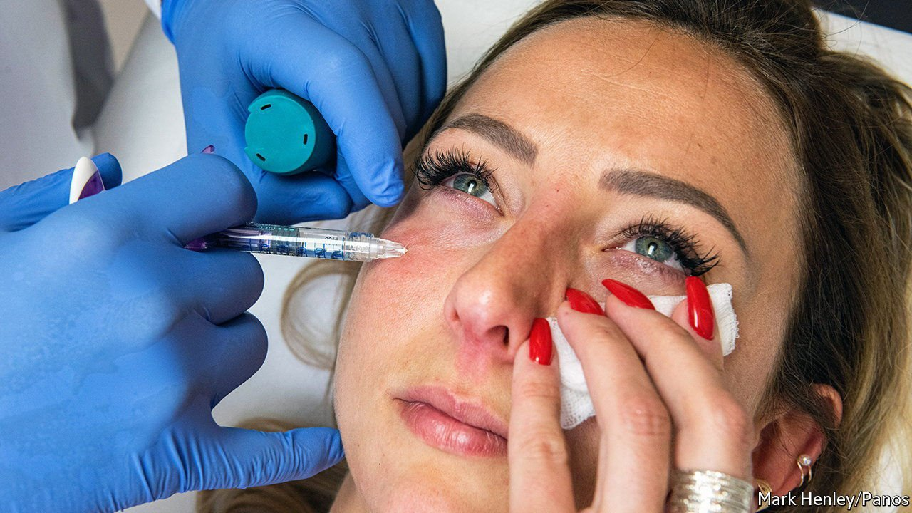

###### The Zoom lift

# Botox and other injectable cosmetics are booming 

##### Video-conferencing and the selfie culture are behind the craze 

 

> Mar 26th 2022 

COSMETIC PROCEDURES used to be the preserve of middle-aged women and often involved surgery. Today they are increasingly sought by girls who want the photoshopped faces of their favourite social-media influencer, and by a growing number of men wishing for fewer wrinkles, fuller lips and sharper jawlines. Globally, more than 14m nonsurgical procedures were conducted in 2020, even amid the pandemic, up from fewer than 13m two years earlier. Increasingly, scalpels are giving way to syringes.

Research and Markets, a firm of analysts, reckons that the global sales of non-invasive aesthetic treatments, currently around $60bn, could more than triple by 2030. A large part of that growth will come from injectables. These include Botox and other substances that freeze facial muscles, as well as dermal fillers which plump softer tissue. Demand has been fuelled by the proliferation of selfies and, during the pandemic, high-resolution video-calls. Snapchat and Instagram filters give users a glimpse of what they could look like with a filler-generated “liquid facelift”. The contrast with what they see on unadorned Zoom can be stark.


In America 2.4m injectable procedures were carried out in covid-hit 2020, roughly one for every 100 American adults. About 700,000 such treatments were performed on Germans, not renowned for an obsession with looks. Brazilians, who are famously beauty-obsessed but much poorer, subjected themselves to around 500,000. Demand for “prejuvenation” work is especially strong in Asia, where younger patients (for, despite the convenience these are still medical procedures) want to pre-empt a craggy visage before any lines actually appear. Since injectables have to be topped up every few months, they guarantee producers of the substances and clinics that administer them a source of recurring revenue. The younger the customer starts, the better for business.

According to a report by McKinsey, a consultancy, over 400 aesthetics clinics, which administer injectable treatments (among others including things like laser fat removal) raised more than $3bn from investors over the past five years. In 2020 AbbVie, an American pharmaceutical firm paid an eye-popping $63bn for Allergan, which has controlled nearly half the market for injectables since it launched Botox for aesthetic use two decades ago and Juvederm, a dermal filler, a few years later.

New products are beginning to threaten Allergan’s dominance. Hugel, a South Korean company, now has a rival offering that is half the price of Botox. It is eyeing the Chinese market, where the stuff is still less common than dermal fillers. Ipsen, a French drugmaker, and Merz Pharma, a German one, also make Botox-style injectables. Ipsen’s Dysport has done well in Turkey and Russia. Merz’s sales are growing briskly in the emerging economies of Asia and Latin America.

Some modern dermal fillers, meanwhile, are formulated with ingredients such as hyaluronic acid that are typically found in mild skincare products. That is less offputting to potential customers than Botox, which is derived from a toxin that occurs naturally in spoilt sausages. Other new treatments are dispensing with foreign substances entirely—though this doesn’t always seem all that more appealing. Certain cosmetic clinics offer to inject stem cells from a patient’s own fat into their face, or platelets from their blood to rejuvenate the skin.

There is a wrinkle. The injectables craze, especially among youngsters, worries regulators. Botox is a prescription drug in most places but many dermal fillers are not. “Treatments are often trivialised on social media and people don’t understand the full ramifications of what can go wrong,” says Tijion Esho, a cosmetic surgeon in Britain. Misplaced injections can lead to abscesses or, in some cases, necrosis. An outcry from doctors and victims of botched procedures forced the British government to announce in February that it would require a licence for people administering nonsurgical treatments. England has already banned them for under-18s. ■

For more expert analysis of the biggest stories in economics, business and markets, , our weekly newsletter.

