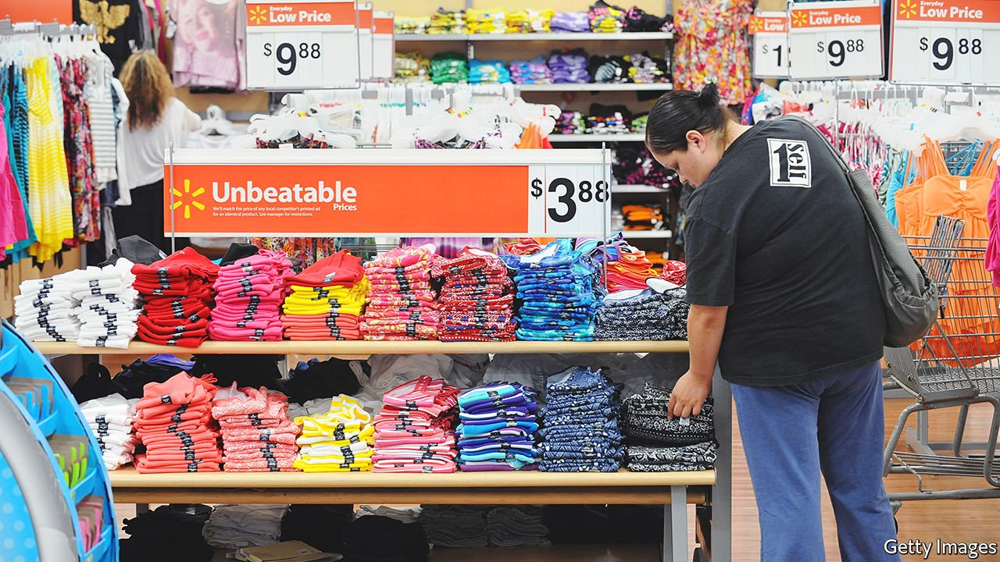

###### Surge pricing

# How companies use AI to set prices 

##### The pricing of products is turning from art into science 

 

> Mar 26th 2022 

FEW AMERICAN business tactics are as peculiar in a freewheeling capitalist society as the manufacturer’s suggested retail price. P.H. Hanes, founder of the textile mill that would eventually become HanesBrands, came up with it in the 1920s. That allowed him to use adverts in publications across America to deter distributors from gouging buyers of his knitted under garments. Even today many American shopkeepers hew to manufacturers’ recommended prices, as much as they would love to raise them to offset the inflationary pressures on their other costs. A growing number, though, resort to more sophisticated pricing techniques.

A seminal study from 2010 by McKinsey, a consultancy, estimated that raising prices by 1% without losing sales can boost operating profits by 8.7%, on average. Getting this right can be tricky. Set prices too high and you risk losing customers; set them too low and you leave money on the table. Retailers have historically used rules of thumb, such as adding a fixed margin on top of costs or matching what competitors charge. As energy, labour and other inputs go through the roof, they can no longer afford to treat pricing as an afterthought.


To gain an edge, shopkeepers have been turning to price-optimisation systems. These predict how customers will respond to different pricing scenarios, and recommend those that maximise sales or profits. At their core are mathematical models that use oodles of transaction data to estimate price elasticities—how much demand increases as the price falls and vice versa—for thousands of products. Price-sensitive items can then be discounted and price-insensitive ones marked up. Merchants can fine-tune the algorithms to prevent undesirable outcomes, such as double-digit price surges or larger packages costing more by unit of weight than smaller ones.

These systems are becoming cleverer thanks to advances in artificial intelligence (AI). Whereas older models used historical sales data to estimate price elasticities for individual items, the latest crop of AI-powered ones can spot patterns and relationships between multiple items. Makers of pricing software are incorporating new data sources into their models, from customers’ tweets to online product reviews, says Doug Fuehne of Pricefx, one such firm. The cloud-based platform developed by Eversight, another provider, allows retailers to test how slight increases or decreases in the price of, say, Heinz ketchup at different stores affect sales not just of that specific condiment but across the category. It is used by big manufacturers such as Coca-Cola and Johnson &amp; Johnson, as well as some supermarkets (Raley’s) and clothes-sellers (JCPenney).

All this makes pricing systems “much more three-dimensional”, observes Chad Yoes, a former executive at Walmart who oversaw pricing at the retail behemoth. Retail bosses are keen to promote this sophistication to investors, who value firms’ pricing power at a time of high inflation. In February Starbucks, a chain of coffee shops, boasted about its use of analytics and AI to model pricing “on an ongoing basis”. US Foods, a food distributor, has touted its pricing system’s ability to use “over a dozen different inputs” to boost sales and profits.

Price-optimisation may make prices more volatile. “Retailers are pricing faster today than they ever have before,” says Matt Pavich of Revionics, another pricing-software firm. That is especially true in the fast-moving world of e-commerce. But even Walmart reviews the prices of many items in its stores 2-4 times a year, says Mr Yoes, up from once or twice a few years ago.

What pricing systems do not do is lead inexorably to higher prices. Mr Pavich calls this misconception “one of the biggest myths” about products like his. Sysco, a big food distributor which rolled out new pricing software last year, is a case in point. The firm says the system allows it to lower prices on “key value items”—as price-sensitive bestsellers are known in the trade—and raise them on other products. It can thus increase profits by expanding sales while maintaining margins. That keeps investors content and shoppers sweet. ■

For more expert analysis of the biggest stories in economics, business and markets, , our weekly newsletter.

