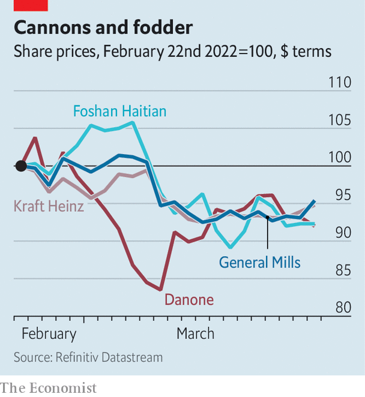

###### Food fight

# Packaged-food firms are running out of room to raise prices 

##### The war in Ukraine is pushing up costs just as shoppers become fed up with inflation 

 

> Mar 26th 2022 

THE MARKET for packaged foods is a competitive one, where price rises by one firm risk pushing shoppers into the arms of rivals. Companies in the industry deal with soaring costs by hedging against spikes in commodity markets using forward contracts, reformulating products so they contain less of the pricier foodstuffs or, failing that, surreptitiously making packages a bit smaller while keeping the ticket price the same.

Amid pandemic-related supply-chain bottlenecks, labour shortages and crop failures, food firms have repeatedly done all that. Even so, they have had to raise prices, often less judiciously than is ideal (see previous article). The invasion of Ukraine, known as Europe’s breadbasket thanks to its rich soil, by Russia, the world’s top exporter of wheat, is forcing their hand once again. Together the two countries account for 29% of international wheat sales and nearly 80% of sales of sunflower oil. Disruptions to those critical supplies are pushing up food companies’ costs just as energy costs are also sky-high as a result of the war.


It will be harder for European food companies to pass price rises to consumers than for American firms. Supermarkets in Europe are more concentrated than in America, and drive a harder bargain with suppliers. Walmart, America’s biggest, controls 17% of the domestic market. Its British and German opposite numbers, Tesco and Edeka, respectively, have nearly 30% of theirs. Moreover, cost-conscious Europeans shop more at discounters such as Aldi or Lidl. They are also less fussy than Americans about branded products and buy more of the retailers’ own labels.

 


On March 23rd General Mills, the American maker of Cheerios and Wheaties, among other sugary fare, reported healthy margins and quarterly sales that were higher than in the same period in 2019, before the pandemic (though flat compared with last year). The firm insisted that demand for packaged food should remain strong all year as many people continue to work from home at least some of the time. Robust appetite for its products will, the firm says, allow it to raise prices to offset the rising costs of commodities.

That may be optimistic. Shoppers’ patience with inflation is wearing thin on both sides of the Atlantic. Investors expect margins to narrow. The share prices of big American, European and Chinese food firms alike took a knock after Russian tanks rolled onto Ukrainian fields on February 24th (see chart). ■

For more expert analysis of the biggest stories in economics, business and markets, , our weekly newsletter.

