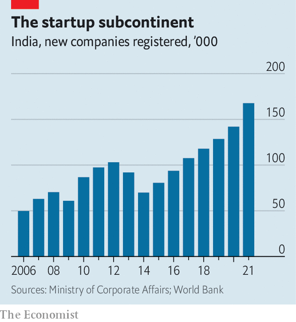

###### Shark attack

# What “Shark Tank” says about Indian capitalism 

##### The reality show’s popularity in India may reflect a growing fondness for free enterprise 

 

> Mar 26th 2022 

SPEAK TO THE bankers and industrialists at the top of India’s economic pyramid and you hear a common refrain. All Indians, they contend, are at heart socialists—themselves included. The popularity of the Indian version of “Shark Tank”, a TV celebration of capitalism (similar to “Dragons’ Den” in Britain) in which ordinary people seek funding for their business ideas from a gaggle of successful entrepreneurs, suggests that this conventional view may be out of date. The show’s 36-episode run, wrote the Hindustan Times, shifted the topic of dinner conversations throughout the vast country from cricket to business plans. Terms like “gross profit” and “TAM” (total addressable market) have entered common parlance among its 1.4bn people.

Shows with star judges awarding talent (and panning its absence) have long had a place on Indian television. But they have historically involved song and dance, not spreadsheets. Sony Entertainment received 85,000 applications for “Shark Tank”. These were whittled down to 198 pitches presented to juries of five judges, themselves chosen to reflect India’s new business elite (rather than being scions of industrial conglomerates they had founded firms peddling everything from cosmetics and drugs to a matchmaking app and electronic payments).


The enterprising hopefuls’ televised presentations were heavier on enthusiasm than polish. Rather than being a liability, this resonated with viewers who, as many blogs and social-media posts attested, saw themselves in the contestants. For “Shark Tank” was, in its effervescent diversity, not unlike Indian society. Of the 67 startups that secured some money from the judges, three-fifths were run by first-time entrepreneurs. More than two-fifths had female co-founders and a third were co-founded by someone from a small city rather than a business hub like Bangalore, Delhi or Mumbai. Only nine of the winning businesses had a founder who boasted a degree from the prestigious engineering and business schools that are the traditional pathway into India’s economic aristocracy.

Some of the winning pitches seemed humdrum (banana crisps). Others were ingenious (an engineer whose family had been devastated by the abrupt death of their cow developed an electronic ear clip to monitor bovine health). Some were both (a bicycle-mounted pesticide sprayer). Even some losing proposals won recognition. Reversible dresses (good for a day in the office and a night on the town) were dismissed by one of the judges as suitable for a mop; his wife subsequently appeared wearing one on TV.

 


“Shark Tank” may have struck a chord because it came at a time when Indians as a whole were becoming more enterprising. Indian entrepreneurs have registered over 310,000 new businesses in the past two years, up from 250,000 or so in the previous two (see chart). The ranks of retail stockpickers doubled between March 2019 and November 2021, to 77m. Some of this happened out of necessity: the pandemic up-ended lives and led millions to seek new opportunities. But some was probably by choice. The number of candidates sitting India’s exacting civil-service exam appears to have peaked in 2016. Some eggheads who would once have become bureaucrats may have opted to become capitalists instead. ■

For more expert analysis of the biggest stories in economics, business and markets, , our weekly newsletter.

