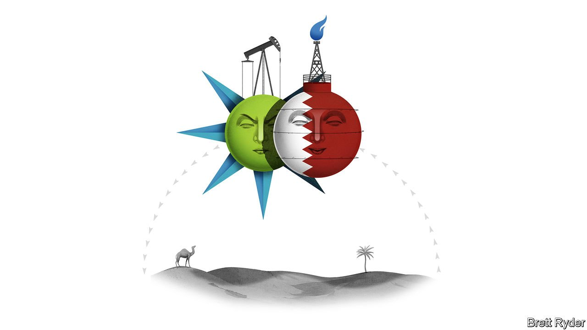

###### Schumpeter

# Why Saudi Aramco could be eclipsed by its Qatari nemesis 

##### QatarEnergy puts commercial interests above geopolitical ones 

 

> Mar 26th 2022 

TO SAUDI ARABIA, Qatar is little more than a sore thumb sticking out into the Persian Gulf. For decades the kingdom has looked down on its neighbour as an irritating pipsqueak, with which it has little in common except the desert. Saudi Arabia has historically cut more of a dash in global affairs; the vast fields of natural gas that Qatar controls have never provided it the same clout as its rival’s oceans of oil. Saudi Aramco, which produces 12.8m barrels of oil equivalent per day, has just attained a market value of more than $2.3trn, making it the world’s second-most-valuable listed company after Apple. Alongside it, QatarEnergy, which produces less than a third as much, looks like an emir’s plaything. Now Russia’s war on Ukraine has also exposed a stark contrast in the attitude of the two countries to the world beyond their borders. Their different approaches to energy geopolitics could have big repercussions for both firms, as well as for the West and the East.

Saudi Arabia undoubtedly believes it is on a roll—and in some ways it is. On March 20th Aramco, the world’s biggest oil exporter, revealed that soaring oil prices had enabled it to more than double net profit to $110bn in 2021, when crude averaged around $70 a barrel. With oil prices now above $100, the bonanza will grow. The company plans to raise capital expenditure to $40bn-50bn this year, up from $32bn in 2021. That will help it towards a goal of adding 1m barrels a day (b/d) of oil-production capacity by 2027.


This stands in contrast to a broad decline in oil investment from the industry as a whole, partly because of pressure to avert climate change. Ironically, the world’s most carbon-emitting company, if you count the pollution from burning its oil, appears to be the giant doing the best out of the energy transition.

At the same time, Saudi Arabia’s assertiveness on energy matters is growing. European leaders such as Emmanuel Macron in France and Boris Johnson in Britain have of late set aside revulsion caused by the murder in 2018 of Jamal Khashoggi, a Saudi journalist who wrote for the Washington Post, and have visited Muhammad bin Salman, the crown prince. Mr Johnson pressed him to pump more oil to replace Russia’s war-disrupted barrels—but got nowhere. So far the kingdom has remained staunchly committed to miserly short-term oil-production increases agreed with the OPEC+ cartel, which it and Russia in effect control.

If anything, Saudi allegiances now lean more East than West. A few weeks ago Aramco finalised a long-mooted investment in a refining complex in northern China. It will supply most of the 300,000 b/d of crude the complex needs. The kingdom’s rulers are in talks with China to price some of the crude supplies in yuan, the Wall Street Journal has reported. If this happens, that would dent the dominance of the dollar in the oil market and jeopardise a deal dating back to the Nixon era when the Saudis created petrodollars in exchange for American security guarantees. Bloomberg recently reported that India’s Adani Group, owned by one of the country’s wealthiest tycoons, may be considering a range of potential partnerships in Saudi Arabia, including buying a stake in Aramco—a further sign of closer ties with Asia.

There are good commercial reasons for Saudi Arabia’s eastward pivot. More than a quarter of its oil exports go to China. Only 10% go to Europe, and 7% to America. Still, Prince Muhammad’s regime is unnecessarily antagonising the West by resisting calls to increase output, which it could do without compromising its business. In fact, its resistance seems almost out of spite—and appears to have less to do with commerce and more with the kingdom’s security concerns, including ways to contain Iran and its proxies, which it feels President Joe Biden’s administration is ignoring. Underscoring such worries, in the past week Yemen’s Houthi rebels struck some Aramco facilities with missiles.

As with Aramco, QatarEnergy’s customers are also mostly Asian. But the emirate, one of the world’s biggest exporters of liquefied natural gas (LNG), has a more pragmatic approach to the outside world. It wants strong commercial relations with China—partly to ensure its LNG exports to the Asian giant are not displaced by Russian gas. But that does not prevent it from maintaining strong ties with America. It is loth to put geopolitics ahead of Qatar Energy’s economic interests.

Such commercial pragmatism was apparent during the blockade of Qatar by a quartet of Gulf states, including Saudi Arabia and the United Arab Emirates (UAE), in 2017-21, notes Steven Wright of Hamad Bin Khalifa University in Doha. During the stand-off, Qatar kept natural gas flowing through the Dolphin pipeline to the UAE in order to convince the world it was a reliable supplier. It is apparent again in Qatar’s response to Europe’s gas crisis. In the run-up to the war in Ukraine, it too, like Saudi Arabia, declined Western pleas to send Europe more fossil fuels. Its reasons, though, were more commercial than mercenary. Most of its LNG was simply tied up in sacrosanct long-term contracts. Now that it has spotted a new commercial opportunity as Europe seeks to reduce its reliance on Russian gas, QatarEnergy is happily talking with Germany about long-term gas supplies.

Dinosaurs in the desert

The biggest contrast between the two energy giants may come amid the energy transition. Aramco is betting that its low-cost and, as crude goes, clean oil has a future for years to come. Like Aramco, QatarEnergy is pouring money into more production—in its case, a $30bn expansion of its natural-gas export capacity.

But a decade from now, when electric cars will no longer be burning Aramco’s oil, many of them will still be charged using electricity generated with QatarEnergy’s gas. After that, both energy giants see the future in producing hydrogen. At that point, Qatar’s efforts to keep on good terms with potential customers on both sides of the geopolitical divide will look more commercially prudent than Saudi huffiness. ■

Read more from Schumpeter, our columnist on global business: (Mar 19th)

 (Mar 12th)

 (Mar 5th)


