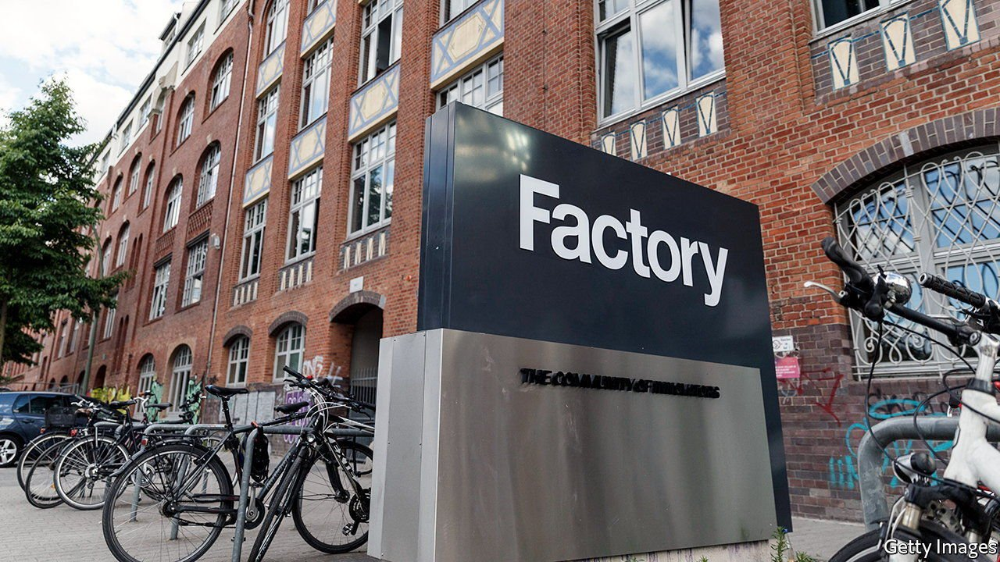
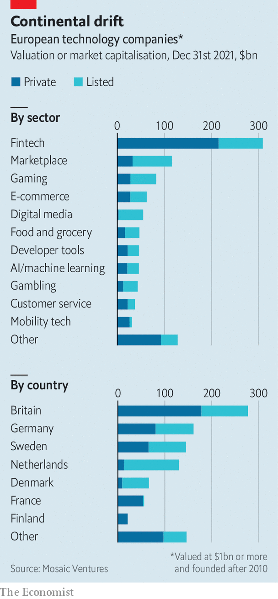

###### New kids in the bloc

# Will the Digital Markets Act help Europe breed digital giants? 

##### Probably not 

 

> Mar 26th 2022 

IN THE EARLY 1970s a handful of former employees at IBM, then the world’s biggest computer-maker, spent weeks pulling double shifts. During the day they quizzed the workers at a nylon plant in southern Germany about what exactly made their factory tick. At night they painstakingly turned this knowledge into code and tested it. The result of all this toil was one of the world’s first comprehensive pieces of business software. The company behind it, SAP, is still Europe’s mightiest technology titan by revenue, with annual sales of nearly €30bn ($33bn). It has a market value of €123bn as it celebrates its 50th anniversary on April 1st (no joke).

Such stamina is a feat, but also raises worrying questions about the European tech industry. Why has SAP remained Europe’s top digital firm for so long? Why has the continent spawned no trillion-dollar Apfel or Amazonie? Might one eventually emerge? And could such a development be speeded by the EU’s landmark technology law, the Digital Markets Act (or DMA for short), which the bloc was expected to approve after The Economist went to press on March 24th?


SAP’s longevity is the easiest to explain. Once firms opt for a certain type of business software, it becomes tedious (and sometimes impossible) to replace it. That guarantees the purveyor a regular revenue stream and a captive market for extensions. SAP also had the foresight to design its software from the start so that it did not become obsolete when the underlying computing infrastructure changed. As a result, it is one of the few information-technology giants that has survived three “platform shifts”: from mainframe computers to more distributed “client-server” systems, then to the internet and, now, to the computing cloud.

Why SAP remains a lonely European presence in a digital realm lorded over by American tech behemoths is less obvious. Oft-heard explanations include the continent’s risk-averse entrepreneurs and consumers, a lack of venture capital (VC), red tape and a fragmented home market. Benedict Evans, a former venture capitalist who now publishes a widely read newsletter, thinks the reason is far simpler: tech grew big in its birthplace, Silicon Valley. Until a few years ago, even aspirant American tech hubs, such as Austin, Miami and New York, did little better at spawning digital darlings than Berlin, London or Paris.

SAP itself is proof that appearing in the right place at the right time is instrumental to making it in tech. The firm’s headquarters may have risen on an asparagus field a 15-minute drive south of Heidelberg, but the region combined many factors that contributed to the firm’s success: more than one well-organised factory whose business processes lent themselves to being turned into software; plenty of accountants and physicists who could hone SAP’s programs; no VC firms to badger it to ship half-baked products in search of a quick buck. Because the German market was relatively small, SAP also designed its code to work with many currencies—a feature that its American rivals, including Oracle, had to add laboriously after the fact.

 


These days breeding tech stars is easier. Demand for digital services is growing in Europe, attracting money, experienced entrepreneurs and startup-friendly rules, such as a more relaxed attitude to employee stock options, says Annabelle Gawer, who runs the Centre of Digital Economy at the University of Surrey. The number of European tech firms worth more than $1bn, both listed and unlisted, has exploded in recent years. When Mosaic Ventures, a VC firm in London, surveyed such companies earlier this year, before a wobble in tech valuations, it counted about 180 new ones since 2010, collectively worth some $1trn (see chart).

The DMA is meant to spur even more such breeding by creating a level playing field on which startups can compete against America’s tech titans. Its provisions will apply to “gatekeepers” which operate one or more “core platform services” and, according to the latest leaks, have a market capitalisation of more than €75bn and had annual revenue in Europe of more than €7.5bn in the last three financial years. The services in question include online search, social networks, video-sharing, operating systems, cloud-computing and online advertising: the bread and butter of America’s big tech, in other words.

Specifically, the DMA may, among other things, compel Apple to let iPhone-users bypass its app store and “sideload” software from elsewhere; force Meta to make its WhatsApp and other messaging services work with rival ones; and require Google to show content from European publishers in its search engine. Without such rules, says Margrethe Vestager, the EU’s top trustbuster, “others will not get room to grow”.

Perhaps. But the DMA may also make it harder for European firms to become really big. Some entrepreneurs may prefer to avoid the hassle of complying with its strictures. Investors’ enthusiasm for firms whose growth prospects could be crimped as a result may also be chilled. And enforcing the new rules against deep-pocketed American firms may be tough, says Thomas Vinje, a veteran antitrust lawyer at Clifford Chance, a law firm. To avoid having the DMA applied differently in the EU’s 27 member states, the European Commission will be in charge. But the 80 officials it has initially delegated to the task may struggle with their in-trays. Britain’s Competition and Markets Authority plans to employ three times as many people to perform a similar function for just one country.

After 50 years SAP is at last seeing serious challenges to its dominance of European techdom. Adyen, a listed Dutch digital-payments provider, has a stockmarket value of more than $60bn. Klarna, a privately held Swedish one, is valued at $46bn. It would be an irony if the EU’s new rules made it harder for such upstarts to grow beyond a certain size—and an even bigger one if they allowed SAP, whose business software is not deemed a core platform service, to hold on to its crown. ■

For more expert analysis of the biggest stories in economics, business and markets, , our weekly newsletter.

