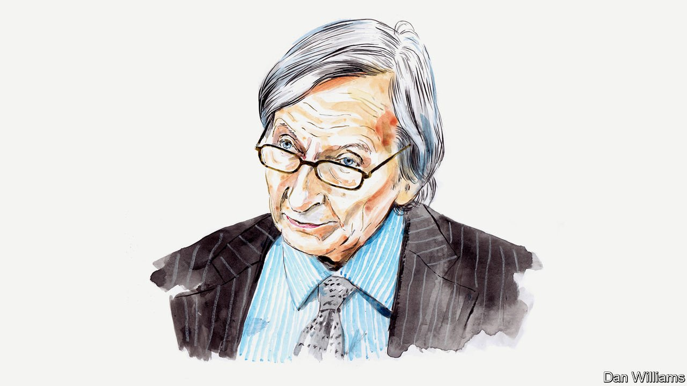

###### Russia and Ukraine

# Sir Adam Roberts rebuffs the view that the West is principally responsible for the crisis in Ukraine 

##### The scholar argues that the expansion of NATO was just one factor among several that led to conflict 

 

> Mar 26th 2022 

WHY IS IT that John Mearsheimer, a distinguished American exponent of international relations, has reached such an apparently perverse conclusion about Russia’s “special military operation” in Ukraine? It is a “special military operation” indeed—one whose initiation and conduct have been condemned as violating the most fundamental rules and norms. Yet he argued  for The Economist’s By Invitation section on March 19th that “the West, and especially America, is principally responsible for the crisis which began in February 2014.”

Professor Mearsheimer does not let Vladimir Putin off the hook entirely: “There is no question that Vladimir Putin started the crisis and is responsible for how it is being waged,” he writes. But Professor Mearsheimer’s central argument is that the crisis began at NATO’s Bucharest summit in April 2008, when President George W. Bush, along with the other NATO member states, ostensibly committed the alliance to the future membership of Ukraine and Georgia. The Russian leadership was deeply opposed to the prospect of NATO extending its reach so close to the heartland of Russia.


It’s questionable whether Mr Putin was right to say NATO posed a threat to Russia’s sphere of influence. From the start in 2008 there were different interpretations of what was meant by “will become members”. For some these words, with no time-frame specified, were there to enable President Bush to return home from Bucharest with something to show for his trip. Other member states, all of whose votes would have been essential for any formal offer of membership, remained doubtful. But Mr Putin took the phrasing seriously.

Professor Mearsheimer’s argument has some strength in suggesting that the 2008 Bucharest summit declaration was a disaster. He has shown consistency in this matter. He practically invented a school of international relations called “offensive realism”, based round the idea that systems in which there are several great powers are prone to manage their mutual relations with deep rivalry and a high risk of war. One conclusion that follows from his world-view is that states are bound to take seriously the concept of “spheres of influence”, an old-fashioned term for a phenomenon that is still very much alive. However much spheres of influence may challenge the idea of the sovereign equality of states, they have by no means disappeared in international relations.

Take the 1962 Cuban missile crisis. In demanding the withdrawal of Soviet nuclear-armed missiles from Cuba, America was, in effect, defending the Monroe Doctrine of 1823. The doctrine sought to exclude European colonial rule and military presence from the western hemisphere. As for the Soviet Union, throughout the cold war it regarded virtually all of eastern Europe, where it imposed client regimes, as its sphere of influence under the euphemistic label of “commonwealth of socialist nations”.

There is no dispute now that Mr Putin wants to defend Russia’s sphere of influence. Right at the start of his speech on February 24th, as his forces invaded Ukraine, he criticised the “expansion of the NATO bloc to the east, bringing its military infrastructure closer to Russian borders”. He embarked on a tirade against the actions of the Western powers and of the Ukrainian government. He infamously claimed, without a shred of evidence, that there was an ongoing “genocide against the millions of people” in the Donbas region.

However, for Professor Mearsheimer to reduce the causes of Russia's invasion to the Bucharest declaration is simplistic and wrong. Other, more important factors were at play. For a start, there were some obvious frustrations, fears and mistakes. The continuing American strategic partnership with Ukraine, which Professor Mearsheimer mentions, may indeed have played a part, rubbing salt in the wound of NATO’s projected expansion. Ukrainian defiance in response to Russia’s huge military exercise on its border last year would have been hard for Mr Putin to tolerate. A successful and democratic Ukraine undermines the Russian leader’s own authoritarianism at home. And there was a faulty understanding of the situation on the ground: both America in Iraq and Russia in Ukraine have launched wars on terrible “intelligence”.

Alongside these proximate causes there are three other factors that help to explain the current crisis in Ukraine. The most important, and the most neglected, is that the break-up of empires is often messy and traumatic. Often foreign military intervention of some kind follows. The end of European colonial empires, and the collapse of the Soviet and Yugoslav empires in the 1990s, forced new or re-constituted states to make fateful decisions. Is citizenship based on ethnicity or simply residence? Should kin living outside the state have a right to citizenship? What frontiers does the state have? What friends and allies? What constitution? What language? Such questions have been at the heart of most of the political crises and armed conflicts of the past 100 years or more. The dozens of UN peacekeeping missions established since 1945 have all had the task of addressing post-colonial and post-imperial crises.

Both Georgia and Ukraine faced many if not all of these quandaries in the 1990s—and faced them long before the question of NATO membership arose. From the very beginning of their new existence the status of Russian minorities in Georgia and Ukraine was particularly difficult. In Georgia two breakaway republics provided a basis, or at least a pretext, for Russian intervention on occasion. In Ukraine, too, defending the rights of its two Russian-supported breakaway republics was the ostensible reason for Russian military interventions there. And in these pro-Russian republics there were forced expulsions, of Georgians and Ukrainians respectively, leading to calls that they should be enabled to return to their homes.

Second, the existence of nuclear weapons outside of Russia necessitated a degree of Western involvement in security matters. An array of nuclear weapons remained in Ukraine (and also in Belarus and Kazakhstan) following the collapse of the Soviet Union. The problem of what to do with this arsenal was addressed in the Budapest Memorandum on Security Assurances of December 5th 1994. The three post-Soviet states agreed to hand these nuclear weapons over to Russia. In return, they received security assurances from Russia, Britain and America, which all undertook to respect the sovereignty, independence and existing borders of Ukraine and the other two states. This provision was violated by Russia’s takeover of Crimea in March 2014. The breakdown of the Budapest Memorandum left Ukraine in an awkward situation. It was unable to trust Russia’s word, but also had reason to doubt Western security guarantees. The idea of full-blooded membership of NATO appeared increasingly attractive but not necessarily more attainable.

The third factor is colour revolutions—the popular revolutions that occurred in many countries in the former Soviet Union in recent decades. They must have reminded Mr Putin of the movements in eastern Europe in 1989 that precipitated the collapse of one communist regime after another. Mr Putin was deeply suspicious of the revolutions, such as the Rose revolution in Georgia in November 2003. It was the first successful assault in the former Soviet Union against the corrupt strongmen who had come to power in the immediate aftermath of communist party rule. It was followed within a year by the Orange revolution in Ukraine that threw out another such strongman, Viktor Yanukovych.

It suits Mr Putin to treat civil resistance movements as parts of a grand international conspiracy. I have been studying such movements for more than 50 years. In that time all kinds of accusations have been made that such movements are the pawns of outside forces. There is little evidence to support such theories. Professor Mearsheimer, in a lecture on “The Causes and Consequences of the Ukraine Crisis” at Chicago University in 2015, actually lent some credence to the idea that such movements verge on being an American instrument. “Our basic strategy is to topple regimes all over the world.” Evidence for this generalisation was not presented. Throughout his analysis Professor Mearsheimer pays remarkably little attention to the ideals and political desires of people in countries that have experienced “people power” revolutions.

These factors suggest that the 2008 proposal to expand NATO to include Georgia and Ukraine is just one among many developments that have made the current crisis so acute. It is arguable, indeed likely, that the NATO expansion proposal made matters worse, as may some other Western actions, but to assert that “the West is principally responsible for the Ukrainian crisis” goes too far.

Sir Adam Roberts is an emeritus professor of international relations at the University of Oxford.

Read more of our recent coverage of the 

