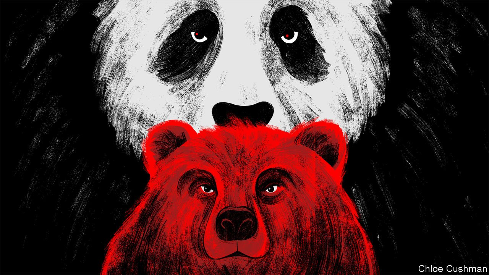

###### Chaguan

# China has honed its justifications for taking Russia’s side 

##### Deflection and anti-Americanism underpin China’s argument 

 

> Mar 26th 2022 

A MONTH AFTER Vladimir Putin plunged Europe into war, China is ready to explain why it sees no urgent need to stop Russia—its closest strategic partner—from killing Ukrainians. After fine-tuning arguments and propaganda lines for weeks, China’s Communist Party bosses and their envoys now have talking points for every audience.

The most common argument is built on deflection and anti-Americanism. This is used for Chinese domestic consumption and in public contacts with Western governments. As Chinese officials tell it, Russia is defending itself against American aggression and a long campaign of encirclement by NATO. Chinese officials think it is unfair of Western leaders to ask their government to intervene, because only American concessions to Mr Putin can bring lasting peace. Moreover, if the war is going slowly, that is because American interests profit from drawn-out agonies, Chinese diplomats charge. Spelling out the accusation, a deputy foreign minister, Le Yucheng, told a gathering at Tsinghua University that “arms dealers, bankers and oil tycoons” from a certain big country (ie, America) are making “highly immoral” fortunes out of the war, while Ukraine suffers. This hard line comes from the top. China’s supreme leader, Xi Jinping, has given instructions that Russia is to be defended and America held responsible for Ukraine’s woes, leaving underlings to “backfill a foreign policy” around that decision, a foreign diplomat based in Beijing explains. To dramatise America’s obligations, Mr Xi reached for a Song-dynasty saying during a two-hour video call with President Joe Biden on March 18th, declaring: “He who tied the bell to the tiger must take it off.”


Mr Xi’s scolding, literary tone is striking because, according to American briefings given to foreign ambassadors in Beijing, Mr Biden used the call to convey his concerns that Russia may be contemplating attacks with chemical or biological weapons in Ukraine. His warnings were not a surprise to the Chinese. A few days earlier Mr Biden’s national security adviser, Jake Sullivan, shared American intelligence about Russia’s possible intentions with China’s foreign-policy chief, Yang Jiechi, during a seven-hour meeting in Rome. Mr Sullivan told Mr Yang that Chinese support for Russian aggression would have a lingering impact on bilateral ties and on Mr Xi’s legacy. Mr Yang, it is related, responded with anger and complaints about America’s support for Taiwan, the democratic island that China claims as its own. Other officials have since copied that same rhetorical pivot to Asia. Mr Le called the crisis in Ukraine and NATO enlargement a mirror for observing American alliance-building in Asia and the Pacific, a trend which if unchecked would push the region “into a pit of fire.”

To Europeans, it might seem a bit parochial for China to draw parallels between a war under way in Ukraine and long-standing Chinese resentments of American alliances in Asia. But seen from Asia, there is a logic to China’s framing of the war in Ukraine as the latest example of global disorder provoked by the West, with a special emphasis on the sanctions being imposed on Russia. In their video call Mr Xi told Mr Biden that intensifying sanctions may gravely disrupt food and energy markets and global supply chains. After meeting African and Asian foreign ministers, China’s foreign minister, Wang Yi, spoke of a common disquiet among developing nations at being asked to take “black or white” moral positions on complex international questions.

Such ultra-pragmatic talking points, crafted to woo countries from the global South, reflect a Chinese horror of being isolated. But they also resonate with many governments, says a foreign diplomat in Beijing, describing meetings at which ambassadors from non-aligned countries swallow Chinese arguments “like candy”. China has a keen sense of countries with long-standing grievances about the West, or that have been placed under sanctions themselves for rights abuses, notes the diplomat. Against that, some South-East Asian governments, from Singapore to Cambodia, have voiced concerns about the dangerous precedent set by Russia’s attack. China’s growling about alliances cuts both ways, says a second diplomat. “China is worried about an Asian NATO. The only player that could make it happen, guaranteed, is China. Just invade a neighbour and see what happens,” he suggests.

Guarding each other’s backs, against the West

A final talking point is offered more discreetly by Chinese officials and scholars. This coldly realist argument asserts that China’s interests are simply not served by breaking with Russia. Zhou Bo, a retired senior colonel in the People’s Liberation Army, now at the Centre for International Security and Strategy and its China Forum at Tsinghua University, insists that China is taking a balanced approach to the war. But he predicts that if China were to condemn Russia’s actions, Western governments would pocket the concession and call it China merely doing the right thing. There is little chance that broader, long-term American pressure on China will ease, because China is not about to change its political system, adds Mr Zhou. As a result, “If China ditches Russia, it is only a matter of time before America comes after China once more.”

Wu Xinbo, dean of the international-studies institute at Fudan University, calls it natural that in his conversation with Mr Biden, Mr Xi stressed Chinese concerns about American support for Taiwan. “Russia may worry about Ukraine joining NATO, but Ukraine is an independent sovereign country. Taiwan is part of China. So in this sense, the Taiwan issue is far more important to China than Ukraine is to Russia,” he says.

Western governments are frustrated that China calls itself a peace-loving giant but will not condemn Mr Putin. That is to misread China, a country at once certain that its rise is unstoppable, and sure that America is bent on stopping it. China has ambitions to bestride the world one day. But it remains exceptionally self-absorbed. Suffering in faraway Ukraine will not change that. ■

Read more from Chaguan, our columnist on China: (Mar 19th) (Mar 12th)

 (Mar 5th)

All our stories relating to the pandemic can be found on our . You can also find trackers showing ,  and the virus’s spread across .

