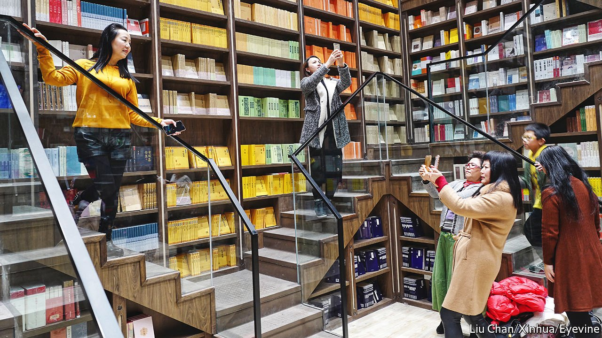

###### Salvation through selfie

# How narcissistic youth might help struggling Chinese booksellers 

##### They like to be seen in pretty shops. They might even buy a coffee 

 

> Mar 26th 2022 

IN 1993, AFTER 14 years of imprisonment, one of China’s most prominent dissidents, Wei Jingsheng, was taken on a tour of Beijing. Authorities hoped that the dazzling new architecture and bustling roads would convince him that the Communist Party he so stubbornly opposed had done great things. Mr Wei admitted to being impressed, but asked to see a bookshop before drawing any firm conclusions.

His tour guides obliged, and later he recounted his “eye-opening” visit. Chinese bookshops remained too conservative, he wrote. They were managed by old officials who didn’t even like books and displayed staid party literature. Bureaucrats would “rather build tall skyscrapers and purchase fancy limousines than…allow the book and culture markets to really open up,” wrote Mr Wei.


Some of China’s state-run stores remain the kind of dull, dusty places described by Mr Wei. Others have spruced up nicely, though. China also now has thousands of independent bookstores, serving coffee and tea and hosting events.

But like their counterparts elsewhere, China’s bricks-and-mortar bookshops are struggling. Their share of book sales declined from 85% to 20% between 2010 and 2020. Online sellers are luring bookworms out of bookshops. In a survey published in November, 80% of bookshop-owners said revenues were falling.

Chinese proprietors have unique problems, too. Only titles that have been cleared by state censors can be placed on shelves. Even the hippest shops feel compelled to display the ponderous works of Xi Jinping, China’s leader. Attempts at edginess carry risks. In February a bookstore in the city of Hangzhou featured works related to the well-known case of a trafficked woman found chained by the neck in a village outhouse. The display, with books about feminism, was decorated with a metre-long metal chain. But the authorities deemed it too controversial, and the store took it down after a few days.

Some sellers are finding other ways to attract potential customers. Bookshops have become a popular destination for Chinese internet celebrities, known as wanghong, and those who aspire to such heights. In pursuit of followers, clicks, sponsorship deals and modelling contracts, they post photos of themselves at attractive locations, which also include museums and amusement parks.

It is easy to find online listings of the hottest wanghong bookshops. Some have big windows with views of famous landmarks. One favourite, part of the Zhong Shu Ge chain, is in north-western Beijing. It features dizzying Escheresque staircases and a mirrored hall. The walls are lined partly with books—and partly with wallpaper that looks like books.

On a recent weekday morning the shop had an ample flow of people browsing and buying. But there were no wanghong in sight. “They all come on the weekends,” said a clerk, “and we just hope they’ll buy something while they’re here. Even if it’s only coffee.”

