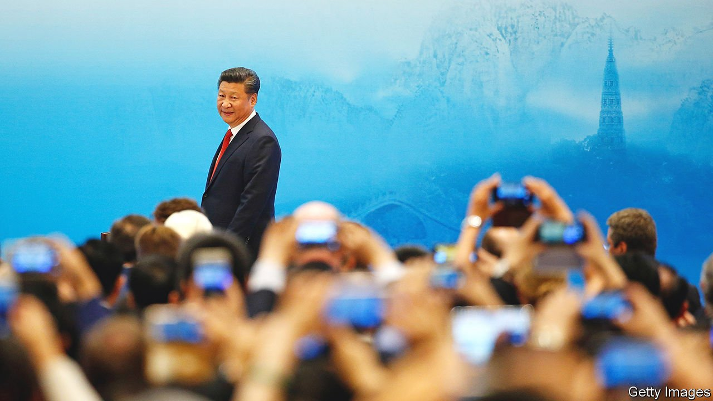

###### Xi’s hard year

# In a crucial year politically, Xi Jinping wants stability 

##### Covid-19, Ukraine and the economy may frustrate his wishes 

 

> Mar 26th 2022 

NO DATE HAS been set for it yet, not even a month. But for every official, the orders are clear. Their work must focus on making sure that a crucial Communist Party congress, to be held in the second half of the year, goes smoothly. The conclave is widely expected to herald the start of at least another five years of rule for Xi Jinping. From the police to economic policymakers, all are trying to minimise untoward events that might overshadow his moment of political glory. “The word ‘stability’ is the key,” leaders intone about the coming year at official gatherings.

It will be a far bumpier ride than they would like. In recent weeks the rapid spread of Omicron, a highly transmissible variant of the virus that causes covid-19, has posed an unprecedented challenge to China’s much-vaunted “zero-covid” policy. Widespread lockdowns have added to the wobbles of an already shaky economy. Just this month Mr Xi contrasted the party’s rule with “Western chaos”. He was referring, in part, to China’s two years of success (after a botched initial response) at crushing covid. If officials relax the policy to protect the economy they would risk a surge of cases that could overwhelm China’s fragile public-health system.


Russia’s invasion of Ukraine is another severe headache. The war began less than three weeks after Mr Xi and his Russian counterpart, Vladimir Putin, signed a joint statement in February declaring “no limits” to the two countries’ friendship. Chinese diplomats are now struggling to balance a desire to preserve what they see as this crucial relationship against a risk of even greater tension between China and the West, which could compound China’s economic difficulties.

Public opinion is hard to gauge, but there is little sign that the party’s policies on covid, Ukraine or the economy are widely resented. Many Chinese express support for the tough zero-covid approach. On social media, however, some grumbling circulates—despite censors’ efforts to stifle it. Even in the state-controlled press there have been occasional hints of disagreement over the party’s economic strategy, which last year included a regulatory clampdown on tech firms and a call by Mr Xi for “common prosperity” that scared entrepreneurs by raising the spectre of big redistributive schemes. Intriguingly, the prime minister, Li Keqiang, mentioned common prosperity only once in his state-of-the-nation speech to the national legislature on March 5th.

Among China-watchers, there is much speculation about the extent of opposition to Mr Xi within the elite, and the impact it might have on his political grip. But there is no convincing evidence that his plans could be derailed for the party congress and a meeting immediately afterwards of the Central Committee, which will announce the leadership line-up (including his own likely appointment to a third term as party chief, violating recent norms). Indeed, history suggests that for all the party’s preoccupation with stability in the build-up to party congresses, which normally are held every five years, the power of paramount leaders can survive enormous buffeting.

Mao Zedong, for example, ruled China for nearly 27 years, despite the deaths of millions in a famine of his own making, bitter political struggles within the party and at least one attempted coup. Deng Xiaoping retained authority well after his retirement, despite public resentment of his bloody suppression of the Tiananmen Square protests of 1989 and open criticism of his policies by conservatives in the party who saw them as a catalyst of the unrest. Similarly Jiang Zemin, who had overseen mass lay-offs from state-owned firms (angering millions of workers as well as conservatives), wielded much power long after he retired from his last post in 2004.

Mr Xi’s bid for an extension of his rule must anger some in the party. Cai Xia, a former academic at the party’s most prestigious training centre for officials (she now lives in America), has accused Mr Xi of forcing the party to “swallow dog-shit” by ordering the Central Committee in 2018 to approve a constitutional revision to facilitate his bid. But there is little sign today of the kind of turbulence in elite politics that marked the build-up to Mr Xi’s anointment as party chief in 2012. That year saw near-open feuding involving a prominent political rival, Bo Xilai, a member of the Politburo whom Mr Xi later accused of being involved in a plot to seize power.

Purges have continued. An 18-month “rectification” campaign of the domestic security forces ended late last year, aimed in part at rooting out those disloyal to the party and Mr Xi. Its most powerful targets included a deputy minister of public security, Sun Lijun, who was accused of leading a “political cabal” within the police (he was formally charged with corruption in January), as well as Fu Zhenghua, a former minister of justice. On March 21st it was announced that a former vice-president of the supreme court, Shen Deyong, was under investigation for unspecified crimes.

But there is no sign of any open campaigning for power of the type that Mr Bo engaged in. Mr Xi’s relentless onslaught against corruption—sometimes a smokescreen for attacking his political enemies—has sown such fear within the party hierarchy that it is hard to imagine any such challenge today. Barriers to organising against him are “near insurmountable”, wrote Richard McGregor and Jude Blanchette in a report on post-Xi succession scenarios that was published last year by the Centre for Strategic and International Studies in Washington and the Lowy Institute in Sydney.

On his management of the pandemic, Mr Xi is showing no sign of wavering. “Perseverance is victory,” he said at a meeting on March 17th of the Politburo’s seven-member Standing Committee. He called for a “step-up” in mobilisation and “unremitting efforts” to combat the current wave of outbreaks. Mr Xi also said that “maximum” effort should be made to minimise harm to the economy and society. But similar phrases have been used by officials before over the past two years.

Crucially, there has been little sign of any let-up in the punishment of officials for letting covid spread on their watch. The South China Morning Post, a newspaper in Hong Kong, has counted more than 70 who have been sacked or reprimanded during this wave. The experience of Hong Kong may encourage mainland officials to stay vigilant. The number of cases detected daily in that city far surpasses the total on the mainland. Daily deaths in Hong Kong have risen to about 200 compared with a handful, if that, in the rest of China. As they see it, Hong Kong’s plight is the result of not pursuing a zero-covid policy thoroughly enough. They note that it lacks the kind of manpower the mainland deploys to .

At this month’s parliamentary meeting Mr Li, the prime minister, admitted the going would be tough. This year, he said, China faced an “obvious increase in dangers and challenges”. But he ended his speech with his usual injunction: “We must unite ever closer around the party centre with Xi Jinping at its core.” It would take daring to do otherwise. ■

