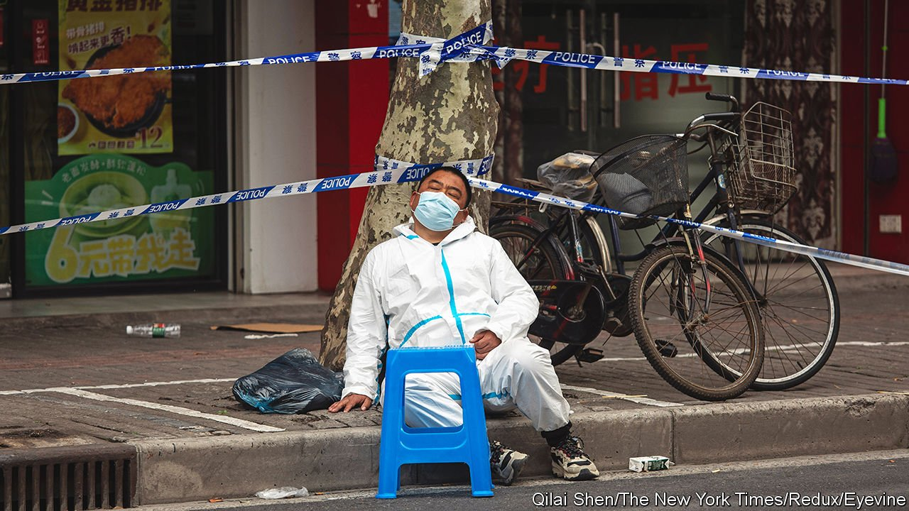
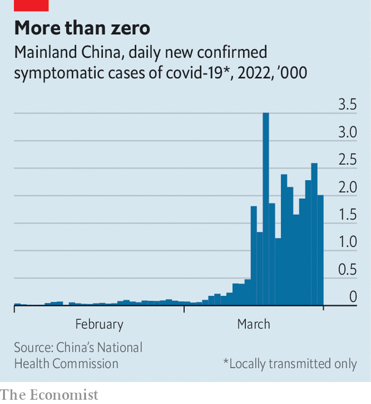

###### Lockdown legions

# The extraordinary manpower behind China’s zero-covid strategy 

##### Millions of workers battle thousands of cases 

 

> Mar 26th 2022 

THE THIRD fall was the one that finally put Gao Ying in the hospital. As a community health worker, she had been helping Hangzhou, her home city, fight a surge in covid-19 cases. She had not slept in her own bed for two weeks. She was exhausted. Still, on March 18th she set off for a meeting on local covid-control measures. That’s when she collapsed three times in a lift, the third time smacking her head on the wall. Video of the incident was captured by a CCTV camera and shared on social media.

 


Ms Gao’s tireless efforts were in response to an outbreak that most countries would consider trivial. Hangzhou, with 12m people, had recorded just 54 symptomatic cases of covid in the two weeks before her fall. (Ten more were asymptomatic.) Overall, China has logged around 27,000 new local symptomatic cases in March, fewer than America recorded most days this month. Still, it is the biggest outbreak in China since the early days of the pandemic (see chart). And it is straining the country’s “dynamic zero-covid” policy, which aims to stamp out the virus with mass testing, extensive contact tracing and strict lockdowns. Those efforts involve millions of workers like Ms Gao.


Technology, such as tracking software, helps. But much of the work involves clipboards, telephones and barricade tape. An important role is played by some 110,000 neighbourhood committees—legacies of the Mao era, when they helped China’s Communist Party keep order. Each committee has between five and nine members, as well as many volunteers. Today they keep tabs on residents, help enforce lockdowns and organise testing.

A neighbourhood committee member might, for example, ask a person who has just travelled from another city to take a test or stay inside for a few days. During targeted lockdowns of, say, a housing compound, they control who gets to go where. (Security guards and China’s 7.7m food-delivery workers are also important during these times.) Smaller cities, of 5m people or fewer, are supposed to be able to test everyone in just two days. That involves a lot of door-to-door visits by committee members, as well as volunteers who organise people in queues.

Contact tracing, in particular, is labour-intensive. The city of Shanghai alone has 3,000 workers devoted to the effort. Most are public-health officials. During outbreaks they can be on call 24 hours a day. Some sound a little worn out. “In a week of continuous battle with the virus, everyone stayed up all night several times, pushing our bodies to the limit,” says one. “So please can everyone who receives a call be patient and co-operate.”

If some people are frustrated with the state’s zero-covid footsoldiers, it is perhaps because there are so many of them—and they don’t always co-ordinate. A person might receive a call from several different officials: one from where they work, another from where they live and yet another from where they have been recently. The police, neighbourhood committees and businesses work the phones, too, checking on people’s whereabouts. Scammers have tried to take advantage of the situation. Real contact tracers will not ask for your bank details, warns an official guide to the process.

Before the pandemic, neighbourhood committees did not have much power. Now, though, they can confine people to their houses for weeks. Invasions of privacy are common. Cameras are often placed outside flats to ensure compliance with isolation protocols. A person might receive a visit after buying drugs that suggest he has a fever. Some high-profile abuses have left people outraged. Health workers in the central city of Xi’an beat up a young man who violated lockdown to buy a steamed bun. Local officials in some provincial cities killed the cats and dogs of quarantined residents out of fear that the animals might spread the virus.

But for the most part the public has been supportive of those implementing the zero-covid policy. For many Chinese, the country’s relatively low number of cases and deaths justifies the overall strategy. If anything, they feel sympathy for the workers involved. The video of Ms Gao attracted much attention. “It’s the third year of the epidemic. Can’t we find a way to slowly reduce the burdens on front-line workers?” said one commenter.

The highly transmissible Omicron variant will make that difficult. Provinces have tended to share workers, depending on where there is an outbreak. But with Omicron spreading across the country, resources are limited. Chinese doctors hint that changes to the zero-covid policy are coming and that the state’s most stringent measures will eventually be lifted. For now, though, China’s politicians are merely tweaking the strategy. “From beginning to end” China must “put lives above all else”, President Xi Jinping told the Politburo’s seven-member Standing Committee on March 17th. The footsoldiers of zero-covid will remain busy. ■

Dig deeper

All our stories relating to the pandemic can be found on our . You can also find trackers showing ,  and the virus’s spread across .

