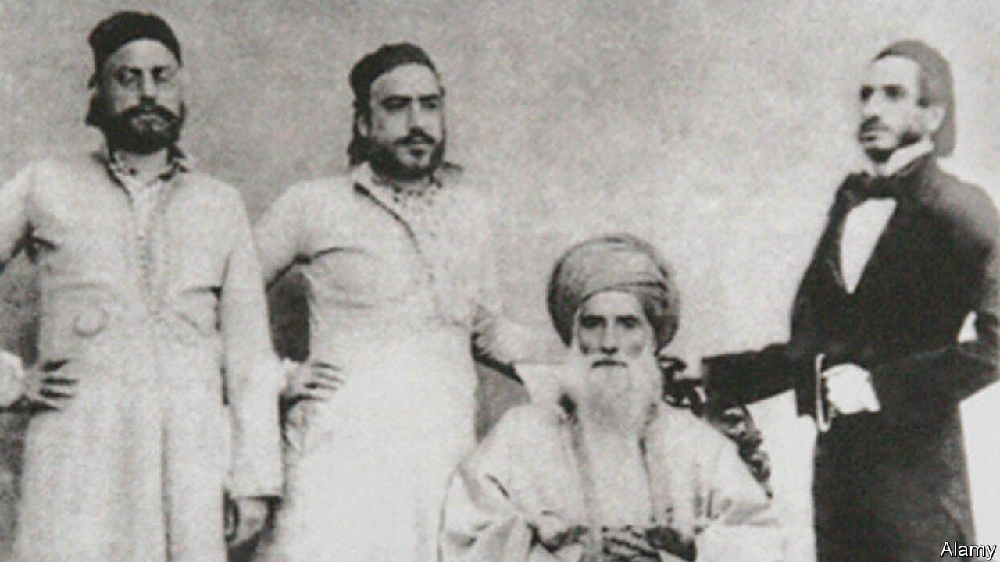

###### Keep it in the family

# The Sassoons were once Asia’s top business dynasty 

##### “The Global Merchants” tells the story of their rise and fall 

 

> Mar 26th 2022 

The Global Merchants. By Joseph Sassoon. Allen Lane; 412 pages; £30

BEYOND THE crumbling fish dock in Mumbai or on Shanghai’s Bund, few know of the Sassoons. Yet theirs was a fabled merchant empire that could once have claimed to be the first truly globe-spanning multinational. In the mid-19th century they were Asia’s most powerful business dynasty. Their decline is a warning to tycoons who dream of descendants perpetuating their eminence and riches.


The story begins with David Sassoon. His family were pillars of a Jewish community in Baghdad that dated to the Babylonian captivity. David, like his forebears, was treasurer to the Mamluk rulers of the province. Exactly why he fled from Dawad Pasha, a cruel potentate, is unclear; but as his grandson, Edward Sassoon, recounted, “certain it is that the place got too hot for him.” David arrived in Bombay in 1832.

The fact that Edward was an MP in Edwardian England hints at the family’s remarkable trajectory. Bombay was the springboard. The Industrial Revolution was in full stride, and the city epitomised a very British marriage of commerce and empire—like much of India, it was run by the East India Company. By the racist standards of the day, Bombay society was tolerant. Enterprising types were welcome, regardless of origins. The family of Jam setji Tata, India’s first industrialist, was soon on warm terms with the Sassoons.

No one doubted David’s probity. Along with a canny but cautious business sense, he was notable for his philanthropy, including the unfashionable activity of educating girls. But his strongest ties were with his family. He had eight sons and six daughters by two marriages. In time the sons were sent to run business outposts that stretched from Yokohama to London, via the coast of China, Calcutta and Cairo.

Letters were the family glue, written in the Baghdadi-Jewish dialect. The author of “The Global Merchants” is not a direct descendant of these Sassoons, despite his surname. But he does read the dialect, having himself been born in Baghdad. He brings out both David’s care for his children and his strictness: he expected at least a letter a week from each remote emissary.

The family rode the empire’s cresting wave. One war in particular turbocharged the Sassoon fortunes, when Britain forced Indian opium on China in 1839. The Sassoons became drug-runners, with a return trade in Chinese tea, along with Indian cotton, shipped to Britain. America’s civil war also favoured the Sassoons, who sent their cotton to Lancashire mills cut off from the plantations of the Confederacy.

The family adopted new technology—they were early users of the telegraph—and diversified into shipping and insurance. A competitor encapsulated the period: “Silver and gold, silks, gums and spices, opium and cotton, wool and wheat—whatever moves over sea or land feels the hand or bears the mark of Sassoon &amp; Co.”

Then, in 1864, the patriarch died and sibling rivalry set in. One ambitious son, Elias, set up in competition. Scions drifted to Britain and bought fine houses. The Prince of Wales was a friend. Marriage alliances were made, including with the Rothschilds, whom the Sassoons once regarded as upstarts but carried social cachet.

Moving to Britain sapped the clan’s entrepreneurial juices. Now conflict hurt them: a cotton slump after the first world war was vicious. The Sassoons had one last fling in the Shanghai of the 1930s, under Victor, a witty playboy and master of the Cathay Hotel. (This part of the story is more fully told in Jonathan Kaufman’s “The Last Kings of Shanghai”.) But in the end war—first Japanese aggression, then China’s civil war, won by the communists—did for Victor’s Shanghai venture too.

What remained of the Sassoon empire was now in the hands of outside executives. The Rothschilds and the Tatas had also brought in outsiders, but remained to supervise them. The Sassoons did not bother. The last traces of their business expired with the outside directors being declared unfit by the Bank of England. ■

