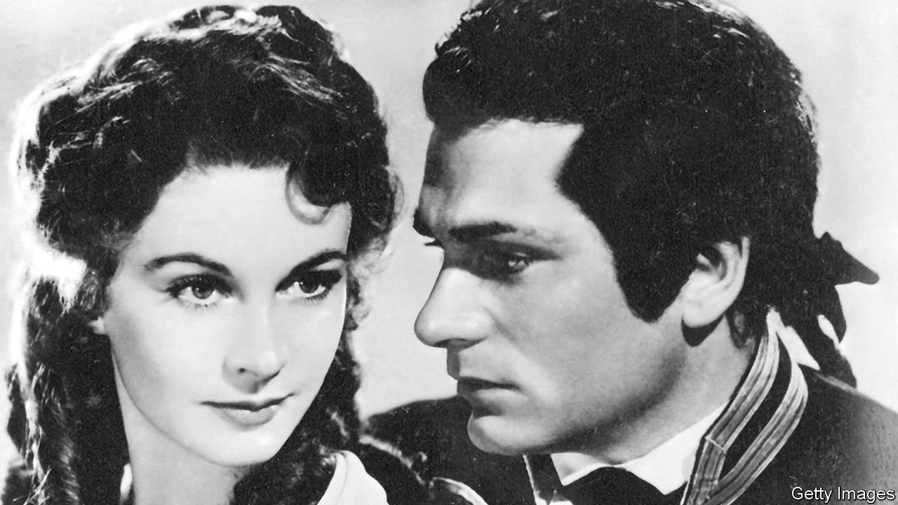

###### When stars collide

# The lives and love of Laurence Olivier and Vivien Leigh 

##### As Stephen Galloway shows in “Truly Madly”, theirs was a tumultuous union 

 

> Mar 26th 2022 

Truly Madly. By Stephen Galloway. Grand Central Publishing; 416 pages; $30. Sphere; £25

IN FEBRUARY 1940 Laurence Olivier and Vivien Leigh attended the 12th Academy Awards ceremony. Olivier was nominated as best actor for his performance as Heathcliff in “Wuthering Heights”; Leigh won the best actress Oscar for her turn as Scarlett O’Hara in “Gone With The Wind”. Two months later, the lovers embarked on an American theatre tour as Romeo and Juliet. Four months after that, having finalised divorces from their previous spouses, they were able to get married. That all happens within four pages of Stephen Galloway’s new joint biography. It must have seemed that the couple were leading the most charmed of lives.


The theme of the book, though, is that if (as its subtitle has it) this was “the romance of the century”, the runners-up must have been horrible. Leigh overdosed on sedatives while making “Gone With The Wind”, a notoriously long, gruelling and calamity-strewn production. When she won her Oscar, Olivier was “insane with jealousy”, he admitted. Reviews of their “Romeo and Juliet” were, he lamented, crushing in their “sheer, savage, merciless cruelty”.

And the wedding was “a shambles”. The bride and groom argued throughout their 90-mile journey to the ceremony. The justice of the peace was so drunk that he got their names wrong and wound up with a shout of “Bingo!” The tone was set for their 20-year marriage. Noel Coward, a long-term friend, summed up its later days in his diary: “Their life together is really hideous,” he wrote. They were “scrabbling about in the cold ashes of a physical passion that burnt itself out years ago…They are eminent, successful, envied and adored, and most wretchedly unhappy.”

When their careers separated them, they wrote agonised letters wishing they were together again. When reunited, they were racked by envy, resentment, exhaustion, infidelities, money worries, miscarriages, alcoholism and, in her case, tuberculosis. Leigh craved company, and threw endless parties in their Oxfordshire country home; Olivier wanted to be alone. He, meanwhile, was fixated on scaling ever higher peaks as an actor and director. After they divorced in 1960 Olivier had three children with his next wife, Joan Plowright. Leigh had still not got over him when she died in 1967.

“Truly Madly” is not revelatory. Relying on extensive quotes from previous biographies, and reports in film magazines and newspapers, the book is a well-researched survey of previous writing about the couple. Mr Galloway’s personal preoccupation is Leigh’s bipolar disorder, which prompted frequent manic episodes. He interviews various psychiatric specialists, and emphasises that her violent outbursts arose from a severe illness and not, as Coward put it, because “she has always been spoilt and when she fails to get her own way she takes to the bottle and goes berserk.”

Perhaps she and Olivier each needed a more stable helpmate. For all the trauma, though, they were well-matched in some ways. Olivier directed Leigh in several hit plays, and Leigh, a voracious reader, contributed numerous (uncredited) ideas to his productions. Their tumultuous relationship appears to have enriched their performances, too.

It is hard to say if life was imitating art or vice versa when Leigh played Lady Macbeth, Anna Karenina, and Blanche DuBois in “A Streetcar Named Desire”, but she and Olivier saw the parallels between their marital strife and their characters’ predicaments. “It was Vivien’s illness that made Olivier the great actor he became,” Simon Callow, another actor, tells the author. “He was forced to engage with overpowering emotions and to acknowledge that willpower was not the solution to everything.”

Something worked, anyway. Leigh won a second Oscar for “A Streetcar Named Desire”. Olivier won two for producing and starring in “Hamlet”, plus countless other awards. His achievements, especially, were prodigious, and he and Leigh were hailed as the king and queen of British theatre. Unfortunately, as in the Shakespeare plays they made their own, royalty was the stuff of tragedy as well as romance. ■

