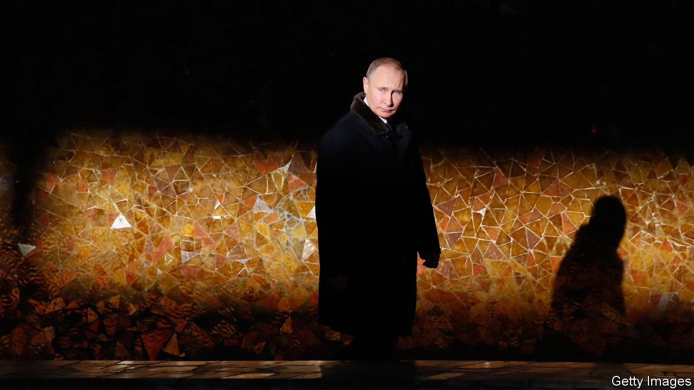
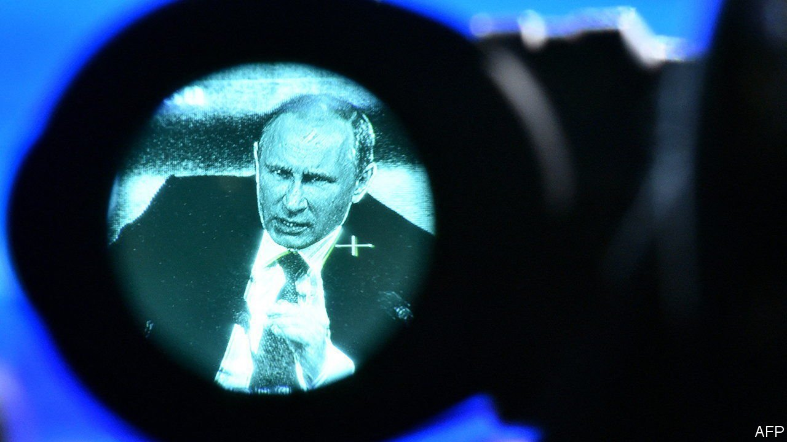

###### Understanding Russia’s president

# Writers have grappled with Vladimir Putin for two decades 

##### Greyness, greed and grievance have been the dominant themes 

 

> Mar 26th 2022 

HE WARNED US. Vladimir Putin gave notice of who he was, and what he was capable of, in “First Person”, a transcript of interviews published in 2000, at the start of his overlong rule. In his youth, he recalled, he had been a tough little hoodlum who fought rats in the stairwell of his communal-apartment building and, later, brawled with strangers on the streets of Leningrad. “A dog senses when somebody is afraid of it,” he had learned, “and bites.” He prized loyalty and feared betrayal. He was hypersensitive to slights, to both his country and himself (concepts which, in the decades that followed, became perilously blurred). He bore grudges.

One of them was over the collapse of the Soviet Union. In the interviews he reminisced about a jaunt to Abkhazia and a judo tournament in Moldova: the Soviet empire had been his wealth and pride, and when it fell, he took it hard. “I wanted something different to rise in its place,” he said of the lost Soviet influence in eastern Europe. Frantically burning papers as a KGB officer in Dresden in 1989, grieving the “paralysis of power” that seemed to have afflicted Moscow, he came to associate protesting crowds with disintegration. Corruption, meanwhile, was only to be expected in Russia, he implied—“and if somebody thinks that somebody stole something, let him go and prove it.”


Sometimes the Mr Putin of “First Person” appears frank, at others, cagey and withdrawn. Few people knew him well; he was seen as a grey man, inscrutable. Greyness, grievance and the greed of corruption have been the dominant themes in books written about him in English since. As he amassed resentments, secrets, assets and fears, the emphasis on these features has shifted. Looking back at a bibliography of Mr Putin shows how he has been changed—or exaggerated—by power, and how haltingly the world has grasped the threat he poses.

As Mr Putin rose without trace from St Petersburg to Moscow in the 1990s, then from the leadership of the FSB (the principal successor to the KGB) to the presidency, greyness was the main tone. Given his oxymoronic slogans, such as “managed democracy” and the “dictatorship of the law”, and his moves to neuter Russia’s media, courts, parliament and oligarchs, observers rarely mistook him for a genuine democrat. But some saw his co-operation with the West after the September 11th attacks as the start of a permanent realignment, not just a tactical feint. Many were slow to realise that his abuses were bound to seep across Russia’s borders.

In “Putin: Russia’s Choice” (2004) Richard Sakwa thought the country had shaken off nationalism and imperialism; he was confident its economic modernisation and global integration would continue. Andrew Jack was warier in “Inside Putin’s Russia” (2004), noting Mr Putin’s democratic backsliding and disregard for human rights. The “contradictions of economic liberalism and political authoritarianism will eventually clash”, he predicted. But he judged this “liberal Chekist” to be more reliable than his predecessor, Boris Yeltsin.

The comparison was widespread: outsiders’ sanguine views of Mr Putin were initially coloured by a feeling that things had been worse, and could yet be again. He seemed caught in a familiar Russian alternation between embracing and rejecting the West. The question seemed to be how useful or obstructive he would prove to Western plans—not whether he might try to remake the world.

Darkness and the don

David Satter was among the first Anglophone analysts to gauge the evil in the system. In “Darkness at Dawn” he accused the FSB of orchestrating a string of bombings in Russia in 1999 that killed around 300 people and ignited the second Chechen war—thus helping Mr Putin, who oversaw the fighting, to secure the presidency. Few were ready to digest that theory; several Russians who pursued it came to a sticky end. (Swap the word “Ukraine” for “Chechnya”, and Mr Putin’s comments on the war in “First Person” eerily fit today’s carnage and lies. His “historical mission” was to prevent Russia’s collapse, he claimed; what might look like aggression was really self-defence.)

In time writers understood that all of Mr Putin’s Russia, not just Chechnya, was ruled through power rather than by the law. As the rackets and redistribution of wealth became brazen, and the lifestyles of insiders pharaonic, greed ousted greyness as the main motif in commentary. The mafia became the preferred analogy for Mr Putin’s clique of siloviki, or strongmen.

In “The Man Without a Face” (2012), for instance, Masha Gessen characterised Mr Putin, then set to reclaim the presidency after a pro-forma stint as prime minister, as a killer and extortionist. This version of him—a KGB thug turned mafia godfather—had been “hidden in plain sight”, but obscured by wishful thinking and that grey veneer. Death and terror were politically useful to Mr Putin, the author wrote. He made no distinction between the state’s interests and his own.

The gangster network was definitively elaborated in “Putin’s People” (2020). In the system of “KGB capitalism” that Catherine Belton described, government in Russia was a machine for extracting rents and expropriating assets, politics a squabble over who got them, and the president its referee. The siloviki were bound together by a regime of mutual blackmail, in which secrets were both weapons and liabilities; for his part, Mr Putin had spilled too much blood and made too many enemies to retire. Besides self-enrichment, the spoils were used to undermine the West, black cash sloshing around the world to fund “active measures” and the “restoration of the country’s global position”.

The third characteristic—grievance—was always visible too. Notoriously, in 2005 Mr Putin described the fall of the Soviet Union as “the greatest geopolitical catastrophe of the 20th century”. After annexing Crimea in 2014, he said the Soviet collapse had left Russia pillaged and shamed. But the fact that his imperial bluster was much more than camouflage for graft, and where it might lead, took far too long to sink in.

In “The New Tsar” (2015), Steven Lee Myers perceptively identified the Orange revolution in Ukraine in 2004 as a breaking-point. Huge protests overturned the result of an election rigged in favour of Mr Putin’s candidate. The reversal combined personal humiliation with a geopolitical rebuff; his fear of crowds, and sense of the jeopardy of democracy, were inflamed.

He “nursed the experience like a grudge”, Mr Lee Myers wrote, tightening the screws in Russia, ramping up his propaganda and setting up tame youth movements to dominate the streets. Mr Putin’s bleak Chekist mindset could not admit the possibility that Ukrainians were turning West—and rejecting him—of their own volition. Convinced that the CIA had paid or cajoled them, he embarked on a spiral of meddling that culminated in the latest invasion. By 2014, thought Mr Lee Myers, he had found a “millenarian” mission as the indispensable leader of an exceptional power. “The question now was where would Putin’s policy stop?”

Among chroniclers of the Putin imperium, Clifford Gaddy and Fiona Hill best guessed the answer. In “Mr Putin: Operative in the Kremlin” (2015), they saw his efforts to make Russia’s economy more resilient, and to eliminate domestic opposition, as a long-haul preparation for confronting the West. His bid to undermine Western democracies through fifth columnists, bribery and kompromat was part of the same strategy. The greyness, they wrote, had always been tactical: Mr Putin was “the ultimate political performance artist”, his mercurial public persona a way to keep his adversaries off-balance.

 


Mr Gaddy and Ms Hill—who became the top Russia adviser in Donald Trump’s National Security Council—concluded that he was more than an avaricious gangster. His objective was to survive and overcome his foes, who, in his view, were Russia’s enemies too; to that end he was waging a long, hybrid war against the West. He would pounce on weaknesses, the pair warned, and fulfil his threats. “He won’t give up, and he will fight dirty.” Yet even these authors judged that, if only for reasons of trade, Mr Putin “does not want Russia to end up being a pariah state”.

The tsar’s ratchet

In retrospect, only the optimists got it wrong. As the novice president, squirming in his suit, aged and ossified into a Botoxed monster—if with the same villainous smile—the greyness faded out of his bibliography. Greed and grievance took over. What outside observers missed, though, was how much, over two decades, the ratcheting effects of power would exacerbate these old features.

According to the inexorable logic of authoritarianism, Mr Putin’s domestic repression grew ever more severe. He became more isolated, both diplomatically and among his advisers. He threw off moral constraints in his military campaigns. The nationalist rhetoric hardened into an apocalyptic ideology, which reached deep into history and cast Russia as a bulwark against the decadent West. His fear of crowds became a sort of narcissistic paranoia. He accumulated grudges—not least, against Ukraine—and stuck around long enough to avenge them.

Meanwhile the costs to his people—real Russians, rather than those of a stylised past—have mounted. His regime has always looted the country’s resources and lied to its citizens, with a contempt typical of authoritarians. As Russia’s soldiers perish on a needless battlefield and its civilians face ostracism, the callousness has become starker. Beyond books about the Kremlin, one insight into that treatment comes from the school of German historians, including Sebastian Haffner, who found a psychological rationale for the devastation Hitler visited on Germany: his rage, they concluded, had always been partly directed at his own country. The ruin Mr Putin is inflicting on Russia (even as he terrorises Ukraine) can be viewed in the same light. He says he loves the motherland, but his actions suggest the opposite.

The book that most clearly saw where Putinism was heading was not a history or biography but a novel. “Day of the Oprichnik” by Vladimir Sorokin, a Russian author living in exile, is set in 2028. The Russia it depicts seems to exist in two time-frames at once, futuristic technology jostling with medieval barbarity and obscurantism. The country is walled off from Europe and the tsar has been restored. His word is law, but even he must “bow and cringe before China”, which (along with gas exports) props up the economy. The oprichnik of the title is one of his elite henchmen—the name comes from an order of pitiless enforcers under Ivan the Terrible. Their methods are murder and torture, their sidelines extortion and theft.

Published in 2006, Mr Sorokin’s satirical dystopia has come to seem more prescient than outlandish. The details are grotesque, but also, sometimes, horribly familiar. In the story, when the wall was built “opponents began to crawl out of the cracks like noxious centipedes”—imagery that anticipates Mr Putin’s dehumanisation of his critics as gnats. Chillingly, when the oprichniks gather for a debauch, one of their toasts is “Hail the Purge!” ■

Read more of our recent coverage of the 


