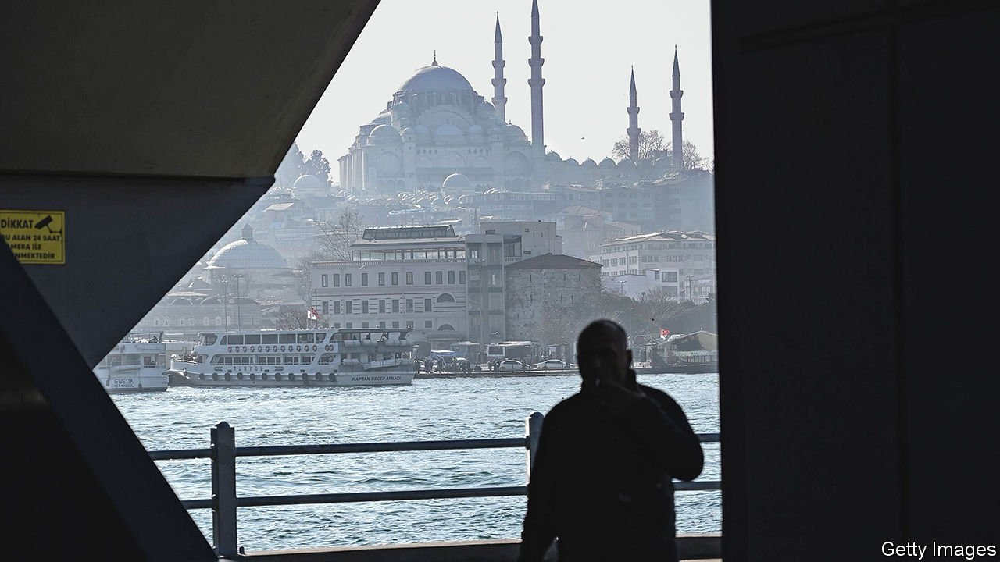

###### From the third Rome to the second

# Istanbul has become a refuge for thousands of Russians escaping Putin 

##### As in the 1920s, Russians are fleeing south from an oppressive regime 

 

> Mar 26th 2022 

ARSENY, A FASHION photographer, and his boyfriend Vova, a film director, woke up in Moscow on the day Russia invaded Ukraine and realised their country had reached a point of no return. “We had been living a lie,” Arseny says. A few days later, after seeing the streets choked with riot police, they boarded a plane to Istanbul. They and many of their fellow passengers had decided to leave Russia, with little hope of return.

Turkey’s biggest city has been a favourite among Russian tourists for decades. It has now become a temporary haven for Russians escaping Vladimir Putin’s dictatorship. They have few other places to go. All EU countries have banned flights from Russia. Turkey has not, and lets Russians in without a visa.


At least 14,000 Russians are estimated to have moved to Turkey since the war started, according to Turkish media. Most are young professionals: lawyers, bankers, journalists, programmers and artists. Hundreds turned up at a recent anti-war benefit concert by Miron Fyodorov, otherwise known as Oxxxymiron, a Russian rapper. On Telegram, a messaging app, the newcomers are exchanging tips on setting up Turkish bank accounts and applying for permanent residence.

They are following a path beaten by Russian exiles a century ago. In the 1920s some 200,000 Russians, Ukrainians, Azeris and Georgians fleeing Bolshevik rule reached Istanbul on crowded steamships. They included White Russian aristocrats, the novelist Vladimir Nabokov, and Fyodor Fyodorovich Tomas, a black impresario born in Mississippi who had run a music club in Moscow and who went on to introduce Istanbul to jazz. A visiting French princess spotted a Russian baron polishing shoes and recognised a waitress as a fellow princess she had seen at a ball in St Petersburg.

In the 1920s nearly all the émigrés moved on to Europe. Most of the new ones do not plan to stick around either. Arseny has applied for an American visa, Vova for a German one. But as long as Mr Putin wages war on Ukraine and on anyone who opposes his invasion, Istanbul will remain a way-station for many of Russia’s best and brightest.

