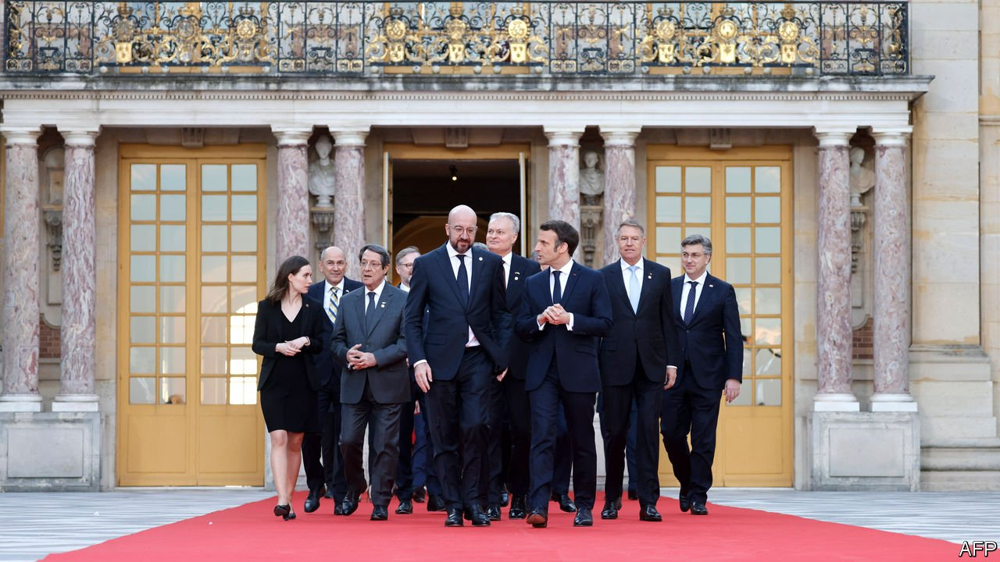

###### The concert of Europe

# The EU’s unity over Ukraine has given it surprising heft 

##### Remaining united will be a vital challenge 

 

> Mar 26th 2022 

IT MAY BE called the European Union, but it has often struggled to live up to its name. Not in recent weeks. Ever since the invasion of  by Russia on February 24th, the 27 member states of the EU have acted as one. Cohesive in its aims and co-ordinated in its actions, Europe has basked in its novel role as a first-rate power. Yet the unifying effects of the original jolt are starting to wear off. Ukraine’s demand that Europe should now do much more to help it is an early test of whether it can stay united as the war grinds on.

The speed and determination with which Europe initially acted startled even old hands in Brussels. Previous crises—whether the euro-zone miasma a decade ago or the bloc’s response to covid-19—had shown it could take months if not years for the union to work effectively. The sight of Russian bombs slaughtering civilians on the bloc’s doorstep, in contrast, shocked the EU into action.


Differences of emphasis remain, inevitable in a club of democracies. But repeated meetings of leaders—the third in a month was under way on March 24th as The Economist went to press, with America’s President Joe Biden in attendance—have resulted in Europe making decision upon momentous decision. Funds were found to  to Ukraine. Any Ukrainian seeking safe haven in the EU . Perhaps most important, tough sanctions were agreed as war broke out. Given that neither America nor Europe is willing to intervene militarily, this was to be the main tool. Few had expected much, given that any of the 27 member states could have vetoed sanctions.

Europe reached consensus, rather than total agreement, before moving forward. Unity was forged despite divisions over how tightly to isolate Russia. “Sanctionistas” have pushed for a stricter embargo, including a ban on . Countries such as Poland and the Baltic states worry that Russia might attack them next; they say they would be willing to live by candlelight if it means stopping money flowing to Moscow. A more hesitant bloc, including Germany and Italy, has been more reluctant to cut off the Russian energy supplies they depend on.

In part thanks to outraged public opinion, the hesitant group found themselves swept along into tougher measures than anyone had thought feasible—though still falling short of an energy embargo. Sergei Lavrov, Russia’s foreign minister, this week admitted the extent of the measures had taken the Kremlin by surprise.

But the old divisions linger. Poland is calling for a total ban on trade with Russia. Germany remains firmly opposed to doing more. “Sanctions should not hurt European states harder than the Russian leadership,” said Chancellor Olaf Scholz on March 23rd. (As often happens in EU debates, other countries agree but are glad not to have to make the case in public.) A familiar sense of gridlock now looms.

As a result Ukrainians who once lauded the benefits of European unity are now questioning it. “What we saw in the beginning of the war was the rise of the European Union as a powerful player that can bring change,” says Dmytro Kuleba, Ukraine’s foreign minister. “What I see in the last ten days in the European Union is backsliding back to its normality where it cannot decide on strong and swift action.”

Mr Kuleba, speaking to The Economist from an unspecified location in Ukraine, sees early signs of “sanctions fatigue” in Europe. Some of the measures agreed upon look less effective now that loopholes have been found. The freezing of Russian central-bank reserves held overseas, for example, has come with carve-outs that have allowed Russia to continue servicing its debt and stave off technical default.

There are other bones of contention. Ukraine has applied for EU membership. Eastern countries are keen to let it in. But founding members such as France and Germany have insisted that the bloc offer only woolly assurances about Ukraine being in “the European family”.

The EU could yet be forced into more sanctions—if Russia used chemical weapons, say, or committed some other battlefield outrage. Member states, and the bloc as a whole, are working to get arms to Ukraine (Mr Kuleba, unsurprisingly, would like more and faster). Regardless of how the war evolves, the security situation in Europe is likely to remain tense. Hence all sides are doing what they can to defuse fights that could sour the mood of unity.

Some will need answers soon. More than 3m Ukrainians have already sought refuge in the EU, for example. Nearly two-thirds of them are in , which will struggle to cope. A smaller influx of Syrian and Afghan refugees caused long and bitter spats in 2015. This time Poland will receive help, one way or another.

Other disagreements are bubbling up. Many are about money, made worse by sagging economic prospects. France was among those suggesting that the cost of sanctions and stronger defence should be met through a joint fund of the sort the EU raised to deal with covid-19; “frugal” northerners are sceptical. At some point a fight will occur about when to reinstate austere EU budget rules suspended during the pandemic. Poland is demanding the release of EU funds withheld over concerns it has hobbled its judiciary. Many national capitals are keen to uphold “rule of law” principles, war or no war.

Long-standing policies that seemed settled may be seen in a new light after the war. Can Europe afford to cut carbon emissions so rapidly, given the war’s shock to energy supplies? France is keen to push its idea of “strategic autonomy”, a nebulous concept that includes Europe relying less on NATO for its defence. Eastern Europe still views the alliance, and thus America, as the guardian of its borders.

Mr Kuleba’s frustration that fresh waves of European sanctions are not forthcoming is understandable. But the disagreements at the heart of the EU today reflect legitimate differences of opinion, not pointless squabbling. Europe’s spurt of unity gave it a hard-power relevance it has rarely enjoyed. One month into the war, the union has served its purpose well. But it must now strive to do more. ■

Read more of our recent coverage of the 

