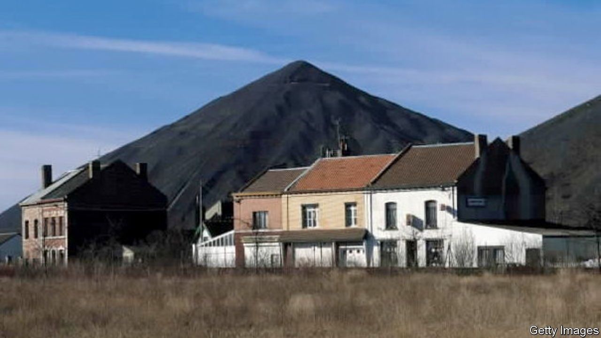

###### Seeds of discontent

# Voters seek an alternative to Macron in blighted France 

##### But the president remains the favourite 

 

> Mar 26th 2022 

THE LAST pit in this northern French village closed in 1974, but the silhouettes of its slag heaps still rise in the distance across flat farmland. They bear witness to the muscular past of the mining basin, which a century ago employed 130,000 people. Today its jobless rate is ten points above the national average, and one in five of its people live below the French poverty line of €1,100 ($1,200) a month. Once a week Ma P’tite Epice Rit, a voluntary food truck, stops by the church in Auchy-les-Mines to sell discounted food near its expiry date to those living on less than €10 net a day. The truck serves some 100 residents. “People here are asphyxiated by daily life,” says a local shopkeeper.

Bypassed by high-speed trains and breezy ambition, Auchy belongs to what analysts call “peripheral” France. Peggy Belicki, who a year ago set up the food truck, filled with apples, potatoes, cabbages and chocolate tarts, says she caters to all sorts, from pensioners to single parents: “We offer a sort of moral-support service.” For years, this working-class town looked to the Communist Party to supply social assistance and ideological answers. The mayor, Jean-Michel Legrand, is from the Communist Party, as were his predecessors reaching back over half a century.


Yet in 2017, at the previous presidential election, the nationalist-populist Marine Le Pen topped first-round voting in Auchy. In the run-off, 65% of its voters backed her; just 35% backed Emmanuel Macron. Ahead of the two-round election on April 10th and 24th, polls say she is the most popular choice for blue-collar voters nationally, and again the most likely to face Mr Macron in the run-off. Promising to keep out immigrants and ease the cost of living, Ms Le Pen has built a stronghold in the northern rustbelt, especially among voters who once leaned to the far left. She represents a northern seat in parliament. And, since 2014, her party has run the town hall in nearby Hénin-Beaumont, where this week she took her campaign bus.

Other candidates are also tapping into the yearning in blighted corners like this for an alternative to the sitting president. One is Jean-Luc Mélenchon, a razor-tongued 70-year-old from the hard left who is on his third presidential run. He came second in first-round voting in the village in 2017. Another is Eric Zemmour, a far-right polemicist whose latest wheeze is “re migration” to send 1m immigrants “home”.

On a recent weekday, Emmanuelle Danjou, a sales manager, was slipping leaflets for Mr Zemmour into letter boxes on an estate of neat two-storey homes. His programme “is really focused on a reconquest of our country. We’ve lost our values; we’re dismantling our country, our history”, she says; “He says out loud what many French people think in private.” Frédéric Dewitte, from a nearby village, joins her leafleting. He used to back Ms Le Pen but now finds her “too left-wing”, and not Eurosceptic enough. Mr Zemmour, he says, is a “man of culture” who could “possibly save France”.

Dislike of Mr Macron is not universal in Auchy. “Excusez-moi, he hasn’t had an easy task,” says a 70-year-old standing in his garden in plastic slippers. On the high street, where the “Best Kebab” joint sits near a boarded-up insurance agency, another man agrees that it is “unfair” to judge the president too harshly, what with the pandemic and war in Ukraine. Yet there is little love for him. He “values globalisation and Europe more than France”, declares Mr Dewitte. Many locals think he has governed for the rich, not for people like them.

This matters for Mr Macron. Not because he needs their votes: polls suggest that he would easily beat any potential rival in the run-off. But if he is re-elected, Mr Macron will have to govern a discontented and volatile country which readily takes its unhappiness to the streets. Some of his campaign proposals, unveiled on March 17th, would be vigorously contested, notably his promise to raise the pension age from 62 to 65. Mr Macron may be well placed to win the presidency, and possibly even a new majority at parliamentary elections in June. But, as Auchy-les-Mines suggests, governing a fractured France may be even harder the second time around. ■

For more coverage of the French election, visit our dedicated 

