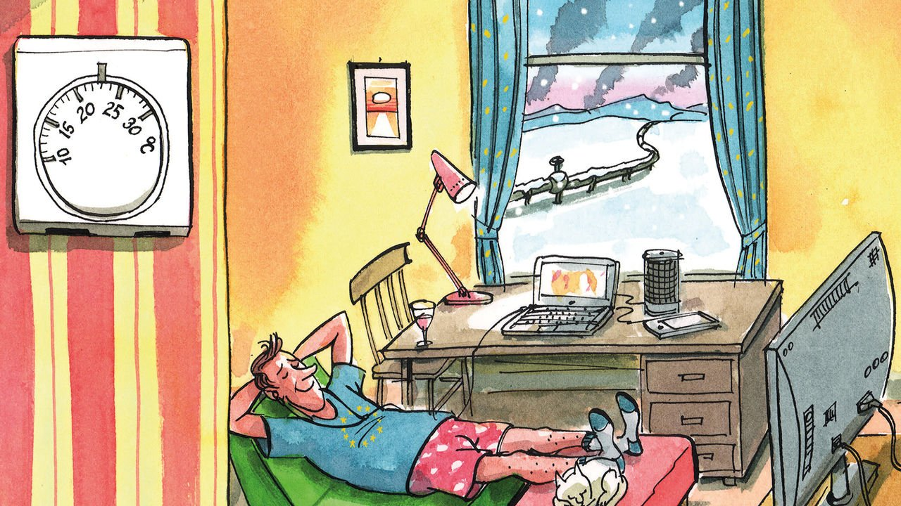

###### Charlemagne

# Weaning Europe off Russian energy will mean making changes 

##### So far, little has been asked of citizens 

 

> Mar 26th 2022 

AT LAST, the spring. For months Europeans have lived with the threat of losing the Russian gas that keeps their homes warm. The prospect seems less daunting now that daffodils are blooming. But despite the seasonal serenity, a wrenching energy transition is under way. Europe wants to cut imports of gas from Russia by two-thirds within a year. Behind the scenes, politicians and companies are already scrambling to work out how to cope next winter. The obvious upshot, one might expect, would be a change in consumer behaviour not seen since the 1970s, when dizzying oil prices caused a rethink of how the West lived. Not so. While European leaders exude an air of war-time concern, the public is living as if nothing were amiss in a continent at peace.

Energy prices, whether of petrol, gas or electricity, have rocketed in Europe. Some people might barely have noticed. In France, the authorities have essentially capped electricity and gas bills. Italy on March 18th added €4.4bn ($4.8bn) in subsidies to limit power-price rises for companies and consumers, on top of the €16bn already agreed in recent months. Several countries have cut petrol duties, a much-needed source of tax income. European leaders meeting in Brussels as The Economist went to press were due to discuss new state largesse to households and industry. This is the “whatever it takes” approach at work. As with covid-19, government is paying first and will ask questions later.


What is startling is how little is being asked of Europeans. Even simple measures that might barely inconvenience people are treated as taboo. Earlier this month the International Energy Agency (IEA), which advises rich-country governments, suggested that Europeans might consider turning down the thermostat by just one degree centigrade. What might seem like mere virtue-signalling greenery would actually cut consumption by 10bn cubic metres of natural gas over a year. That is roughly one month’s worth of Russian imports. This modest appeal was relayed by precisely nobody in office.

Some EU governments want to ban Russian oil, the Kremlin’s biggest money-spinner. Yet no one is seriously considering the obvious way of using less of it. Lowering motorway speed limits by 10kph would trim fuel use in the rich world by around 15%, not to be scoffed at when Europe is scrambling for any hydrocarbons it can get. Throw in subsidies to boost the use of public transport, a plea to work from home one day a week where possible and a ban on car use in cities on Sundays, and Europe could save perhaps a fifth of the Russian oil it imports, according to IEA figures and Charlemagne’s guesswork. These may or may not be sensible ideas. The point is that they are not being discussed.

Why is Europe not rediscovering the spirit of the 1970s? Back then the European public was expected to accept some discomfort and inconvenience. Speed limits went from the exception to the norm (except on German autobahns, of course). Dutch and German cities were among those that went pedestrian one day a week. France decreed public buildings should be no warmer than 20°C, two degrees lower than today’s European average. Television broadcasting was shut off at 11pm, an idea that could usefully be revived for social media. Daylight-saving schemes adopted during the world wars were soon revived across the continent. “Whatever it takes” involved people donning jumpers.

Lots of ideas to cut back energy use tomorrow are being mooted. But few Europeans are even being nudged to use less energy today. One reason may be that the rich world has changed in 50 years. Past crises have helped make modern economies more energy efficient. The current oil and gas shock is not so painful, especially since the world has become used to seesawing crude prices. But recent history outside Europe suggests that rapid change is possible. After Japan shut down its nuclear plants in the aftermath of the Fukushima disaster in 2011, a public-information campaign beseeched people to cut back energy use. Trains were slowed, air-conditioners were turned down and employers moved shifts to save power. A similar campaign is nowhere to be seen in Europe.

Keep cool

The absence of such measures reflects three factors. The first is that Europe may not truly be committed to weaning itself off Russian hydrocarbons. More storage of gas at EU level, as looks likely to be agreed, could dent Russia’s stranglehold on Europe. Some might think that will solve the problem, at least if the war ends soon. Keeping the option, if not the necessity, of importing Russian gas would avoid a painful pivot away from cheap power.

Second, energy is a politically toxic topic. The mere mention of speed limits or dearer petrol triggers accusations of urban politicians ignoring the plight of car-dependent provincial folk. Spanish farmers are protesting about energy prices. France’s president, Emmanuel Macron, wants no more gilets jaunes protests ahead of an election next month. Europe is on a glide path to “net zero” emissions, to which the Ukraine crisis has given fresh impetus. Sensible long-term policy might be derailed by rash short-term measures in reaction to transient (albeit traumatic) events.

The third, and most depressing, possibility is that politicians now think their electorates are incapable of sacrifice. Two years of pandemic-era nagging has tested the public enough. The end of covid-19 restrictions (if not the virus itself) was meant to presage a new Roaring Twenties. That is no time for hair-shirt preachiness. “A Europe that protects” is a recent Brussels mantra: citizens must not be inconvenienced by a changing world.

This is a shame. Ukrainians are daily making sacrifices on an extraordinary scale. A growing number of Europeans are opening their homes to them and making donations. The public mood in Europe is of defiance towards Vladimir Putin. Nobody needs a politician’s blessing to lower the thermostat or skip a flight. But it is depressing that none of them has even thought to ask. ■

Read more from Charlemagne, our columnist on European politics:

 (Mar 12th) (Mar 5th) (Feb 26th)

Our recent coverage of the Ukraine crisis can be found 

