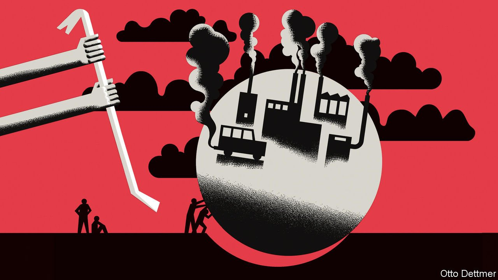

###### Free exchange

# Have economists led the world’s environmental policies astray? 

##### A new book argues for a supercharged approach to net zero 

 

> Mar 26th 2022 

IF THE WORLD economy fails to decarbonise, it will not be because of the cost. The gross investment needed to achieve net-zero emissions by 2050 can seem enormous: a cumulative $275trn, according to the McKinsey Global Institute, a think-tank attached to the consultancy. But over a period of decades the world would have had to replace its cars, gas boilers and power plants anyway. So the additional spending needed to go green is in fact much smaller: $25trn. Spread that over many years and compare it to global GDP, and it looks significant but manageable, peaking at 1.4% between 2026 and 2035. And that is without counting the returns on the investment. British officials reckon that three-quarters of the total cost of the transition to net zero will be offset by benefits such as more efficient transport, and that the state may need to spend only 0.4% of GDP a year over three decades.

The challenge of getting to net zero, therefore, is not primarily budgetary but structural: how do you design politically viable policies to ensure the transition actually happens? That is the question Eric Lonergan, an economist and fund manager, and Corinne Sawers, a climate consultant, take on in their new book “Supercharge Me: Net Zero Faster”.


The authors are not kind to economists, who typically want to put a price on emissions and then let markets do the work. Economists have, the authors allege, skipped a chapter in the textbooks. They have focused on externalities, the damage done to society when carbon is emitted. But they do not think about the elasticity of demand—the extent to which prices change behaviour.

Carbon prices do not alter people’s choices much when there are too few substitutes for dirty goods, or when those substitutes are too expensive. High fuel taxes, for example, tend to provoke a political backlash against environmentalism—think of France’s gilets jaunes—but do not much alter transport emissions. Britain has had one of the highest levels of fuel duty in the rich world in recent decades, note Mr Lonergan and Ms Sawers, but drivers’ take-up of electric vehicles has been unremarkable.

The authors argue that getting people to make the big leaps needed to decarbonise, such as buying an electric car or installing a domestic heat pump, instead requires “extreme positive incentives for change” (EPICs). They laud Norway for exempting electric vehicles from road tax, cutting their parking charges in half and giving them access to bus lanes. (More than 90% of cars sold in the country are now electric.) They propose big mortgage discounts for homeowners who retrofit their properties. And they want the state to generously subsidise lending to green projects while exempting them from a range of taxes. “To succeed we have to fight on all fronts,” they write.

Their assault on carbon pricing is not entirely without merit. The theoretical attraction of the policy is that it leads the market to discover the cheapest ways to cut emissions, where behaviour is easily changed, while allowing other parts of the economy to choose to pay the toll. Economists in Barack Obama’s White House were among those who puzzled over the “social cost of carbon”—the optimal carbon price that would deter some emissions, but not those that were sufficiently beneficial to the economy to offset their effect on global temperatures.

But in a world of fixed-date net-zero targets this sort of logic loses power. Such goals concern all pollution, not just that which is easily abated. Saying there is a maximum permissible amount of global warming of 1.5-2°C above pre-industrial levels—the targets in the Paris agreement—is like saying there is a point at which the social cost of carbon is infinite. In this world policymakers are not setting a carbon price to distinguish between emissions. They are trying to change behaviour. It may be that EPICs or investments in green technology are a more politically viable route to doing so than raising the carbon price to whatever level is necessary to extinguish inelastic demand for fossil fuels.

Yet the authors push their criticism of carbon prices too far. They praise Britain’s adoption of wind power, but fail to note the role that its “carbon price floor”, a minimum levy bolted on to the EU’s emissions-trading scheme, played in the transition. They lament the “complexity” of carbon taxation, while also advocating a fiddly green corporate tax. And they fail to notice the flawed political economy of their kitchen-sink approach. For example, they call on central banks to provide the green subsidies they desire. To whom would the central bank be accountable? And once the principle that monetary policy does not allocate capital is conceded, what is to stop other demands being made on it? Carbon pricing is simple and transparent by comparison.

Casting the net wide

Moreover, there is an important role for carbon pricing even in a net-zero world. One area of technological possibility concerns the removal of carbon dioxide from the atmosphere. The potential for “direct air capture”, or a well-governed market for carbon offsets such as planting trees, restores the logic of using carbon prices to discriminate between emissions as well as simply deterring them. If such advances materialise, the carbon price might eventually be the exact cost of extracting carbon from the atmosphere, with the market determining the size of the gross flows on either side of the net-zero ledger.

Even if Mr Lonergan and Ms Sawers are right that some EPICs are needed to make the journey to net zero politically easier, then, economists’ long-standing arguments for carbon pricing still have considerable merit. And the world has been slowly coming round: in 2021 more than 20% of greenhouse-gas emissions were covered by a carbon-pricing scheme, up from about 5% a decade ago. The path to net zero will involve more than set-it-and-forget-it carbon pricing. But economists’ favourite climate-change policy remains an essential one. ■

Read more from Free Exchange, our column on economics:

 (Mar 19th) (Mar 12th)

 (Mar 5th)


