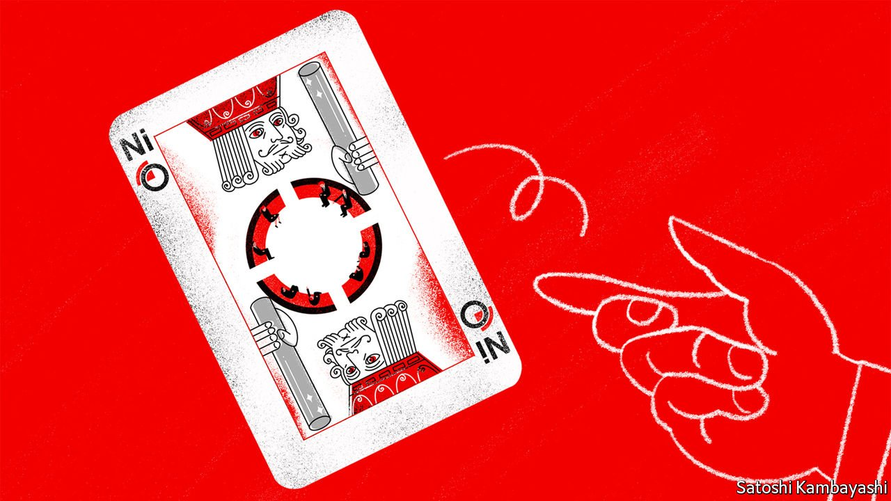

###### Buttonwood

# The parallels between the nickel-trading fiasco and the LIBOR scandal 

##### From afar London’s vaunted finance-industry heritage looks a lot like backwardness 

 

> Mar 26th 2022 

IN “CASINO”, A film from 1995, Joe Pesci plays Nicky Santoro, a violent gangster with a short fuse. Santoro has been losing heavily at blackjack. If the next card is a picture card, he will lose some more. The dealer turns the king of clubs. Santoro angrily flicks the card back and, in the saltiest language, orders the dealer to try again. A nervous floor manager nods his assent. The dealer turns the queen of hearts. Santoro grows angrier. The dealer tries again. The same sequence—picture card, profanity, fresh deal—is repeated, until Santoro has a winning hand.

In real-life casinos, as in financial markets, you do not get another free go if your bets go awry. Nor do you get your money back—except, apparently, at the London Metal Exchange (LME). This week the buying and selling of nickel on the exchange is slowly getting back to normal. But the cancellation of some inconvenient trades prior to a two-week hiatus in active nickel trading has damaged the reputation of the LME and the standing of London as a financial centre. A parallel that springs to mind is LIBOR—another London-branded benchmark that global finance lost faith in.


Start with a recap. The price of nickel, a metal used in stainless steel and electric-vehicle batteries, had been rising in the wake of the invasion of Ukraine. Russia produces a fifth of the world’s purest-grade nickel. Stocks were already low. Then, on March 7th, nickel prices rose by 66% to $48,000 a tonne. In the early hours of March 8th the price doubled. The LME suspended trading in nickel, judging that prices no longer reflected the underlying physical market. But it went further. It cancelled all trades made after midnight. The price rises, the exchange said, had created a systemic risk to the entire market.

What happened was a classic short squeeze. At its centre was Tsingshan Holdings, a Chinese nickel producer, which had short positions (bets on falling prices) on the LME but also away from the exchange. Its attempt to cover the shorts by buying back nickel at inflated prices only drove the price higher. The fear was that Tsingshan could not make its margin calls, interim payments to parties on the other side of the trade. That might have taken down some of the LME’s member-brokers. Exchanges call a halt to trading from time to time. But the cancellation of trades is extremely rare. And in other asset markets, the parties who lose out to extreme price moves have to take those losses. They don’t get to flick the cards at the dealer and expect him to try again.

The LME justified its actions as protecting the integrity of the physical market. In doing so, it created a divide. On one side are the miners and metal-bashers that rely on the exchange for trading, pricing and hedging services. On the other side are fund managers, who use its futures and options to gain exposure to commodities as an asset class. The LME, which has a parent company in Hong Kong, seems to have favoured the first group over the second. For some, this was the right call. They see the exchange as a venue for metals trading, not a casino. But speculators are vital. Producers sell futures to insure themselves against a price rout that would threaten their solvency. Someone has to take the other side.

This is where the parallel with LIBOR comes in. The London Interbank Offered Rate was supposed to represent the interest rates at which banks lent to each other overnight. It was based on a survey of bankers. During the financial crisis of 2007-09, some bankers submitted false quotes to serve their private interests. Trust was destroyed. But so embedded was LIBOR as a benchmark, that it has taken many years to phase it out.

Though nothing the LME has done is illegal, trust in it has also been compromised. The metals prices set on the exchange are far less central to finance, but they are nonetheless the benchmark for industry pricing. And as with LIBOR, it is not easy for users to quickly take their business elsewhere. Like all established exchanges, the LME benefits from the power of networks: the more traders it attracts, the more others flock to it. A consequence is that the LME has a formidable market share in metals trading.

Like many London institutions, it leans on its heritage. It has a 145-year history, and is the last open-outcry venue in Europe. Viewed from New York or Connecticut, though, heritage looks like backwardness, and the LME’s face-to-face trading a sign of its insularity. For now nickel trading has resumed in London. Players have returned to the tables, a few of them cursing like Santoro. But the game will never be quite the same again.

Read more from Buttonwood, our columnist on financial markets:

 (Mar 19th)

 (Mar 12th)

 (Mar 5th)

For more expert analysis of the biggest stories in economics, business and markets, , our weekly newsletter.

