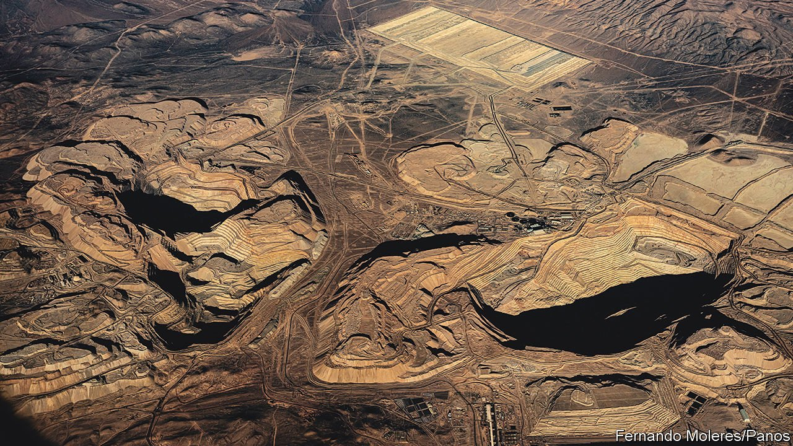
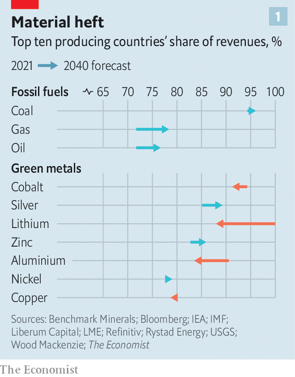
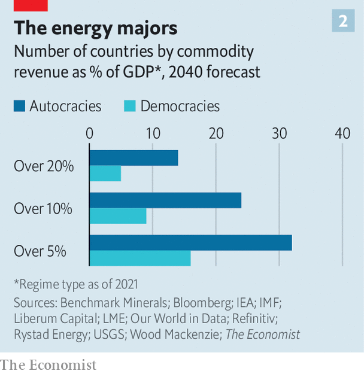
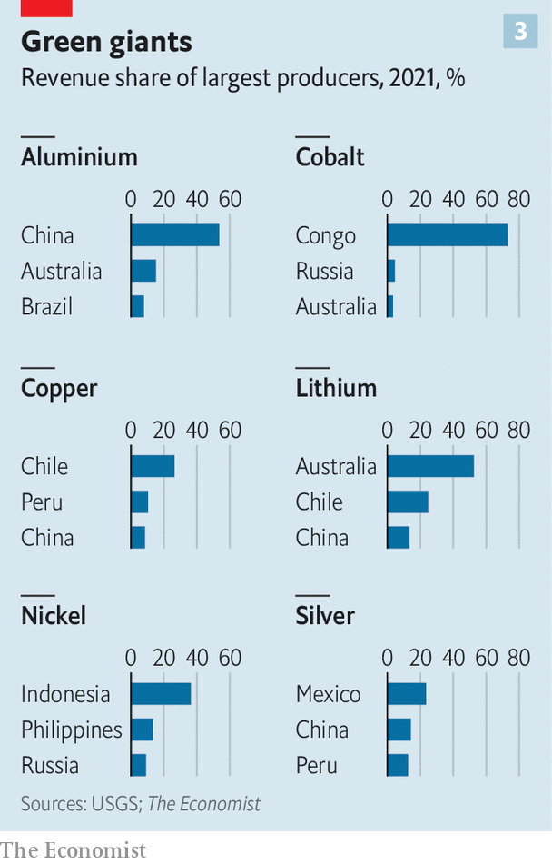

###### Full metal jackpot

# The transition to clean energy will mint new commodity superpowers 

##### We look at who wins and loses 

 

> Mar 26th 2022 

IN MID-FEBRUARY Russia seemed on the verge of a revolution with a distinctly reddish tint. Alisher Usmanov, an oligarch, was developing Udokan, a copper mine in Siberia that required removing an entire mountain top. In the Arctic tundra Kaz Minerals, a mining firm, had raised enough cash to build Baimskaya, a rival mine so remote that it needed its own port, icebreaker and floating nuclear plant. For years the projects had been put on hold because of their immense costs. But expectations of soaring demand for copper, used in everything from grids to turbines, had boosted prices of the auburn metal, making the mines viable.

Now the copper price is even higher. But the projects are in trouble. Insiders say they are short of vital foreign equipment that has been blocked by the West after Russia’s invasion of Ukraine, and that they are starved of the funds they had expected from blacklisted Russian banks. Mr Usmanov, too, faces sanctions. A spokesman for Udokan says, “We are doing everything we can to ensure business continuity.” Yet even if the mine starts producing this year as planned, it is unclear who will buy its output. Foreigners, even the Chinese, are shunning Russian production.

 


As the world weans itself off dirty fuels, it must switch to cleaner energy sources. The International Energy Agency (IEA), an official forecaster, predicts that wind and solar could account for 70% of power generation by 2050, up from 9% in 2020, if the world embarks on a course to become carbon-neutral by 2050. That translates into huge demand for the metals, such as cobalt, copper and nickel, that are vital for the technologies underpinning everything from electric cars to renewables; the IEA reckons that the market size of such green metals would increase almost seven-fold by 2030. And much like fossil-fuel reserves, these commodities are distributed unevenly (see chart 1). Some countries have none at all. Others are blessed with vast deposits.


The metals rush will not be as big as the oil-and-gas boom that toppled King Coal after the second world war. But there are some echoes with the past. Between 1940 and 1970 the share of hydrocarbons in the energy supply of rich countries rose from 26% to nearly 70%. Once-marginal economies in the Middle East were transformed into uber-rich petrostates. Between 1970 and 1980 the GDP per person of Qatar and Saudi Arabia grew 12- and 18-fold, respectively. Bedouin villages became boom towns; fishing dhows gave way to super tankers and luxury yachts.

This time the transition will bring windfalls to countries we dub the “green-commodity superpowers”. We calculate that this club, many of which are poor economies and autocracies, could pocket more than $1.2trn in annual revenue from energy-related metals by 2040.

With the opportunity, however, come risks. As the troubled mining projects in Russia show, important investments can become victims of local conditions and geopolitics. Huge rents could corrode domestic markets and political institutions; autocrats enriched by electrodollars could make mischief beyond their borders. Saad Rahim of Trafigura, a trading firm, says the shift to clean fuels is “less an energy transition than a commodity transition”. It will be a turbulent one.

The green boom is not just another “supercycle”, as prolonged periods of high commodity prices are known. The last such cycle, early this century, was fuelled by rapid urbanisation and industrialisation in China. The combined real GDP of Brazil and Russia, two resource-rich economies, grew by two-thirds between 2000 and 2014. But the rally was largely driven by China alone. When the country’s leaders decided it should build fewer factories and flats, the commodity giants suffered. The green transition, by contrast, stems from the decisions of many governments, not one. And decarbonising the world is likely to be the job of decades.

Another big difference lies in the materials in demand. China’s splurge burned through heaps of coal, iron and steel. The green boom centres on non-ferrous metals that are more niche. Their combined annual revenues today, at $600bn, is equivalent to only a fifth of that of the bulk materials that China favoured. There may be more explosive growth to come.

To understand which commodity producers stand to win and lose from a green transition, we construct a simple scenario for the use of ten “energy-linked” commodities in 2040, assuming that global warming by 2100 stays below 2°C. Based on data from a range of industry sources, we project demand and revenue for three fossil fuels (oil, gas, coal) and seven metals (aluminium, cobalt, copper, lithium, nickel, silver and zinc) that are critical to building an electricity economy. We assume that prices remain at today’s elevated levels, prompting miners to exploit untapped deposits. And we assume that a producer’s market share in 2040 is in line with its share of known reserves.

Our findings suggest the world will be less reliant on energy-related resources in 2040 than it is today—largely because wind and sunshine, the sources of the future, are free. Total spending on our basket of ten commodities falls to 3.4% of global GDP, from 5.8% in 2021. Spending on fossil fuels, relative to world GDP, falls by half (and would shrink further were it not for gas). The revenue from green metals remains smaller, but rises from 0.5% to 0.7% of GDP. It nearly triples in absolute terms.

 


The number of big producers of energy-linked commodities falls over time: 48 stand to pocket sales equivalent to more than 5% of their GDP, down from 58 in 2021 (see chart 2). More than half of total spending goes towards autocracies.

You can group producers into three buckets, based on the expected change in their revenues from the ten energy-linked commodities between now and 2040. The first comprises the winners—the green superpowers. These electrostates include some rich democracies. Australia has troves of every metal included in our sample. Chile is home to 42% of the world’s lithium reserves and a quarter of its copper deposits, much of them in the Atacama desert (pictured above). Others are autocracies. Congo has 46% of global cobalt reserves (and produces 70% of the world’s output today). China is home to aluminium, copper and lithium. Poorer democracies in Asia and Latin America may also hit the jackpot. Indonesia sits on mountains of nickel. Peru holds nearly a quarter of the world’s silver.

The second bucket comprises countries with revenues that stay flat, or fall a little. It includes the low-cost members of the Organisation of the Petroleum Exporting Countries (OPEC)— including Iran, Iraq and Saudi Arabia—and Russia. Although oil revenue shrinks, their share of it expands from 45% today to 57% in 2040. Other countries, such as America, Brazil and Canada, lose fossil-fuel earnings but are able to tap vast mineral deposits.

Higher-cost petrostates lose the most. Many oil-rich nations in north Africa (Algeria, Egypt), sub-Saharan Africa (Angola, Nigeria) and Europe (Britain, Norway) see their revenues shrivel. Small states like South Sudan, Timor Leste and Trinidad have theirs hit hard. The pain does not spare some Gulf states: the proceeds captured by Bahrain and Qatar, for instance, decline by a fifth or more.

What might prevent the new commodity superpowers emerging? The key ingredient is capital spending. The IEA estimates that major mines that came online in the past decade took, on average, 16 years to build. To meet booming demand by 2040, the industry must splash out on new projects now. The sums required are big. Julian Kettle of Wood Mackenzie, a consultancy, reckons $2trn must be spent on green-metal exploration and production (E&amp;P) by 2040. Recent projects suggest digging out enough copper and nickel alone would require $250bn-350bn in capital expenditure (capex) well before 2030.

Pedal to the metal

Some of the outlay is taking place. Anglo American, a miner, aims to expand its copper output by 50-60% by 2030. “We will deliver our part of the bargain,” says Mark Cutifani, its boss. Many others will not. Burnt by the commodity crash of the mid-2010s, mining majors have reduced investment. Liberum Capital, an investment bank, calculates that annual copper E&amp;P capex has fallen by half since 2014, to $14bn. As prices rise, so do profits. But cash is being given back to investors rather than redeployed. “Supply growth has almost become a dirty word,” says Stephen Gill of Pala Investments, a venture-capital firm.

Only China is spending a lot. In Kolwezi, in Congo’s cobalt belt, barefoot children greet all foreigners with shouts of “ni hao”. Chinese groups have nabbed most big commercial deposits; Albert Abel, an artisanal miner, complains they have bought most small mines too. Glencore, an adventurous Swiss trader, is the only Western firm to have a foothold. In Indonesia Chinese miners are clearing swathes of rainforest to dig out nickel.

The capex drought is a result of three daunting problems: the industry’s limited firepower, diminishing investment returns and rising political risk. Start with firepower. Though what miners must spend over two decades is equivalent to only four years of typical oil E&amp;P capex, it still seems beyond the capacity of the comparatively tiny sector. Even big miners can only fund one serious project at a time.

This might be fixed by tapping capital providers beyond the majors’ usually cautious public-market investors. These could include vertically integrated manufacturers that rely on scarce minerals. Tesla, an electric-car maker, has promised to buy the future nickel production of mines in Australia, Minnesota and New Caledonia. Private-equity firms and state-backed national champions tasked with securing supply could also chip in.

A second problem is the worsening quality of mineral deposits. Udokan says it is the last potential mine with copper content above 1% of the rock. The average grade of Chilean copper has fallen by 30% over the past 15 years, to 0.7%. Lower grades are pushing up extraction and processing costs (and carbon emissions). “Today we use 16 times more energy to make the same pound of copper as we did 100 years ago,” says Mr Cutifani.

 


Innovation may help. Last year BHP, another miner, and Equinor, Norway’s state-backed energy firm, invested in an artificial-intelligence startup that sifts through 20m pages of state and scientific archives to identify where new deposits might lie. In time technological breakthroughs could even make exploring sea floors profitable. The world’s 67,000km of mid-ocean ridges contain a lot of copper, cobalt and other minerals. This, too, could mint electro states: Fiji (8%) and Norway (5.5%) hold the most economic rights to those ridges.

Yet innovation also makes future returns less certain. The durably high prices that miners need to invest will also encourage big buyers to seek alternatives to the dearest metals. Tesla’s batteries include less than 5% cobalt, down from one-third just a few years ago. Innovation could also facilitate recycling. By 2040, the IEA reckons, extracting cobalt from old batteries could help meet 12% of total demand.

Game of stones

Perhaps the biggest risk to investment comes from politics. The minerals mania stands to make some poor economies rich overnight. The story of commodity booms over centuries, including the hydrocarbon bonanza, shows that this resource blessing can also be a curse, which could in turn discourage further investment.

Gigantic oil rents have made many countries unstable. Rival factions vie to control riches, fuelling inequality and strife. Vast dollar inflows buoy local currencies, crushing exporters. Debt binges during boom times trigger fiscal crises when the cycle turns. Resentful populations make domestic politics even more fractious. Take Nigeria. In 1965 it exported ten different commodities, from cocoa to tin. Two decades of oil discoveries later, petroleum accounted for 97% of its merchandise exports, and had contributed to political instability.

The worry now is that history repeats itself. Some electrostates are poorly equipped to manage windfalls. The majority of the world’s 96 commodity-linked sovereign-wealth funds are backed by sales of fossil fuels; only seven green-metals exporters have established rainy-day funds, according to Global SWF, a data provider. That is despite a big need for them: much of the spending on metals is expected to take place by 2050, after which demand will ebb and exporters could face leaner times.

Even the prospect of a bonanza could tempt governments to extract more rents from firms. Some tensions are already emerging. Rio Tinto, the world’s second-largest miner, was able to restart a long-stranded Mongolian project only after agreeing to write off $2.4bn in loans to the government. In January Serbia withdrew the firm’s exploration permits after protests over plans for a big lithium mine. Peru’s new leftist president is mulling higher taxes; one of its biggest copper mines has been blockaded for weeks by locals demanding a share of profits. Chile is debating nationalising copper and lithium as it works on a new constitution.

This volatile environment suggests metals may have to become pricier still before foreign firms think it worth taking a gamble. Price rises so far have already sent some Western miners to frontiers once deemed too perilous to explore. On March 20th Barrick Gold, a Canadian firm, signed a deal to invest $10bn in a copper mine on Pakistan’s border with Iran and Afghanistan. BHP is returning to Africa with an investment in Tanzania.

But prices may still not be high enough. Last year Ivan Glasenberg, then Glencore’s boss, said copper may have to hit $15,000 a tonne, up from today’s record $10,000, to truly incentivise new supply. The higher prices go, however, the more they run the risk of depressing demand, or making local politics yet more volatile. Either could cause investment to stall again.

Many would-be green giants know they can help avoid climate catastrophe. “If we stop mining, we won’t be able to cut emissions,” says Juan Carlos Jobet, a former energy minister of Chile. To realise their super powers, though, they will need to break the curse. ■

For more expert analysis of the biggest stories in economics, business and markets, , our weekly newsletter.

