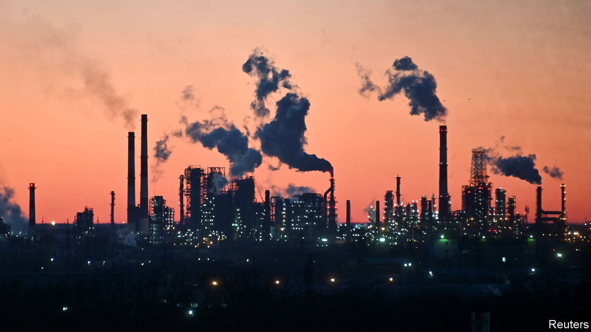
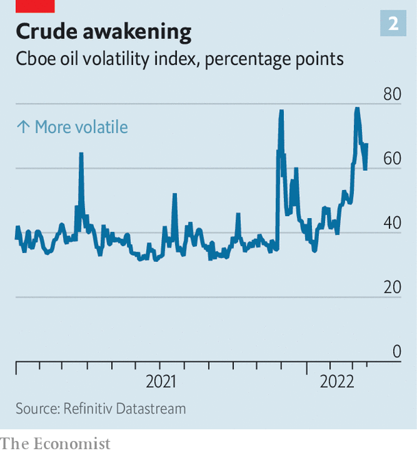
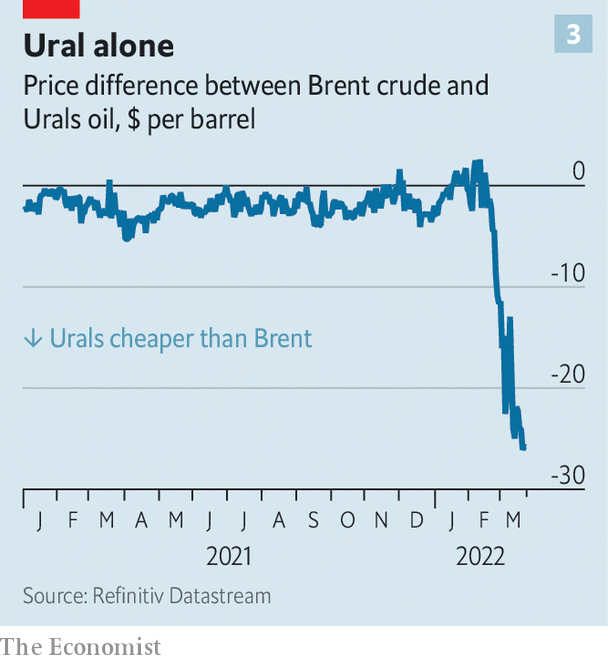

###### A volatile mix

# Three big uncertainties cloud the oil market 

##### OPEC’s calculations, America’s shale quandary and Chinese lockdowns make a volatile mix 

 

> Mar 26th 2022 

ALMOST A MONTH after Russia’s  sent the oil price surging, turbulence in one of the world’s most crucial commodities markets shows little sign of coming to an end. The price of a barrel of Brent crude oil surged to $121 on March 23rd, as storm damage halted exports from a Russian pipeline. Over the past fortnight it has whipsawed from a peak of $128 to as low as $98. The pandemic-related chaos of 2020 aside, the OVX index of oil-market volatility has rarely been higher in the past decade than it has been this month.

The swings reflect the interplay between the geopolitical and economic forces buffeting the world today, from war to rising interest rates and covid-19. Even beyond the outcome of the conflict in Ukraine, there are three big sources of uncertainty for the oil market. The first is what the members of the Organisation of the Petroleum Exporting Countries (OPEC) do as  bite and Russian production is shunned. America has banned imports of Russian oil; even in countries that have not taken that step, prospective buyers are struggling to transact with the Russian financial intermediaries that have been cut off from the plumbing of global finance as a result of sanctions, and may fear fresh sanctions to come.

 


On March 16th the International Energy Agency, an official forecaster, said that international markets could face a shortfall of 3m barrels of oil per day from April as a consequence. (The world consumed about 98m barrels a day last year.) The disruption in what was once a fluid global market is best illustrated by the gap between the prices of the Brent benchmark and Urals oil. On January 31st it stood at about 60 cents per barrel. By March 23rd it was around $30.


 


This leaves a great deal of power in the hands of the two countries that are most able to offset a chunk of the Russian shortfall: Saudi Arabia and the United Arab Emirates. So far, both have resisted pleas to raise output substantially. At a meeting in early March, OPEC and its allies (including Russia) merely confirmed existing plans to raise overall output by 400,000 barrels per day. Their next gathering, at the end of this month, will be watched closely. Even small shifts in public pronouncements have the potential to set off swings in the oil price.

The second seam of uncertainty relates to the capacity of American shale-oil production to meet the supply shortfall. During the first fracking boom, which lasted from around 2010 to 2015, American output surged, causing the oil price to slump and weakening OPEC‘s hand. But conditions in the American economy have changed dramatically since, leaving analysts and industry insiders doubtful that shale can rise to the challenge.

 


For a start, financing conditions are less encouraging than they were during the boom in 2010-15. The Federal Reserve is expected to raise interest rates several times this year and next: two-year Treasury yields are just above 2%, compared with the sub-1% levels that persisted during most of the past boom. Another constraint on production comes from America’s tight labour market. Just over 128,000 people were employed in oil-and-gas extraction in February, down from more than 200,000 at the height of the fracking boom in late 2014. With the headline unemployment rate at 3.8% and employers struggling to fill vacancies already, finding several tens of thousands of workers to move across the country will be no mean feat.

The industry’s attitudes have also shifted. Both American producers and their potential creditors are now far more cautious about borrowing. Banks and asset managers are bound by stricter environmental standards. That is one factor driving costs higher. In the first quarter of 2022 energy-exploration and production firms reported the steepest increase in lease-operating expenses (ie, the recurring costs of operating wells) in at least six years, according to a survey by the Dallas Fed. Drillers themselves, having struggled to make consistent profits in the past, are far keener on capital discipline this time, too.

The third component of the volatility in the oil price is to do with demand. China’s “zero-covid” strategy is being tested . The country has recorded its highest numbers of cases since the pandemic began, and big cities are  again. Platts Analytics, a commodities-research house, suggests that the restrictions could cut oil demand by 650,000 barrels per day in March, roughly equivalent to Venezuela’s oil output.

Even before the lockdowns began, there were signs of a deceleration in China’s economy, particularly in the property sector. Any sign that the slowdown in the world’s biggest importer of energy is becoming broad-based would mean more tumult for commodities.

The machinations of OPEC, the shale calculus in America, and the health of the Chinese economy: any one of these sources of uncertainty would usually be sufficient to generate price swings. Together, they make a flammable mix. ■

For more expert analysis of the biggest stories in economics, business and markets, , our weekly newsletter.

This piece was updated to reflect a change in oil prices. 

