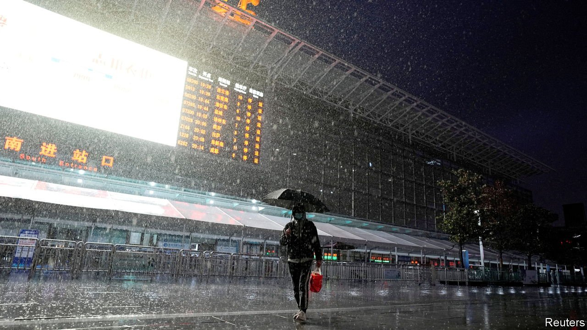
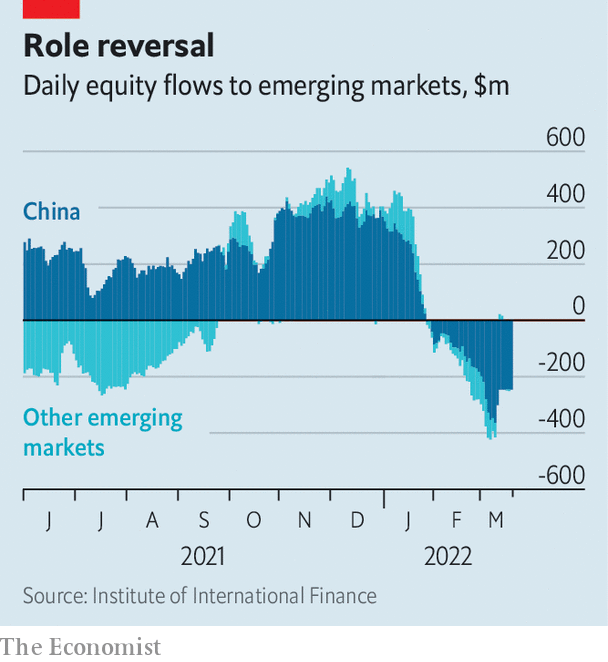

###### Departing thoughts

# Why foreign investors are feeling jittery about China 

##### Geopolitics are only their latest concern 

 

> Mar 26th 2022 

STATE MEDIA have not tried to hide the fact that billions of dollars in global investors’ funds have drained away from China in recent weeks. They have attributed the outflows—$11.5bn since the start of March—to volatility in global markets, a hawkish Federal Reserve and the impact of Russia’s invasion of Ukraine on global supply chains. One government publication downplayed the seriousness of the situation and speculated that foreign money will soon come pouring back in.

Indeed, China’s markets have experienced short spells of outflows in recent years only to see them reverse quickly, usually within two months. Onshore markets have mainly been a sure bet since the inclusion of many mainland-traded securities in several global indices, such as MSCI’s flagship emerging-markets index, starting in 2018. Tens of billions of dollars’ worth of inflows have been ushered into China’s markets each year since then. Occasional outflows, once in 2019 and twice in 2020, have occurred in that time. During the most severe bout in July 2020 about $12bn drained away before net inflows resumed two and a half months later.


This time around, however, foreign investors say that deeper, structural problems are sapping China’s markets. The outflows have been more violent. And they have been accompanied by a global sell-off in Chinese securities. The Hang Seng tech index, which tracks many of China’s biggest tech groups listed in Hong Kong, is down by 45% compared with a year ago. The NASDAQ Golden Dragon China index, which includes similar companies listed in America, has fallen by 58% over the same period. “A bounce is unlikely to come easily until investors see structural forces change again,” says Kevin Lai of Daiwa Capital Markets, a broker.

 


Reports in the state media notwithstanding, the outflows do not appear to be closely linked to Fed tightening. Even as China has seen equity outflows, not much capital has flowed out of other emerging markets (see chart).

Instead investors point to China-specific factors. State meddling in the private sector and with tech companies has, of course, become commonplace. Another worry is that Xi Jinping’s support for Russia could lead to sanctions on Chinese firms. The war has also led to increased concerns over Taiwan, which China claims as its own and has vowed to take back. Fears over a Chinese invasion have for the first time led some investors to add geopolitical risk to their frameworks for assessing their Chinese investments. The risk premium that investors deem acceptable to hold Chinese assets is rising, leading some to lower their allocations. The longer the war in Ukraine drags on, the higher the premium could go.

Moreover, China’s weakening control over the Omicron variant of covid-19 darkens the economic outlook. The response to a worsening outbreak in Shanghai, home to many foreign executives, has become an embarrassment for local officials. International flights have been diverted. A chaotic, rolling lockdown of districts is being implemented. The gates of residential communities are being welded shut to keep dwellers from leaving. The situation, in China’s most developed city, and two years into the pandemic, reveals Mr Xi’s lack of an exit strategy from the crisis. The property market has also continued to wobble. On March 22nd Evergrande, a troubled developer, said Chinese banks had claims on $2bn of its cash, another bad sign for foreign creditors hoping to recover their investments.

The market sell-off has jolted officials into action. The financial stability and development committee (FSDC), chaired by Liu He, a top economic adviser, is spearheading an attempt to regain investors’ confidence. Starting on March 16th Mr Liu and the FSDC have promised to increase lending growth and push state-owned funds to buy more stocks.

China’s leadership will support the listing of firms in America and ease its crackdown on tech companies. Housing-market policies will become more accommodative. And the government is also preparing to tackle the Omicron outbreak with self-testing kits and Pfizer’s Paxlovid pill, which helps protect infected people against serious disease.

Mr Liu hopes to better communicate China’s economic plans to the market in the future. But the important thing, says Laura Wang of Morgan Stanley, a bank, is how quickly the authorities can execute their promises. It will take more than talk to stanch the outflows. ■

For more expert analysis of the biggest stories in economics, business and markets, , our weekly newsletter.

