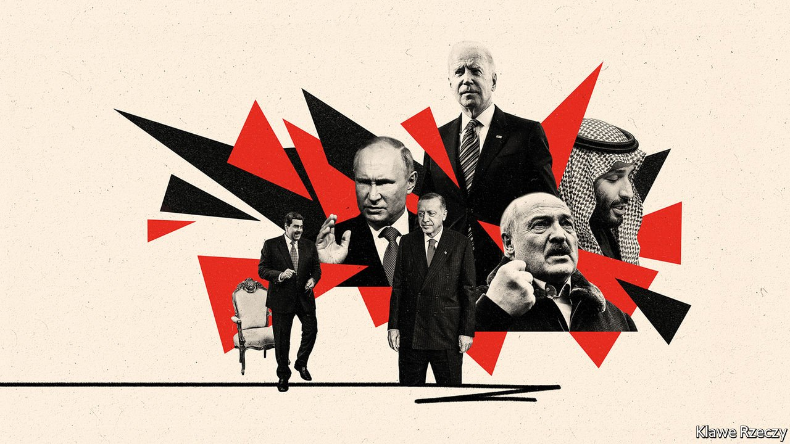
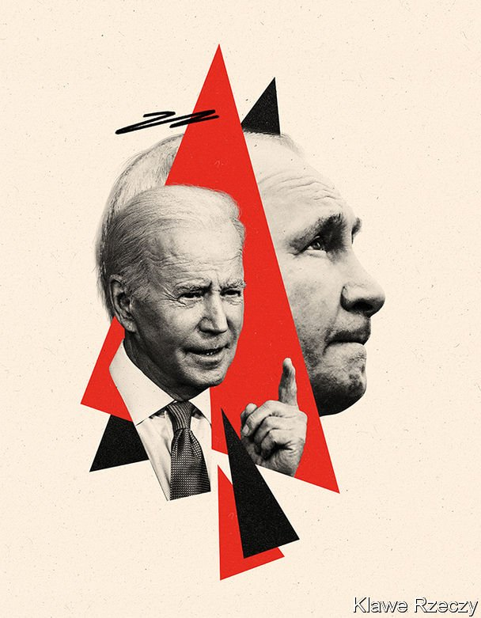

###### New cold war, new compromises

# How Vladimir Putin provokes—and complicates—the struggle against autocracy 

##### As in the old cold war, ugly trade-offs are inevitable 

 

> Mar 26th 2022 

THE STRUGGLE between autocracy and democracy is “the defining challenge of our time”, President Joe Biden said in December at a virtual “Summit for Democracy”. Vladimir Putin’s invasion of Ukraine offers evidence he was right. With missiles and tanks, an autocrat is trying to snuff out a freely elected government.

Further, the core of the coalition against Mr Putin, consisting of America and most of Europe, is solidly democratic. In short, the pushback against Mr Putin would seem to fit Mr Biden’s framing—a “battle between democracy and autocracy”, as he said in his state-of-the-union speech. But geopolitics is never so neat.


Though Mr Putin’s , China, is authoritarian, several democracies are ambivalent. India, a big buyer of Russian arms, . South Africa, whose ruling party had a long friendship with the former Soviet Union, lays some blame for the war on NATO. Brazil’s president, whose “masculine qualities” Mr Putin once praised, professes neutrality. Israel says it is temporising in hopes of playing mediator.

And Mr Biden is also seeking help from authoritarian regimes, provoking worries that, just as the West overlooked abuses by anti-communist allies during the cold war, it will make ugly compromises now to counter Mr Putin. Doing so would pose diplomatic and political challenges. Compared with claiming compromise was necessary to resist the spectre of communism, it may prove trickier to argue—to allies abroad and voters at home—that one should curry favour with autocrats in order to confront autocracy.

Consider Turkey, a country of vast strategic importance where democracy is under siege. Western criticism of Turkey’s strongman, Recep Tayyip Erdogan, has gone quieter since the war began.

While sympathising with Ukraine and selling it remarkably effective combat drones, Mr Erdogan has opposed sanctions against Russia and kept his airspace open to Russian planes. He has also thrown Mr Putin a financial lifeline, suggesting that trade between Turkey and Russia be carried out using roubles or gold. Ordinary Russians  have found a haven in Turkey. Yet so have Russian oligarchs fleeing Western sanctions. Two superyachts belonging to Roman Abramovich, a billionaire friend of Mr Putin, have docked there.

Western officials are urging Turkey to take a tougher line on Russia. Turkish democrats fear Mr Erdogan will demand a steep price, such as Western leniency towards his habit of locking up his critics and muzzling the media. On March 1st Mr Erdogan suggested that Turkey be given a fast track to European Union membership. A week later, he urged Mr Biden to lift sanctions against Turkey’s defence industry, imposed after Mr Erdogan bought an S-400 air-defence system from Russia. America has since offered a way out, suggesting that Turkey send the S-400s to Ukraine. That is unlikely to happen for technical and political reasons, not least Turkey’s fear of retribution from Russia. But America may yet cut a bargain with Mr Erdogan. America put up with an undemocratic Turkey during the first cold war because it was an ally. It may do so in the new cold war, too.

Among the Western countries, liberal ones face a version of this dilemma. Poland is a lot more democratic than Turkey, but in the past few years its government has interfered with judges and harassed opposition media. Because of this, the EU froze €36bn ($40bn) in pandemic-recovery funds earmarked for Poland.

Today, however, Poland has  and allows weapons for the Ukrainian resistance to cross its territory. Facing the threat that Russia, its oldest foe, could be on its border, it is keen to reconcile with the EU. That could spur the ruling Law and Justice party to temper its judge-nobbling and press-stifling. But the opposite is also possible. Poland’s Western partners may overlook abuses because of the essential role it is playing over Ukraine. “It would be very odd to be pressuring the Polish government on the rule of law right now,” says an analyst close to the Biden administration. “But Warsaw should understand that countering autocrats requires strengthening our own democracy.”

For their part, critics fear that Law and Justice will use the spectre of further Russian aggression to wrap itself in the flag, tighten its grip over Polish institutions, and step up attacks against “enemies” within, such as liberals, feminists and gay people. “Perhaps we need to change our approach even more thoroughly,” a presenter on Polish state TV recently mused. “Can a frontline state allow itself to tolerate attacks on its system of values?”

The war has caused energy prices to soar, prompting the West to reconsider its relations with autocratic petrostates. (Of the 13 members of OPEC, a club of oil exporters, 11 are rated “not free” by Freedom House, an American watchdog; two are rated “partly free”.) Unlike his predecessor, Mr Biden has infuriated Gulf rulers by stressing human rights. He once promised to make the Saudi regime “the pariah that they are”. Now he is asking it to pump more oil—a message reinforced by Boris Johnson, Britain’s prime minister, who visited Riyadh on March 16th. Mr Biden may have to go further to make nice with Muhammad bin Salman, the Saudi crown prince, whom he has accused of ordering the dismemberment of a Washington Post columnist in 2018. The prince is cosying up to China to demonstrate he has options. He is considering pricing oil sales to China in yuan instead of dollars, the Wall Street Journal reports. The prince wants more help with his ill-fated war in Yemen and immunity from prosecution in America.

Another oil-fuelled autocracy, Venezuela, hopes the war in Ukraine will help it escape an embargo. Many democracies refuse to recognise Nicolás Maduro, an election-rigging despot, as president. Mr Putin has propped up Mr Maduro with planeloads of weapons and cash, plus some troops, largely to show he can meddle in America’s backyard. But now everyone’s calculations are changing.

Mr Maduro can no longer count on Mr Putin, who is cash-strapped and far more concerned about conquering Kyiv than coddling Caracas. Mr Biden cares more about stopping Mr Putin than unseating Mr Maduro. Hence the extraordinary scene on Venezuelan television on March 7th, when Mr Maduro described meeting a White House delegation two days before. “The two flags looked beautiful,” he gushed, “united, as the flags of the United States and Venezuela should be”.

The Biden administration says the main aim of the visit was humanitarian. Mr Maduro released two imprisoned Americans. He also promised to return to talks he abandoned last year with the much-persecuted Venezuelan opposition. But the two sides talked about oil, too. The delegation to Caracas reportedly made any sanctions relief contingent on Venezuela exporting some oil to the United States.

Both sides are wary. But a limited rapprochement seems possible, and would surely strengthen Mr Maduro’s grip on power. His meeting with American officials was “de facto recognition” that he is in charge, says Temir Porras, a former chief of staff to Mr Maduro. The strongman has “got something that he always wanted”. Republicans accuse Mr Biden of showing weakness by reaching out to despots. Marco Rubio, a senator from Florida, said that the meeting “did tremendous damage” to the opposition.

Sympathy for the devils

Democracies have a long history of deals with nasty regimes. Some were plainly necessary. To defeat Nazi Germany the West worked with Josef Stalin, prompting Winston Churchill to remark: “If Hitler invaded Hell, I would make at least a favourable reference of the Devil in the House of Commons.” Others seem shameful. America’s cold-war support for anti-communist kleptocrats in strategically peripheral places, such as Mobutu Sese Seko in Zaire (now Congo), finds few defenders today.

 


The struggle against Mr Putin will force the West to reconsider many of its ties with lesser malefactors. But the new cold war is different from the old one. Communism was a universal ideology that inspired revolutions in Africa, Asia and Latin America. Putinism is a howl of nationalist and reactionary rage. Neither Russia nor China offers “a compelling worldview capable of attracting mass popular support worldwide”, notes Stewart Patrick of America’s Council on Foreign Relations. This makes them less of an existential threat to the free world than the Soviet Union was, and so reduces the incentive, or rationale, for making bargains as distasteful as those made to keep communism at bay.

As sanctions crush Russia’s economy, the Kremlin’s support for its own autocratic clients may wither. Strongmen in Mali and the Central African Republic may survive, since the Russian mercenary operations that protect them appear to be self-financing. (The CAR has a lot of diamonds.) But Bashar al-Assad in Syria and Alexander Lukashenko in Belarus may be wobblier. Mr Putin has saved both tyrants in the past, sending troops to crush Syrian rebels in 2015, and goons to help Mr Lukashenko put down protests against a stolen election in 2020. Both men are keen to keep Mr Putin in their corner. Mr Assad, who is seeking to  from his fellow Arabs, is said to have sent Syrian “volunteers” to help Russia in Ukraine.

Mr Lukashenko helped Mr Putin by letting Russia launch its southwards push for Kyiv from Belarusian soil. Belarusian troops were supposed to join in, but the Belarusian opposition says they are reluctant to follow orders from an unpopular despot to attack blameless fellow Slavs. Belarusian rail workers have reportedly sabotaged rail links with Ukraine to stop supplies from reaching the invaders.

So far, the war itself is demonstrating some of democracy’s strengths and autocracy’s drawbacks. Ukraine’s fighters have astonished their adversaries, and its people’s commitment to their freedom has inspired the world. For his part, Mr Putin was able to start his ruinous war on a whim. His flunkeys are scared to bring him unwelcome news. He seems sincerely to have expected many Ukrainians to welcome his troops. And his regime, like most autocracies, is corrupt, rendering his army weaker in the field than on paper. Budgets have been looted; Russian kit is breaking down for lack of maintenance or spare parts.

Yet the result of the war is unpredictable, and so too will be its effect on global democracy. If Mr Putin achieves something resembling a victory, that could inspire strongmen everywhere. If he loses, that could inspire those who stand up to them. When Mr Biden reconvenes his democracy summit later this year, much will depend on the courage of Ukrainians, and the support they receive from democracies, with all their flaws. ■

Read more of our recent coverage of the 

