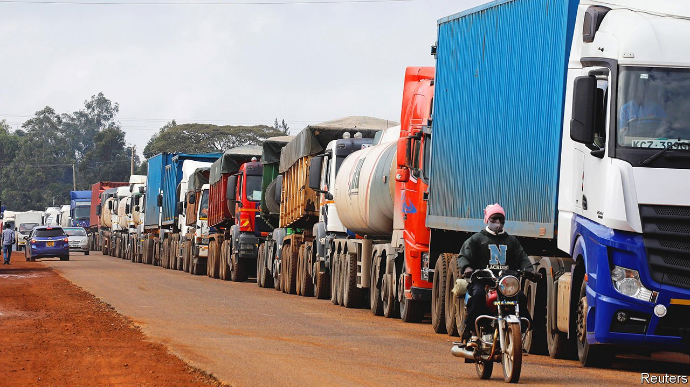

###### Long walk to free trade

# Africa’s ambitious trade plan needs to speed up 

##### Non-tariff barriers hinder commerce even more than tariffs 

 

> Mar 26th 2022 

IN 1963, AS decolonisation swept through Africa, politicians heady with pan-African ideals called for a common continental market. They saw it as a way to transcend colonial economic models based upon extracting and exporting natural resources. Sadly there has been all too little progress since. Intra-African trade remains small compared with the continent’s external trade. Primary commodities account for more than 70% of Africa’s exports. Just 18% of exports by African countries are to others on the continent—a lower share than equivalent figures for Asia (58%) and Europe (68%).

The African Continental Free Trade Area (AfCFTA) is  this. This ambitious pact has been ratified by 41 of Africa’s 55 countries. Making it easier for them to trade with one another should boost manufacturing, incomes and growth. The World Bank estimates that, if implemented, by 2035 the AfCFTA would enable an additional 30m people to escape extreme poverty, increase intra-African exports by 81% and boost wages by 10%. Although the AfCFTA has in theory been operational since the beginning of this year, in practice no trade has happened under its terms because of continued political wrangling. Africa’s leaders risk squandering the promise of freer trade.


Some of the potential benefits of the AfCFTA come from lower tariffs. To realise these, the continent’s trade negotiators still have work to do in agreeing on rules of origin, the bedrock of any trade area. They need to get their skates on.

The biggest prize, however, will come not from lower tariffs but from lower “non-tariff barriers”—by pulling down more of the other obstacles that make it hard for, say, a Ugandan farmer to export chickens to Kenya or for a Beninese weaver to sell fabric to Nigeria. These barriers include corruption, shoddy infrastructure, red tape at border crossings, sloth-like customs bureaucracies and expensive logistics. Because of them, transporting goods within Africa can be three to four times as costly as in other parts of the world. In 2017 it took an average of 251 hours to ensure paperwork was in order when importing goods into sub-Saharan Africa, versus nine hours in rich OECD countries.

Many of these problems can be fixed. Potholes could be filled; ports expanded. Paperwork could be digitised and sent in advance of time. More countries could build one-stop border posts, instead of making lorry drivers queue separately for migration, road taxes, vehicle inspection and customs clearance. In east Africa such streamlining has cut crossing times from 12 hours to four. Not requiring covid-19 tests would let lorries spend more time ferrying and less time tarrying. Countries should make it easier to establish logistics startups, such as firms that cut costs by matching loads with empty vehicles. Cheaper transport means cheaper goods in shops.

Yet all this is easier said than done. One obstacle is that vested interests, such as trucking cartels and customs bureaucracies, profit from inefficiency. Ghana has shown that these can be weakened. Another problem is that for all their homilies about free trade, many African politicians are protectionists at heart. No country seems to want to move first in ongoing talks about implementing the free-trade deal. Even though they stand to benefit the most, the largest economies in each region—Egypt, Kenya, Nigeria and South Africa—are proving pitifully slow to embrace the trade pact.

A third political challenge relates to outsiders, including America, China and the European Union. Though they say they want to support the AfCFTA, they often undermine it by signing bilateral deals which then complicate Africa’s efforts to harmonise its own trade rules.

Each of these problems requires the sort of leadership that has so far been in scant supply. But if politicians seize the opportunity, the AfCFTA can help the continent climb out of the economic slump it has been pushed into by the pandemic and the war in Ukraine. It would also send a message to the rest of the world. At a time when protectionist noises are growing louder, Africa has a chance to be an inspiring outlier. ■

