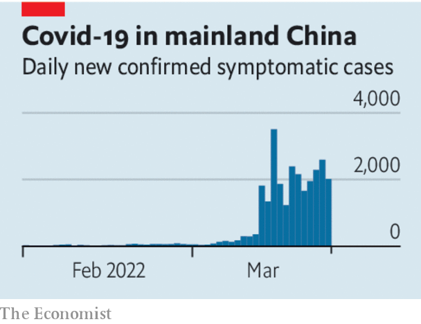

###### Escaping zero-covid

# China must eventually learn to live with the coronavirus 

##### It has a lot of work to do first 

 

> Mar 26th 2022 

AN OUTBREAK OF covid-19 on the scale China is experiencing would barely register in most countries. Much of the world has decided to live with the virus. Not China, though. So far in March it has recorded around 27,000 new local symptomatic cases—and each one is viewed as a threat to the government’s “zero-covid” policy. For two years China has smothered outbreaks using mass-testing, strict lockdowns and by tracking its people in ways that would make Mark Zuckerberg blush.

Chinese leaders think their policy a huge success. The Economist estimates that the country’s death rate from covid is 5% of America’s. The Chinese economy has expanded by 10.5% in the past two years, compared with 2.4% in America and 0.4% in advanced economies generally. China’s covid controls “demonstrate the advantages” of the Chinese Communist Party’s leadership and the socialist system, boasts Xi Jinping, the president. All the signs are that his people tend to agree.

 


Yet the party hid the start of the pandemic, and  the difficulty of crushing a highly transmissible variant like Omicron. China’s leaders have acted as if they could close off their country until covid went away. Instead, sketchy preparation for an Omicron-type outbreak has put China at risk of a catastrophe.


The experience of Hong Kong shows what could happen. Like the mainland, Hong Kong once boasted a very low case-count. But Omicron has overwhelmed the city, which now has the highest daily death-rate in the world from the virus. Hospitals have left patients waiting in loading bays and car parks. The vast majority of the dead have been unvaccinated old folk. When the outbreak began, around 65% of over-80s had not been jabbed.

The risks are similar on the mainland. Among those 80 and older, only 51% have received two jabs, and less than 20% have had a booster. Many Hong Kongers were given Western vaccines. The Chinese government, apparently for political reasons, refuses to allow these on the mainland. Three doses of the home-grown kind do offer some protection against severe disease and death, but it seems to wane more quickly than the protection provided by Western vaccines.

For now, China has little choice but to stick with its covid controls. The problems go beyond vulnerable old people. China’s skimpily funded health system is ill-equipped to handle a big wave. Using Hong Kong’s mortality rates as a guide, a large outbreak on the mainland would result in millions of deaths. The lingering trouble is that Chinese officials lose their jobs if an outbreak occurs on their watch. Fear of the sack creates incentives to invent sometimes cruel and irrational local rules.

In the longer term, though, change is inevitable. More transmissible variants like Omicron make the cost of enforcing zero-covid very high. Today tens of millions of people are locked down. Morgan Stanley, a bank, thinks China’s GDP may not grow at all this quarter compared with the last. That could affect the global economy. Restrictions in Shanghai and Shenzhen, accounting for more than 16% of China’s exports, raised alarm once again about supply chains.

China needs to help its people live with covid. It has made a start by allowing at-home tests, and sending patients with mild symptoms to isolation centres, not hospital. Mr Xi has urged officials to cut the economic impact of covid controls. More must be done. The elderly and vulnerable need vaccinating and boosting, fast. China has approved an antiviral pill, Paxlovid, from an American firm, Pfizer: why not use Western vaccines, too?

But Mr Xi still seems attached to zero-covid in the longer term. Having staked its legitimacy on keeping cases near zero, the party is loth to change strategy. Soon it will have no choice. Even if China succeeds in seeing off this wave, another will follow. The government needs to devote as much energy to charting a path out of the zero-covid policy as it has to enforcing it. ■

