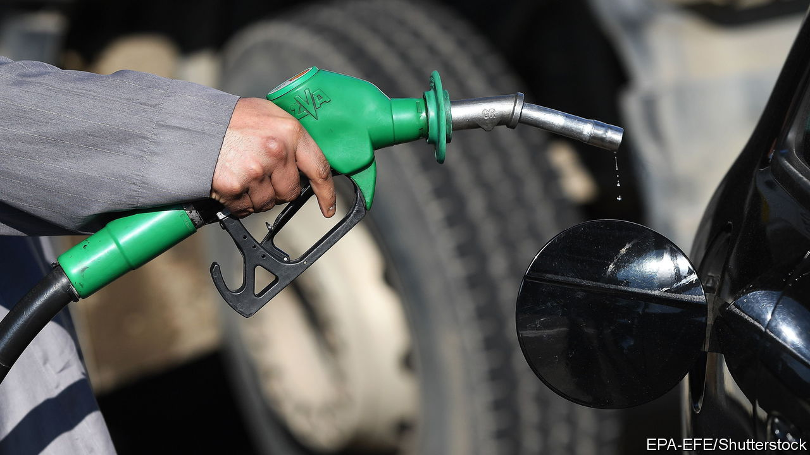

###### When duty falls

# Cutting fuel taxes is a bad idea 

##### Governments should support household incomes instead 

 

> Mar 26th 2022 

GOVERNMENTS THAT are trying to shield voters from soaring energy and fuel costs are coalescing around a simple idea: help people buy petrol. This week Rishi Sunak, Britain’s chancellor, cut fuel duty by 5p ($0.07) per litre, a 9% reduction, for a year—the most ever in cash terms. From April 1st France will rebate 15 cents ($0.16) per litre of fuel for four months. Many other European countries including Italy and Sweden have also announced cuts. Last year Japan introduced a fuel subsidy of ¥5 ($0.04) a litre, which was recently raised to ¥25. In America two states have suspended their petrol taxes and a bill has been introduced in Congress to do the same to the federal levy.

These tax cuts are a mistake. They will waste money and make it harder to wean the rich world off fossil fuels. There are better ways to help people cope with rising energy prices.


Petrol taxes, like all levies on transactions, affect both buyers and sellers. When taxes fall, buyers pay a lower total price. As a result they demand more fuel, which encourages sellers to push pre-tax prices higher. The exact division of the benefits between consumers and producers is debated, but one study of a petrol-tax holiday in Illinois and Indiana in 2000 found that consumers enjoyed only 70% of the upside.

That means today’s fuel-tax cuts are wasteful. Governments could spend the same amount of money on other policies to help households without suffering a 30% leakage. It also makes the policies perverse, because the producers who benefit include Russia, whose oil Europe continues to buy, despite its invasion of Ukraine. Although the tax policies of any one small country are unlikely to affect global oil prices much, many countries cutting fuel levies at once will boost demand on a global scale, helping to fill Russia’s coffers.

Governments should be trying to reduce the demand for fuel, not stoke it. The price of petrol  a rapid effect on how much people drive, because many trips are unavoidable. But that may be changing as working from home has given many people a daily choice about whether to commute to the office. In the short term, maintaining fuel taxes would help  Russian oil, starving Russia’s economy of foreign currency. Even with sanctions as they are, the energy industry is warning that Europe may soon need to ration diesel, which is becoming scarce.

In the long term fuel duties lead people to switch to electric cars or public transport, reducing carbon emissions. They also mean that driving bears more of the other costs it imposes on society, such as congested roads and dirty air. These goals are less pressing than the energy crisis, and today’s cuts are presented as temporary. But fuel duties are notoriously difficult to raise because they are so unpopular, meaning that the cuts may become permanent. Nobody believes that Mr Sunak will implement the big rise he has pencilled in for a year’s time. In 2011 Britain put off a planned rise in fuel duty for seven months. It was repeatedly postponed and now Mr Sunak has cut instead. America’s federal tax on petrol has been 18.4 cents per gallon since 1993.

In both cases the tax has stayed constant even as inflation has eroded its real value and the increasing fuel-efficiency of cars has made driving cheaper. In January motor fuel accounted for little more than $1 in every $50 the American consumer spent. Adjusted for today’s higher price at the pump, the share of spending is still lower than the average since records began in 1959. Drivers notice dearer fuel, and American consumer-confidence is its lowest in over a decade. But today’s high oil price will not hurt motorists as much as the oil embargoes of the 1970s.

There are better ways to help struggling households than to lean against the price mechanism. Governments should temporarily support the income of the poor in ways that do not encourage the consumption of fuel. Mr Sunak has cut taxes on low and middle earners, which is a start, but he should also have made universal credit, Britain’s stingy main welfare benefit, more generous (see Britain section).

Calories and joules

What is more, support for incomes, unlike tax cuts for motorists, helps offset the full spectrum of forces that are eroding living standards. The biggest blow to Europe’s wallets is coming not at the pump, but through the cost of heating and electricity. Food prices have soared, too. Not everyone drives, but everyone needs warmth and sustenance. ■

Read more of our recent coverage of the 

