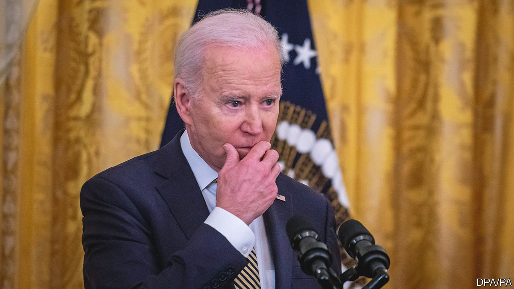

###### Ukraine’s backers

# For all America’s success in helping Ukraine, hard times lie ahead 

##### Joe Biden must hold together a fractious coalition 

 

> Mar 26th 2022 

VLADIMIR PUTIN’S epoch-changing miscalculation over Ukraine was the outcome of a trio of mission-defining misjudgments. One was that Ukraine’s government would collapse quickly. Another was that his modernised army would be dominant. The last was that America, in irreversible decline, was no longer capable of leadership. For Ukraine to be defeated, Mr Putin had only to get one premise right.

The first two misjudgments have caused general surprise. The third has stirred up general interest, among allies and foes alike. In recent years America has seemed less committed to the institutions it created after the second world war, largely as a result of its own disastrous occupation of Iraq following the attacks of September 11th 2001. Barack Obama chose to “reset” relations with Russia after it invaded Georgia in 2008 and failed to enforce a red line against the use of chemical weapons in Syria. Donald Trump accused his allies of duping America and called NATO “obsolete”. After America’s humiliating flight from Kabul last summer, Mr Putin seemed to have concluded that Joe Biden would be unable or unwilling to do much for Ukraine.


Today, as Mr Biden lands in Europe for NATO, G7 and EU summits, it is clear that America has  Mr Putin by being innovative, agile and resolute. It understands that the security of Europe is at stake in Ukraine. The question is whether that success can survive the tests that lie ahead. At home, destructive political partisanship is once more rearing its head. In Europe, the coalition that America so carefully stitched together is beginning to fray.

America’s innovation began before the war, with the unprecedented release of intelligence. Along with Britain, the Biden administration issued detailed, up-to-the-minute warnings about Russian troops massing on Ukraine’s borders, would-be provocations, the plan of attack and a blueprint for a puppet government. This robbed Mr Putin of the power to disorientate that served him so well in the seizure of Crimea in 2014. The supply has continued in battle. Information from intercepted communications, NATO aircraft and satellites is rapidly given to Ukrainian forces, who use it for targeting.

The agility was on display when America changed course in the opening phase of the war. Mr Putin was not alone in thinking that Kyiv would fall within days. The Biden administration offered Volodymyr Zelensky safe passage out of the capital. Ukraine’s president vowed to stay even as his forces repelled Russian paratroopers. America and its allies responded with more weapons and fresh sanctions.

And NATO has demonstrated resolve. In 2019 Emmanuel Macron, France’s president, warned that it was suffering “brain death”. Today it is reinforcing its eastern flank. Germany, its second-wealthiest member, has overturned decades of timid defence policy by agreeing to give Ukraine arms and pledging to increase spending. In its wholehearted leadership of NATO, American diplomacy has recovered from the lows of the Trump years.

The fact that the war has lasted so long is an endorsement of Mr Biden’s support. But, as it drags on, sustaining that support is becoming harder. At home some Republicans have taken to blaming Mr Biden for the war, arguing however implausibly that the real cause of the invasion was Kabul and American acquiescence over a German gas pipeline coming from Russia. They accuse Mr Biden of being weak.

In the long run, partisanship is a grave threat to American influence abroad. Mr Biden’s best riposte to his critics is to throw his efforts into dealing with the other, far more urgent political problem, which lies in Europe. This is the first sign of  helping Ukraine withstand the Russian army.

Ukraine says it is short of arms. There have been pledges, including this week from Britain, but supplies could arrive too late. Ukraine also complains that NATO’s distinction between defensive weapons, such as anti-tank missiles, and offensive weapons, such as aircraft, is meaningless when the invader is bent on destruction. Diplomatic sources accuse Germany and Hungary, in particular, of standing in the way of extra sanctions.

All this is becoming an urgent problem. Mariupol, a city with a population of 400,000 before the invasion, is being razed to the ground by Russian artillery. Civilians, including children, have been deported to Russia. Mr Biden has warned that Mr Putin may be about to order the use of chemical or biological weapons. As Russian atrocities mount, Ukraine will need more help. When Mr Biden meets European heads of government he will have to stiffen their resolve. If he fails to unite his allies, his good work will have been squandered. ■

Read more of our recent coverage of the 

