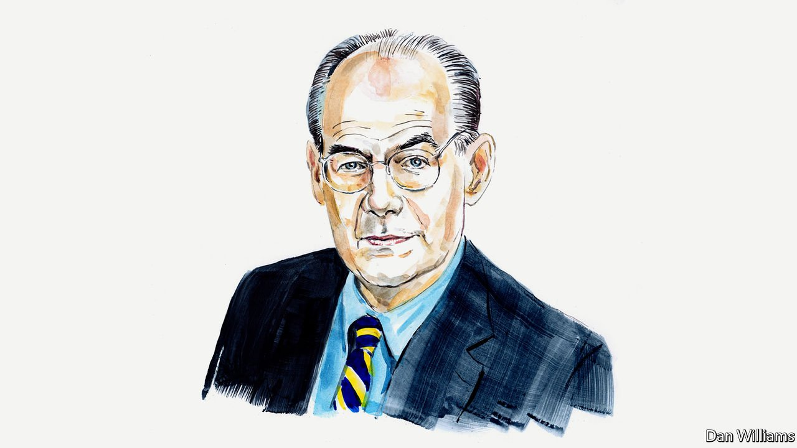
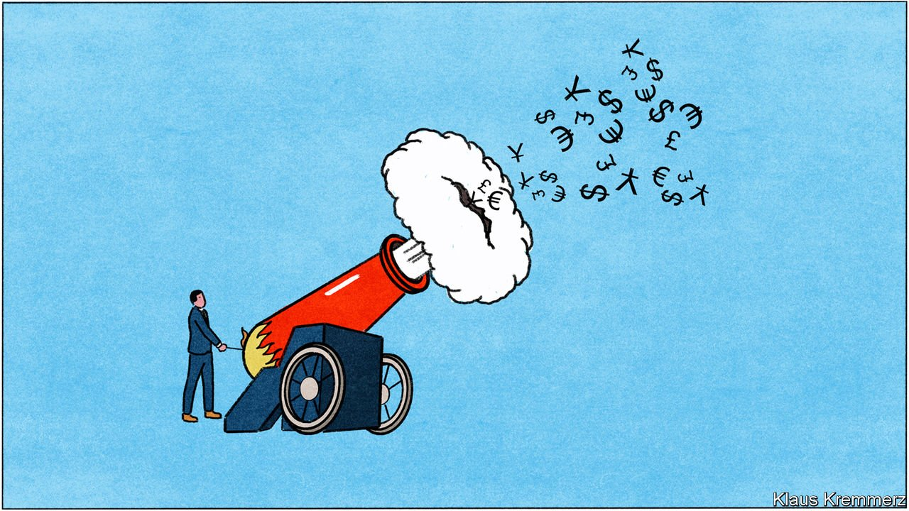
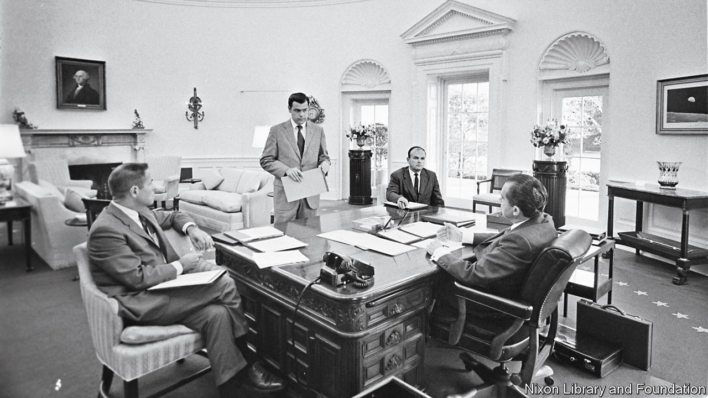

###### On Vladimir Putin and the West, private equity, Richard Nixon, company cults

# Letters to the editor 

##### A selection of correspondence 

 

> Mar 26th 2022 


The war is not the West’s fault

Russia is not an innocent victim of NATO’s expansionist policy, as John Mearsheimer claims (, March 19th). On the contrary, it is the Kremlin’s policy that forces Russia’s neighbouring countries to seek effective alliances. The problem with Mr Mearsheimer’s argument is the assumption that had NATO not expanded, Russia would be a different place today. The historical evidence does not support that.


Moreover, his arguments deprive Ukrainians of any agency. He consistently ignores the possibility that Ukrainians might choose democracy and seek membership of the European Union of their own free will (in this, he echoes Kremlin talking points). He draws a false equivalence between a liberal, wealthy economic bloc on the one hand and an authoritarian gas station run by a mafia on the other. Mr Mearsheimer should consider the distinct possibility that Russia’s long history of attempted dom inance over Ukraine, and other central and eastern European countries, is what helped drive many Ukrainians, and Poles, towards the EU.

PIOTR ARAK

Director

Polish Economic Institute

Warsaw

Mr Mearsheimer’s attempt to understand the root causes of the conflict suffers from a deeply flawed methodology: he does not understand that world politics are made by real people, rather than figments of abstractions. Thus, Russia’s security concerns are ultimately defined by Vladimir Putin, and his pre-eminent security concern is about staying, and surviving, in power. What threatens that is not NATO expansion but a “colour revolution” in Russia. A prosperous, democratic Ukraine would surely encourage popular opposition to the Putin regime in Russia, and therefore in his view it must be prevented at all costs.

Amazingly, Mr Mearsheimer suggests that Ukraine’s Maidan uprising in 2014 and the flight of Viktor Yanukovych was a “coup”. This is not only a morally murky statement because it airily dismisses the concerns and the dignity of the vast majority of 44m Ukrainians who do not want to be ruled by Mr Putin’s Russia. It also fails to understand that sometimes it is not only leaders who shape politics but also ordinary people. If Mr Mearsheimer were right, European and German unification should never have happened.

Western institutions may well have put Mr Putin “into a rage”, as Mr Mearsheimer says. NATO enlargement is not, however, at the root of the war. What happens in Ukraine is not a “direct threat to Russia’s future”: it is a direct threat to Mr Putin’s future.

PROFESSOR HANNS MAULL

Senior distinguished fellow

German Institute for International and Security Affairs

Berlin

Having grown up in communist Romania I take particular offence at Mr Mearsheimer’s notion that eastern European countries are merely a buffer zone or some kind of geopolitical pawn. Russia does not own eastern Europe. These are sovereign countries who desire nothing more than to relinquish their ties to Russia and join the free world. Eastern Europeans asked, begged, to join NATO having made enormous strides towards political reform. Should we have allowed Russia to drag them back into the abyss?

MONICA FRIEDLANDER

Cambria, California

Mr Mearsheimer writes: “The mainstream view in the West is that he [Putin] is an irrational, out-of-touch aggressor bent on creating a greater Russia in the mould of the former Soviet Union. Thus, he alone bears full responsibility for the Ukraine crisis.” That mainstream view is absolutely correct.

NICK DEYCHAKIWSKY

Brighton, Michigan

 


Clarity in private equity

One way to rein in private equity’s predatory behaviour (, February 26th) would be to pass the Stop Wall Street Looting Act, revived in the Senate last year by Elizabeth Warren. This is far from the only campaign for more transparency in the industry.

Leaked documents show that the opacity that defines the private-equity industry, including investors’ identities, source of funds and often even the assets under owner ship, has the FBI deeply concerned that the industry is a soft target for money launderers. Anti-corruption campaigners are calling for the Financial Crimes Enforcement Network at the Treasury to finalise a stalled rule from 2015 requiring investment advisers to establish effective anti-money-laundering programmes.

No less than national security and the integrity of elections is at stake. In 2015 a software company that managed much of Maryland’s voter-registration system was bought by a private-equity fund in which a Russian oligarch with close ties to Vladimir Putin was the largest investor (the fund no longer owns the voter system).

Bringing more transparency to private equity would also be a good investment in safeguarding future public spending in a crisis. Our analysis has identified more than $1.2bn in loans for small businesses that went to companies backed by private funds. Most of these can be written off. The legislation that left open this loophole should be counted as another “dividend” of the industry’s extensive lobbying operation.

If private equity is coming into the mainstream and out of the shadows it should be prepared to play by mainstream rules and stop operating under a shroud of secrecy.

DAVID SZAKONYI

Co-founder

Anti-Corruption Data Collective

Washington, DC

 


Tricky Dick

The attempt to defend or exonerate Richard Nixon by Dwight Chapin, an aide to the former American president, (“”, February 26th) brought to mind Hunter S. Thompson’s obituary, which, as it happens, I read whenever I feel a little blue. But that is besides the point; what isn’t, is that Mr Chapin’s book sounds like a terrible casting of the past. For a more reasonable and balanced view, I feel a refresher of what Mr Thompson wrote about Nixon is in order:


The recently departed Mr Thompson had many more things to say, but I believe that will suffice.

MATT TURNER

Hope, Canada

 


You will conform

column on the common characteristics of cults and companies (March 5th) brought back fond memories of my time working for ross perot’s electronic data systems (better known as EDS) back in the late 1980s. Company indoctrination started with a ten-week electronic boot camp with rules such as “no facial hair” and “no tassels on your shoes”. It continued after through motivational trinkets, like fluorescent erasers emblazoned with the words “rub out non-conformance”.

ANDREW VANBERKEL

Toronto

