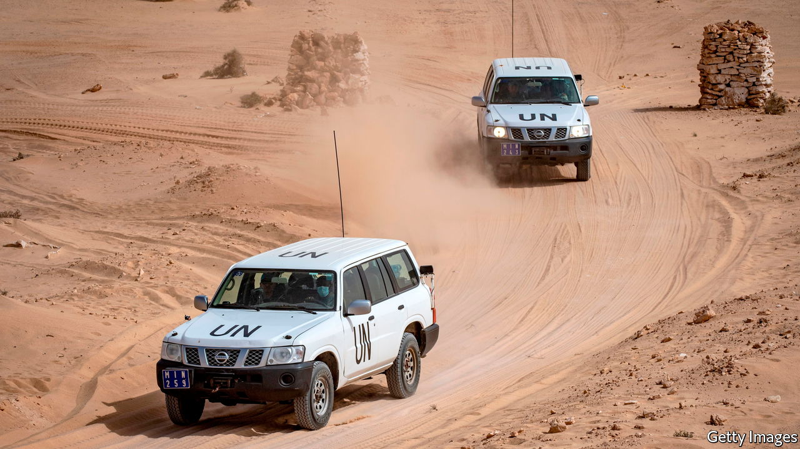

###### The sands they are a-swirling

# Morocco scents victory in Western Sahara 

##### Guns and canny diplomacy are helping it knock back Algeria 

 

> Mar 26th 2022 

THE BATTLE over Western Sahara has long felt as sluggish as the region’s barely shifting sand dunes. It is almost half a century since Morocco claimed sovereignty over the slice of desert, previously a Spanish possession, that runs 900km (560 miles) along the Atlantic coast, south of Morocco proper. The Polisario Front, an indigenous guerrilla group backed by Morocco’s rival, Algeria, is still fighting for independence. For several decades the rest of the world has looked away, parking the dispute with the UN and promising the mirage of a referendum on self-determination to settle the issue. In fact, it has been frozen in the baking desert, seemingly for ever. But of late the sands have been swirling.

On March 18th Spain abandoned its long-held neutrality and tilted in favour of Morocco. Its prime minister called Morocco’s plan to give the Saharans autonomy within the kingdom “the most serious, realistic and credible”. The EU gave a cautious thumbs-up to Morocco, too. (The Americans had already recognised the kingdom’s claim in the last days of Donald Trump’s presidency.) Morocco cheered the latest shift. Algeria fumed.


Morocco’s diplomatic success is partly thanks to its mischief-making. In the past year it has repeatedly let migrants from Morocco and elsewhere in Africa pour into Spain’s north African enclaves, Ceuta and Melilla, upping illegal migration into Spain by 40%. A BBC poll of young Moroccans in 2019 suggested that 70% wanted to emigrate—and that was before the rains failed, tourism slumped under covid-19 and the prices of basics like flour soared after Russia invaded Ukraine. In addition, Morocco, seizing a chance to squeeze Europeans harder, reduced intelligence co-operation, boycotted Spanish ports and exports, and withdrew its ambassadors from several European countries. Once a bulwark of pro-Western solidarity in forums such as the UN, this month it failed to vote when the UN General Assembly castigated Russia over Ukraine.

Polisario, meanwhile, is drooping. Its forces have been hammered. Israel has aided Morocco militarily, passing on tanks seized in wars with other Arab armies and helping build a defensive wall through the Sahara modelled on its Sinai fortifications. Its supply of combat drones, soon to be made in Morocco, has turned the tables on Polisario and its backer, Algeria.

The energy crisis should have given Algeria some leverage. It is southern Europe’s closest big source of hydrocarbons. Pipelines link it to Spain and Italy. Europeans worry that Russia may use its influence in Algeria and eastern Libya to gain control over supplies to southern as well as eastern Europe. But Algeria is in a bind. It needs European revenue and Western finance to expand production. And its ageing generals are paralysed by infighting. Algeria recalled its ambassador from Spain, while Morocco’s returned to her post.

Still, the struggle is not over. Spain stopped short of fully recognising the kingdom’s sovereignty over Western Sahara. Though Morocco has agreed to stop the flow of migrants for now, relations with Spain are still dogged by rows over Morocco’s port expansion along its Mediterranean coast and the pittance the EU pays Morocco for fishing off its Atlantic coast.

Meanwhile the kingdom continues to create “facts on the ground”. Its settlers now outnumber local Saharans three to one. Officials from the north often get the best land. A motorway will soon run south to the border with Mauritania. The Moroccans hope that the huge port they are building at Dakhla, the territory’s second city, will enhance trade with sub-Saharan Africa, while cables may bring energy from solar and wind farms to Europe. And if pesky locals still demand independence? One of Dakhla’s largest new developments is a towering prison on the edge of town. ■

