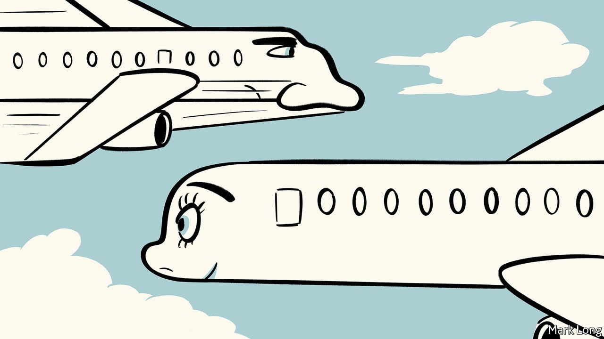

###### The resilience of rhinoplasty

# Plastic surgeons make a bundle despite Lebanon’s economic crisis 

##### Many people have no jobs. Others, nose jobs 

 

> Mar 26th 2022 

RHINOPLASTY HAS long been a rite of passage in Lebanon. Teenage girls want a dainty new nose in time for their graduation parties, celebrated in selfies. Lebanon’s many woes have not hindered the habit. Plastic surgeons are apparently making as much as or more than they did before an economic crisis, starting in 2019, that the World Bank has ranked as the third-worst anywhere, ever.

The World Health Organisation reckons that Lebanon’s economic meltdown prompted nearly 40% of the country’s doctors to leave. But for those who have stayed, the pickings, especially for nose jobs, may have increased. The pool of patients has stayed the same. There are fewer dexterous doctors to paddle in it.


If fewer Lebanese can afford cosmetic surgery, the gap has been filled by patients from abroad. Mostly of Lebanese descent, they provide 70% of the country’s bidders for beauty, reckons Chadi Murr, a plastic surgeon. That is a notably higher share than before the financial crisis, he says.

Beautifying a beak in Beirut is cheaper than in the West. The average Lebanese nose job costs $2,500, less than half the going rate in America. And while the hooter recovers, customers can visit grandparents and cousins. Some say that Lebanon’s diaspora is 15m-strong, twice as big as the beleaguered country’s resident population.

Lebanon’s beauty aficionados are a resilient and resourceful lot. When angry protesters blocked the roads in 2019, hoping to get rid of Lebanon’s government, those bent on cosmetic improvements simply headed for the clinic on foot. While the country lamented a lack of basic medicines, plastic surgeons stocked up on Botox and flesh-fillers. With the electricity supply regularly conking out, Saad Dibo, a plastic surgeon, moved stock into his flat, where his own generator kept the fridges cool.

For about half a year after an explosion in the port of Beirut killed more than 200 people in 2020, many visitors were afraid to come, says Dr Murr. Locals were “not in the mood” for nips and tucks either, he admits. His practice languished. But soon he was busy treating scars and burns from the blast.

“It’s weird” how well his business has managed, he concedes. Bleaker times may return, so he has opened a surgery in Cyprus, where he spends one week in eight. In a country so disaster-prone, you need a fallback. But as long as Lebanese ladies like to tweak their noses, Beirut’s beauty business seems likely to survive.

