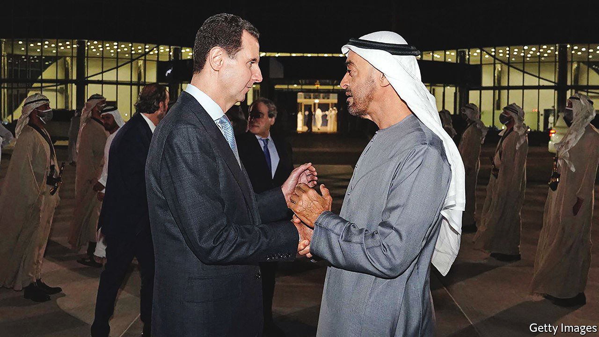

###### Springtime for Bashar

# Syria’s outcast dictator returns to the Arab world 

##### Bashar al-Assad’s warm welcome in the Emirates is a sign of America’s waning influence 

 

> Mar 26th 2022 

BASHAR AL-ASSAD has few occasions to fish out his passport. The Syrian tyrant has been largely confined to his own country since 2011, when he set out to crush a string of peaceful protests calling for reform. As civic unrest turned into civil war, he became a pariah. His few foreign forays have been to Russia and Iran, wartime allies to whom he owes his survival.

On March 18th Mr Assad emerged from isolation. He landed in the United Arab Emirates (UAE) for the sort of visit afforded to any head of state. There was an honour guard and a series of meetings with bigwigs. State media in the UAE published photos of Mr Assad with Muhammad bin Zayed of Abu Dhabi (pictured above), the country’s de facto ruler, and grinning with the leader of Dubai, the flashiest Emirate.


Mr Assad’s first trip to an Arab country since 2011 was both predictable and shocking. Predictable, because the UAE has spent years pursuing a rapprochement with him. In 2018 it reopened its embassy in Syria, which (like many others) was shut in the uprising’s early days. Abdullah bin Zayed, the Emirati foreign minister, flew to Damascus last year and met Mr Assad. The Emiratis had long been less eager than many of their partners to defenestrate Syria’s dictator. They had feared that regime change in Syria would bring Islamists, whom they abhor, to power.

It was the timing that shocked. March 18th was the 11th anniversary of the first Friday protest in the southern city of Deraa, a date many Syrians see as the start of their revolution. The symbolism was not lost on them. The visit also came as Russia waged war in Ukraine, using tactics honed over seven years backing Mr Assad. Syria was one of five countries to vote against a UN resolution damning Russia’s invasion.

The UAE feels that isolating Mr Assad has not worked: making him a pariah not only failed to depose him but left him reliant on Iran. Russia has been a bulwark against Iranian hegemony in Syria, but, with its army tied down in Ukraine and its economy hobbled by sanctions, its influence there is likely to ebb. Emiratis argue that they (and other Arab states) should fill the void. “The terrain changes, and we have to adapt to the new terrain,” says a foreign-policy official. The UAE has called for Syria to be reinstated in the Arab League, from which it was suspended in 2011.

Western powers are not happy. Their policy remains to isolate the man whose war killed perhaps 500,000 people and displaced 13m. Asked if giving Mr Assad a warm welcome helps bolster his regime, Emiratis respond with a list of Western failings in Syria, chief among them Barack Obama’s decision in 2013 to ignore his own “red line” against Mr Assad’s use of chemical weapons. That he remains in power, they argue, is a choice at least partly of the West’s own making.

That charge is not meritless. Western governments called for Mr Assad’s ouster in 2011, but their support for the rebels trying to eject him was half-hearted. Painful sanctions imposed by America and Europe have not compelled Mr Assad to change. Some anti-regime Syrians now argue that they only deepen the country’s misery.

If the Emiratis can explain why they welcomed Mr Assad, however, they struggle to articulate what their welcome might achieve. He wants trade and aid to rebuild his shattered country. Much of Syria looks like a terrible place to invest in, but a few projects could be lucrative for Emirati firms. DP World, the Dubai ports giant, is keen to invest in Tartous, a Mediterranean harbour in a relatively calm part of Syria.

Whether that will buy Mr Assad’s favour is another matter. Like his father Hafez, who ruled from 1971 to 2000, he is adept at playing off Iran and Arab states against each other. The Syrian regime has no love for Gulf rulers: Assad fils once called them “half men” for their failure to support Hizbullah, the Lebanese Shia militia, during its war against Israel in 2006. There is no reason to trust that a pot of reconstruction aid will persuade Mr Assad to toss out his Iranian saviours, or that his corrupt, vicious dictatorship will be a force for stability in the Levant.

In decades past it would have been difficult to imagine a Gulf state breaking so publicly with its American protector. But the UAE, like several of its neighbours, has grown exasperated with America. It is not that the latter is leaving the region. Tens of thousands of American troops are still deployed in Iraq, Syria and the Gulf. After an Iranian-backed group fired missiles and drones at Abu Dhabi in January, America sent a squadron of F-22 fighters and a guided-missile destroyer to the UAE.

Sorry, snoozy Uncle Sam

America is not absent, but it seems incoherent. It wanted Mr Assad gone but allowed him to stay. Its Iran policy does an about-face every four years. President Joe Biden vowed to make Saudi Arabia a “pariah”, until he needed its help to lower oil prices; both the Saudi and Emirati crown princes now duck his phone calls. The UAE feels little need to follow America’s line when it seems so meandering.

Three days after his embrace with the Syrian dictator, Prince Muhammad flew to Sharm el-Sheikh to meet the Israeli and Egyptian leaders, his first such tripartite meeting. This surprise summit touched on everything from food prices to Iran’s nuclear programme. All three participants are close to America, yet all three have sharp disagreements with it. Syria is a case in point. Abdel-Fattah al-Sisi, Egypt’s president, restored ties with Mr Assad soon after he took power in 2014. Many Israeli security people opposed Mr Assad’s ouster, fearing a failed state on their border. America may complain about their positions on Syria and other issues. But its Arab allies feel ever less need to listen. ■

