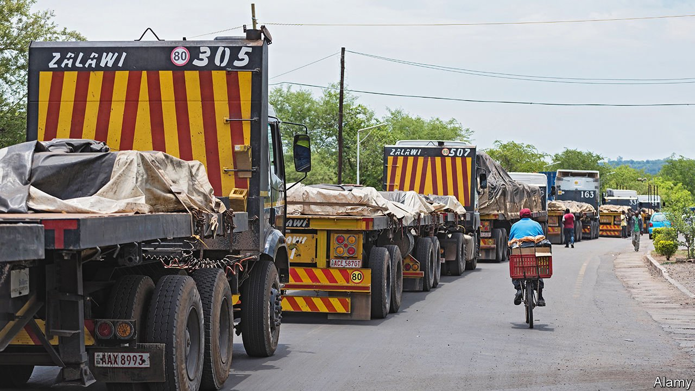
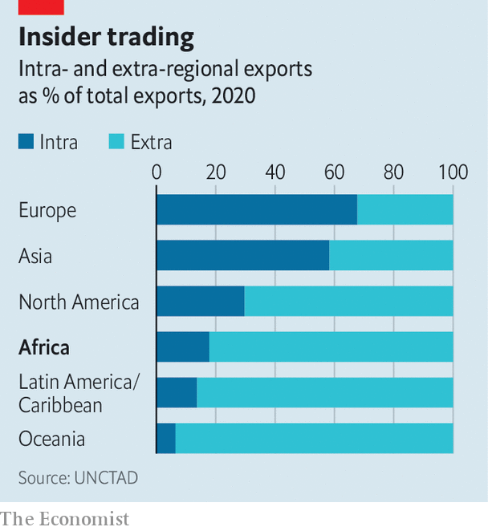

###### Trade flaws

# Why it costs so much to move goods around Africa 

##### Startups are helping shift things faster, but rules remain onerous 

 

> Mar 26th 2022 

IF TIME IS money, then Beitbridge must be a most expensive place. Late last year lorries carrying, among other things, cobalt from Congo, copper from Zambia and tea from Malawi snaked for miles as they waited to cross the Limpopo river into South Africa. Many were there for days. Some drivers bribe their way to the front; 1,000 rand ($68) is the going rate. Others cannot. In 2020 four drivers are said to have died in their vehicles while waiting.

 


African politicians say they want to end such bottlenecks. The African Continental Free Trade Area (AfCFTA), so far ratified by 41 of Africa’s 55 countries, could boost the region’s economies by making it easier to trade among them. In 2020 just 18% of exports were to other African countries (see chart), lower than the equivalent shares in North America (30%), Asia (58%) or Europe (68%). More trade within the region could lead to more jobs, higher wages and less poverty.


The AfCFTA pledges to grease the wheels of trade in two ways. The first is by reducing tariffs, especially between countries in different regional blocs, such as the Southern African Development Community and the East African Community. This could boost intra-African trade by 15-25%, reckons the IMF. But double that effect would come from reducing “non-tariff barriers”, the grit that really gums up trade.

Poor infrastructure is one such barrier. Africa’s land area is big enough to accommodate China, India, the contiguous United States and much of Europe. Yet its railway network is not very much bigger than France’s and Germany’s combined. Many lines were built by colonial companies to link mines to ports, rather than countries to one another. And existing tracks are struggling. South Africa’s state network operator was eviscerated by corruption under Jacob Zuma, a former president. Newer Chinese-built railways in Kenya and from Djibouti to Ethiopia are under-used, either because they struggle to compete with road freight or because they lack ancillary infrastructure such as storage yards.

Ports are small and slow. Cargo waits for more than two weeks on average, as against less than a week in Asia, Europe and Latin America, says CDC Group, a British development-finance institution. Handling costs are around 50% higher than in other parts of the word, reckons the African Development Bank (AfDB).

Some 80-90% of freight goes by road, of which there are not enough. Road density is among the world’s lowest. And just 800,000km of the total of 2.8m in sub-Saharan Africa are paved, says a report from 2018 by the Export-Import Bank of India. Many roads are badly placed. Some duplicate colonial railways; too many are built in the areas of powerful ethnic groups.

The IMF reckons that if the quality of Africa’s infrastructure were brought up to the global average this would increase continental trade by 7%. Surprisingly, though, even bigger gains could be made by improving how trade flows—unblocking the existing pipes, if you will, rather than installing bigger ones. It reckons that if the quality of Africa’s logistics rose to the global average, it would mean a boost of 12%. The gains are large because the cost of logistics in Africa is three to four times higher than the world average, notes a recent paper by Patrick Plane, a French economist. Such costs can add 75% to the price of goods, estimates the AfDB. So long as this is the case, Africans will not feel the full benefits of globalisation and freer trade.

Why are logistics so costly in Africa? Partly it is because of a paradox. Those who want to move merchandise complain that they cannot find lorries. Those with lorries moan that their vehicles spend too long sitting idle. One reason for this is that African countries typically buy more goods than they sell. It can cost twice as much to send cargo from the South African port of Durban to Lusaka than the other way, says Mark Pearson, a consultant based in the Zambian capital. This is because the transporter cannot assume a “backhaul” journey. So he charges double. Others wait around. Lorries taking goods from Lagos to Kano, in the Nigerian north, can spend weeks until there are enough cattle or vegetables to pay for the return journey. When they do head south they often overload the vehicle, damaging the truck and the roads.

Small fleets make things worse. Roughly 80% of transporters own fewer than five lorries. These microbusinesses depend on the cash from one trip to fund the next and can be crippled by a punctured tyre. Sigma Feeds, on the outskirts of Nairobi, once organised its own lorries. No longer. It was too stressful. “Drivers who needed money for school fees might siphon off fuel to sell,” says Vandan Shah, the CEO.

Putting idle lorries to work

Another problem is a lack of information. In much of the world large firms can buy space on trains or lorries in logistics spot markets. But in Africa, where these do not exist, miners or brewers have to sign long-term contracts with larger logistics firms such as Bolloré or South Africa’s Imperial Logistics, in which they agree to pay for capacity, whether they use it all or not. “There is no visibility between supply and demand,” explains Wale Ayeni of the International Financial Corporation, the private-sector arm of the World Bank.

Startups such as Lori Systems, founded in Kenya, and Kobo360, a Nigerian rival, hope to solve this problem by matching traders and transporters in digital marketplaces. This promises not only to reduce wasted journeys, but also to reduce the price-gouging power of trucking cartels. Startups also check paperwork, vet drivers, provide cash upfront to truckers and help with maintenance in case of breakdowns. “If a tyre falls off a driver can go on our app and order a new one,” points out Ife Oyedele, a co-founder of Kobo360.

“Infrastructure is still a massive headache,” says Uche Ogboi, the boss of Lori Systems. “But our mentality is that this is a government thing and we will have to deal with it until they fix it.” Lori, she reckons, can help to improve more than half the obstacles that lead to high transport costs, such as by enabling drivers to forward paperwork to border posts.

“A big part of business in Africa is reliability,” says Mohammed Akoojee, the boss of Imperial, which last year bought a stake in Lori. His clients would rather pay more to know that their goods will arrive on time than for journeys to be cheaper and late. Imperial hopes to use Lori’s software to develop spot markets for freight.

The deal is part of a broader trend of consolidation in African logistics. This month DP World, a Dubai-based port operator, bought Imperial, which should create a ship-to-shop company across much of Africa. Last year DP World and CDC Group teamed up to develop African ports, including in Egypt, Senegal and Somaliland. Another firm, Arise Ports &amp; Logistics, incorporated in 2020, is partly owned by an investment fund affiliated with Maersk, a Danish shipping giant, and Olam, a Singaporean trader. And Chinese entities are involved in the running or building of at least 46 ports in sub-Saharan Africa, according to CSIS, an American think-tank.

Logistics firms, as well as the businesses with goods to move, hope that the long-mooted idea of “trade corridors” will come to fruition. These are a mix of hard and soft infrastructure linking countries. Corridors would allow a container sealed in Shanghai to reach Lagos or Mombasa, with its paperwork all approved for it to travel right on to, say, Niger or Uganda.

The AfCFTA is meant to encourage such trade-easing efforts. This year it helped start a scheme to allow traders in one country to pay for goods in another using their domestic currency, rather than dollars, thus cutting foreign-exchange costs. But in general progress has been slow. Though the AfCFTA has had more launches than NASA, no trade has actually happened under the terms of the deal. “There is a lack of urgency,” says David Luke of the London School of Economics (LSE).

The current stumbling block is over rules of origin, the foundations of any trading area. In contrast to the EU, where large countries such as Germany and (pre-Brexit) Britain were advocates of liberalisation, Africa’s largest economies—Egypt, Nigeria, South Africa and, to a slightly lesser extent, Kenya—are all run by governments with protectionist leanings. Outsiders do not help either: the EU has many different types of trade deals with African countries, making it harder for those countries to harmonise their own rules.

Disputes between countries can clog up trade for months. Rwanda and Uganda closed their border for three years, only opening it recently. For most of last year Kenya banned imports of Ugandan chicken and eggs because its farmers complained about their neighbours’ prodigiously productive poultry. In 2020 a dispute between transport unions in the Gambia and Senegal made it difficult to get goods from Banjul to Dakar. And so on.

Stalled talks over rules of origin have also stopped progress on other issues. Many countries still rely on paper customs forms. Few border crossings have “one-stop windows”. Truckers need to queue separately for immigration, customs, car tax and covid tests. Such things add to the costs of getting things across borders; it is $2,000 to ship a container from China to Beira in Mozambique, but a further $5,000 to ship it 500km inland to Malawi.

The political obstacles within countries can be just as tough as those between them. Overhauling ports and border posts is difficult partly because of vested interests. African states often rely heavily on customs duties to fill their state coffers, a practice going back to the extractive model of colonial regimes. An individual inspector at the port of Toamasina in Madagascar, for instance, is responsible for collecting 1.3% of all taxes in the whole country.

Such power opens the door to rent-seeking and corruption. Sandra Sequeira and Simeon Djankov, both of the LSE, found that about 15 years ago more than half of shipments going through Maputo, and more than a third via Durban, involved bribes. Digitisation and higher wages do not seem to reduce corruption. When Ghana raised salaries for police controlling borders, bribe-taking increased.

Businesses are far from blameless, adds Gaël Raballand of the World Bank. Powerful oligopolies can collude in corruption, whether to get their goods moving or, as odd as it may seem, to keep them in port—a way to raise the costs of entry for would-be competitors, notes Mr Raballand.

“The problem is still at the borders,” grumbles a Kenyan fleet owner. Even if drivers send paperwork in advance, they can still wait behind others who do not. “We pay for drivers to skip the lines. You have to. This is Africa.” ■

