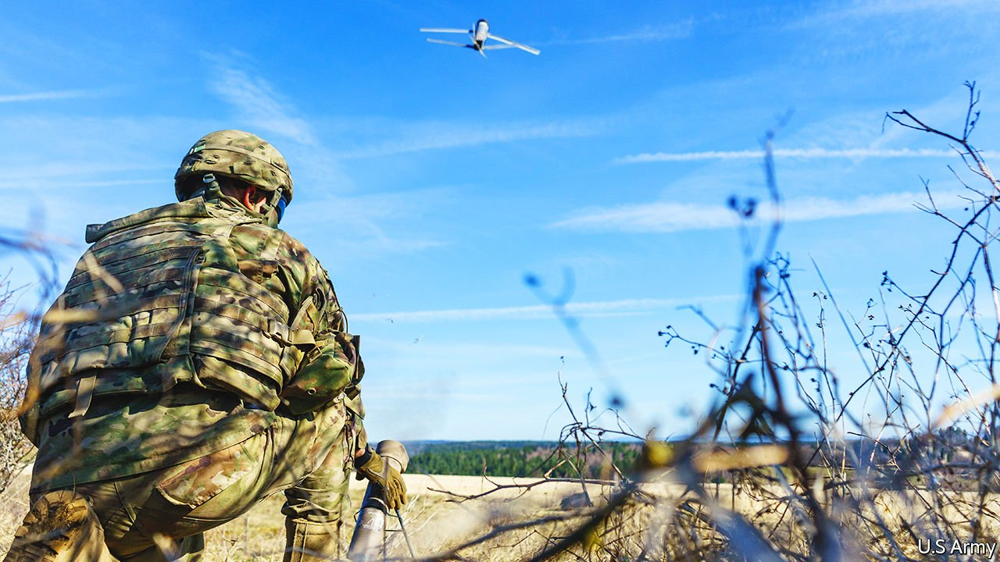

###### Loitering munitions

# Baguette-sized flying bombs are about to enter service in Ukraine 

##### Their operators will be able to pick the best target in real time 

 

> Mar 26th 2022 

JAVELIN ANTI-TANK missiles supplied to Ukraine by America are imposing a heavy toll on Russian forces. Now, the Americans are sending a batch of 100 somewhat different portable weapons—so-called loitering munitions. The difference is that, with a Javelin, you have to choose the target before you launch the missile. With a loitering munition, you don’t. Rather, you can fly it to a target-rich environment and pick out the richest of the lot to attack.

The Javelin, a modern successor to the Bazooka, weighs 20kg with its launcher and can hit something up to 4km away. Switchblade, as the loitering munition in question is known, is subtler. The version most likely to be delivered (though no one will confirm this) weighs but 2.5kg, yet has a range of 10km. Though it cannot penetrate tank armour, its grenade-sized warhead is effective against unarmoured vehicles and groups of troops. That, as Nick Reynolds, an analyst at RUSI, a British defence think-tank, observes, means they can be used in particular against artillery batteries, whether of guns or rocket launchers—which are “softer” targets than tanks. This may be increasingly important as Ukraine’s cities are subjected to heavy artillery bombardment.


Like Javelin, Switchblade is launched from a tube. But rather than being a sleek rocket capable of travelling supersonically, it is a miniature aircraft—a drone—with wings that flip out after launch (hence its name) and an electric propeller which drives it forward at a leisurely 100kph for a flight that can last up to 15 minutes. It is controlled using a tablet that displays videos from an optical camera and an infrared thermal-imager which are on board the craft. When the operator spots a target, he or she locks onto it and the drone accelerates towards it at up to 160kph, chasing it automatically if it takes evasive action.

Robert Bunker, director of research and analysis at C/O Futures, a security consultancy in California, says that the precision thus offered allows Switchblade to focus on high-value targets: not just artillery, but the headquarters and command vehicles of artillery units. The close-up view provided by camera and thermal-imager means that targets can be picked with care.

Moreover, if the operator realises a mistake has been made as the drone closes in, the attack can be called off and the weapon flown back into the sky until another target has been identified. That gives Switchblade an advantage over a different sort of loiterer, armed drones. These, in the form of missile-carrying Bayraktar TB2 drones from Turkey, helped Ukraine mount its defence in the early phases of the war. But they are the size of light aircraft and need considerable supporting infrastructure, such as runways and refuelling facilities. A Switchblade, by contrast, can be carried around in a backpack (it is about the size of a baguette) and deployed whenever needed. It is also cheaper, far easier to distribute and can be used with minimal training.

Though thousands of Switchblades have been used in action by American forces in Iraq and Afghanistan since their introduction in 2011, they have until now flown under the metaphorical as well as the physical radar. No video has been released of them in combat. And they have been exported only to Britain, probably America’s most trusted ally.

Ukraine, however, is well prepared to use them. Its military planners realised some time ago that loitering munitions could be an effective equaliser for a smallish country threatened by a large neighbour. In 2017 the government signed a deal with WB Group, a Polish electronics company, to buy supplies of its catapult-launched Warmate loiterer, which has a weight of 5.3kg and a range of 15km—though legal problems interfered with its planned deployment last year, and whether it is now in use is not public information. Nevertheless, in December the defence ministry announced that dedicated loitering-munition units would be formed within Ukraine’s army, to act as parts of “brigades of the future”.

On top of all this, several Ukrainian firms are developing loiterers. The most advanced project is run by Athlon Avia, one of many enterprises which sprang up to aid the armed forces before, during and after the Crimean crisis of 2014. Since then, Athlon has become a full-fledged drone-maker, and one of its products, the ST-35, is a loitering munition. This weapon passed flight tests with the Ukrainian army in 2020—though whether it has yet been deployed has not been announced.

The ST-35 is launched in an unusual way. Instead of being fired from the ground it is taken aloft by a multicopter drone which, after releasing it, then acts as a communication link. That gives an effective control range of 30km.

Three other Ukrainian firms—Adrones, CDET and Cobra—are also working on the idea, and although none had a deployable system when the current war started, experience has shown that Ukrainian armourers excel at improvisation and at turning out usable products rapidly in difficult conditions. Weapons which offer the potential of striking unseen from long range, whether supplied from America or from Poland or in haste from local workshops, are particularly valuable. Their success may also give an insight into how important they could be in future wars. ■

To enjoy more of our mind-expanding science coverage, , our weekly newsletter.

Read more of our recent coverage of the 

