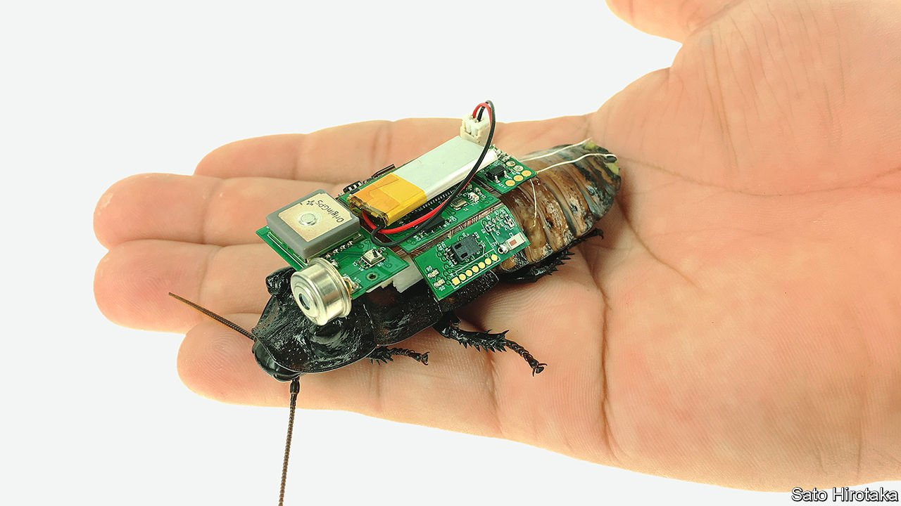

###### Cyber-roaches

# Robotised insects may search collapsed buildings for survivors 

##### They can detect movement, body warmth and exhaled carbon dioxide 

 

> Mar 26th 2022 

WHY GO TO all the trouble of designing and building a drone if nature has already done most of the job for you? That is the attitude taken by the small but determined band of researchers who are trying to robotise insects. Some are working on turning flying critters like beetles into such cyborgs—perhaps for use in military reconnaissance or espionage. Others prefer to concentrate on the creepy-crawly side of entomology, by taking electronic control of cockroaches.

The first cyber-roach goes back to 1997, when Shimoyama Isao of Tokyo University sent electrical signals to a cockroach’s antennae, causing it to turn either left or right depending on which antenna was stimulated. Others have built on this approach by recruiting extra sense organs, such as the rear-facing cerci. They have also begun fitting the insects with instrument packs that might let them do a useful job: searching collapsed buildings for survivors.


One such is Sato Hirotaka of Nanyang Technological University, in Singapore. He has been working on cyber-insects (including flying versions, in the form of giant flower beetles) for 15 years. Now, he has added another twist to cyber-roaches. Instead of having their movements dictated by remote control, his are autonomous agents. They are run by algorithms that respond directly to sensors in their backpacks.

The insects thus fitted out by Dr Sato are Madagascar hissing cockroaches, which are about 6cm long. The backpacks contain a communications chip, a carbon-dioxide sensor, a motion sensor, an infrared camera and a tiny battery.

For search-and-rescue operations in collapsed buildings, fleets of these roaches would be released into the rubble, to crawl their way through while searching for signs of life such as movement, body heat and elevated CO levels from respiration. The artificial intelligence that decides whether a set of signals actually indicate the presence of a human being is programmed directly into the camera. If it thinks it has spotted someone, it alerts a rescuer.

To test this arrangement, Dr Sato and his team ran trials in a simulated disaster zone. They laid out concrete blocks of various shapes and sizes in an area of 25 square metres. Interspersed among these were a number of people, and also some decoys, such as a heat lamp, a microwave oven and a laptop. They then released the cyber-roaches, having first programmed into them the search’s start and end points. The software proved able to recognise humans correctly 87% of the time, a success rate Dr Sato thinks could be improved still further by collecting multiple images from different angles.

The next phase of the project is to refine the system for use out of doors. That done, manufacture of the backpacks and automation of their attachment to the insects will need to be commercialised. If all goes well, Dr Sato reckons the result could be available for deployment within five years.

To enjoy more of our mind-expanding science coverage, , our weekly newsletter.

