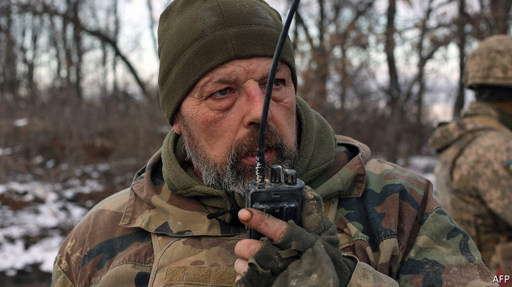

###### Ukraine’s internet connectivity

# The degrading treatment of Ukraine’s internet 

##### And how the Ukrainians are responding 

 

> Mar 26th 2022 

DEGRADING AND ideally destroying your opponents’ ability to communicate are elementary military tactics. And, in its war on Ukraine, Russia has certainly attempted to do this. These days, closing down communications focuses on the enemy’s internet capabilities. So it is not surprising that analyses by NetBlocks, a firm in London that monitors internet activity, suggest that the number of devices connected to Ukraine’s internet has fallen by nearly a quarter since Russia’s onslaught began. Alp Toker, NetBlocks’ founder, describes that loss as striking. But it could be a lot worse, for it means that most Ukrainians are still online. What is going on?

For one thing, Ukraine boasts an unusually large number of internet-service providers—by one reckoning the country has the world’s fourth-least-concentrated internet market. This means the network has few choke points, so is hard to disable. In this, indeed, it fulfils one objective of the internet’s ancestor from the 1970s, ARPANET, which was intended to be similarly resilient to attack. Repair crews, for their part, are toiling heroically, including, when possible and more efficient, by fixing equipment owned by competitors.


As for cyber-attacks, at the invasion’s outset hackers shut down a proportion of the satellite links that Viasat, an American firm, provides to clients who include Ukraine’s armed forces. That attack appears to have been an upload of malware disguised as a legitimate software update. Overall, however, cyber-attacks have not been as disruptive as feared. This suggests that “cyber aid” provided by the West in recent years was money well spent. Josh Lospinoso, who used to help America’s army and National Security Agency (NSA) develop hacking software, says Ukraine’s cyber-resilience could be a sign that agencies in NATO countries are assisting on the sly.

Beyond all that, Russian units seem to be leaving parts of the network alone, at least for now. These include sections that are accidentally providing them with data on targets, reckons Kenneth Geers, also once an official at the NSA and now working at the NATO Co-operative Cyber Defence Centre of Excellence, in Tallinn, Estonia. Dr Geers says Russians are feeding information to artillery teams by scanning social media and studying intercepted texts and calls, looking for messages that reveal military savvy and intent. If they can find out where the senders are, artillery strikes may follow.

That implies Ukrainian carelessness. But another reason Russian forces are deliberately preserving parts of Ukraine’s telecommunications is that their own gear for military communications is scarce or underperforming.

Pursuing plans B and C

On the whole, though, Russia wants to stop Ukrainians conversing. So, to counter the loss of power and connectivity thus imposed, a range of lash-ups, workarounds and jury-rigs are being prepared.

Some use available materials. Yuri Vlasyuk, boss of iLand, a computer store in Kyiv, says batteries that power electric vehicles are being employed to make power banks for use during blackouts. However, electric cars are still uncommon in Ukraine, so Mr Vlasyuk called some friends in the Czech Republic and Lithuania to help out. Eventually, they managed to ship several hundred electric-car batteries to Kyiv. If the electricity does go out there, the assembled battery packs will power smartphones and other gear. Mr Vlasyuk says his gizmos have been distributed across Kyiv and to soldiers on the front.

An additional approach is to extend a phone’s range—a handy trick if nearby cell towers are destroyed. This can be done using commercial devices called signal boosters, but makeshift range-extension antennae also work. These are made with lengths of coaxial cable and conductive household materials, “copper wire, Coca-Cola can, empty, this kind of stuff”, says a retired radio-communications engineer in Warsaw who follows wartime jury-rigging of this sort. In the right conditions, such contraptions can triple a mobile phone’s range to about 15km, greatly increasing the number of towers it is able to talk to.

Then there are shortwave-radio hams. Many of Ukraine’s roughly 15,000 amateurs are now manning radios for military or intelligence units, says Artem Biliy, a ham operator in Lviv. To assist with this, Ukraine has temporarily banned conventional ham transmissions. But, if needed, hams could constitute a sort of alternative internet, Mr Biliy notes. With the use of modem software, digital data on smartphones and computers can be converted into analogue signals for shortwave transmission. Using the same software, radio operators hundreds of kilometres away can translate the signals into text or images. But this is cumbersome. It takes several minutes to send a low-resolution photo from one ham radio to another.

Which is where Elon Musk comes in. Responding to a plea for help from Ukraine’s government, Mr Musk, head of SpaceX, an American rocketry firm, quickly provided internet terminals that connect to a constellation of satellites called Starlink. Because Starlink satellites orbit a mere 550km up, the service is faster than those that rely on geostationary satellites nearly 36,000km away.

Early batches of these terminals went to eastern and central Ukraine. The first shipment to the country’s west arrived in Lviv on March 22nd. Lviv IT Cluster, a group of information-technology firms that are collaborating with SpaceX, is speedily distributing the terminals. How many there are is a secret. But Stepan Veselovskyi, Lviv IT Cluster’s head, says there are enough for hospitals, utilities and rescue services, and also for “critical” government offices, military units and businesses. Smartphones and computers that connect to a Starlink terminal via Wi-Fi download about 150 megabytes of data a second, enough for 12 minutes of video.

To assist their wartime use, SpaceX has tweaked the terminals to draw power from vehicle cigarette-lighter sockets, and has provided special adapters to that end. It has also shipped more conventional power sources, in the form of solar arrays, battery packs and electricity generators. Starlink is the closest thing Ukraine will get to a backup internet. Russian officials are angry. Dmitry Rogozin, head of Russia’s space agency, Roscosmos, slammed Starlink as “the West we should never trust”.

Using Starlink does carry a risk. The terminals’ emissions make them bright targets for missiles designed to seek radar emplacements, says a colonel in Ukraine’s army. For this reason, he says, troops will use Starlink only as a backup. Also, though Starlink is useful, if internet and telecoms networks were to break down it would be able to connect only a tiny fraction of Ukraine’s population. That population does, however, seem so far to be making a pretty good fist of keeping these networks going by other means. ■

To enjoy more of our mind-expanding science coverage, , our weekly newsletter.

