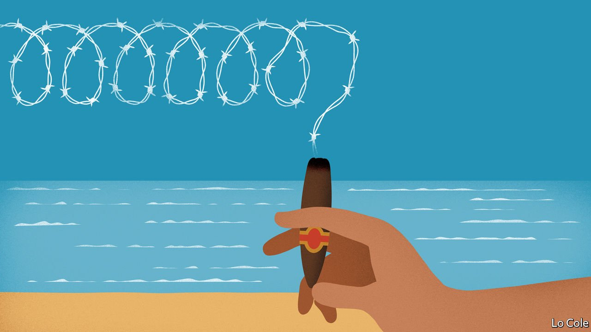

###### Bello

# Cuba’s dictatorship has a cultural opposition that it can’t tolerate 

##### The socialist island is as repressive as Russia, albeit sunnier 

 

> Mar 26th 2022 

WHEN YUNIOR GARCÍA, a dramatist, was still living in his home city of Holguín, in eastern Cuba, the local secretary of the Communist Party, Miguel Díaz-Canel, came to see two of his plays. “We talked,” says Mr Garcia. “He seemed open and more modern. He liked the theatre.” Since 2019 Mr Díaz-Canel has been Cuba’s president. “He has stopped smiling. He reads out everything he says. He has acted as a despot.”

Mr García, one of whose plays has been staged at the Royal Court theatre in London, has suffered from that despot ism. He was a founder of the San Isidro movement, a group of artists and writers based in Havana. In 2020 they staged a protest against censorship outside the culture ministry. “It began with 20 people and grew to 500,” he recounts. It was the biggest gathering of its kind in decades. A senior official agreed to meet the artists, though talks got nowhere. But it was a turning point, Mr García thinks.


In its more than 60 years of rule, Cuba’s Communist Party has been adept at isolating dissidents, branding them stooges of the United States. In its early decades the regime enjoyed public support, thanks to free education, health care and housing and the charisma of Fidel Castro. The first crack came with the collapse of the Soviet Union and the end of its largesse to its Caribbean client, later partially replaced by Venezuela.

Now Venezuela’s government has little money, Mr Castro is dead and his brother and successor, Raúl, has retired. Mr Díaz-Canel and the military-bureaucratic complex he heads face unprecedented difficulties. While Donald Trump was president of the United States he intensified sanctions barring most tourism and remittances to the island. This compounded the inefficiencies of Cuba’s centralised economy.

The pandemic kept tourists away and highlighted the parlous state of Cuba’s health service. Hospitals were overwhelmed and oxygen ran short. The economy is still 11% smaller than in 2018. In January 2021 the government devalued the peso, to try to cut subsidies and inefficiencies. As a result inflation was almost 300% last year, according to the Economist Intelligence Unit, our sister organisation. On the black market the peso is worth less than a quarter of the official rate. Many shops have empty shelves, except those that sell in dollars, which many Cubans lack.

Frustration boiled over in spontaneous protests across the island on July 11th 2021, in which there were isolated incidents of violence. This social explosion was fanned by mobile phones and the internet, to which the government granted access in 2018. It was probably the biggest public challenge to the regime since the 1960s. The response was harsh: almost 800 people were charged over the protests and more than a hundred have so far received long prison sentences, some of up to 30 years, in summary trials.

On July 11th Mr García and his movement, now called Archipelago, demanded 15 minutes on television to explain their view of the events. They were arrested and he spent a night in jail. Cracks showed in the normally monolithic façade of the regime. Silvio Rodríguez, a prominent singer-songwriter and a pillar of the revolution, met Mr García. “He’s conscious of the situation,” says the playwright. “But he’s devoted his life to a Utopia and can’t admit that he’s wrong.”

Archipelago sought official permission to organise a peaceful protest last November 15th to call for the release of the prisoners. In response the regime ordered military mobilisations on that day. So the protesters switched to November 17th. The security police told Mr García he would go to jail for 27 years. He said he would march alone carrying a white rose. But in the days beforehand his home was surrounded by a mob of 200 people. Rather than face long jail terms, he and his wife, Dayana, escaped to Madrid. The regime seemed content to let them go, its usual expedient with troublemakers. Dozens of other activists, artists and journalists have left the island since July, many of them ending up in the Spanish capital.

The government has shut Mr García’s theatre group. Archipelago is dispersed. But it has already achieved something. It has shown that the regime faces not just a disgruntled populace but also an intellectual opposition it does not know how to handle and which is hard to brand as the creation of the CIA. By repressing such voices, the regime can doubtless stay in power. But other voices may pipe up, reminding the world that Cuba is like Russia, only sunnier.

