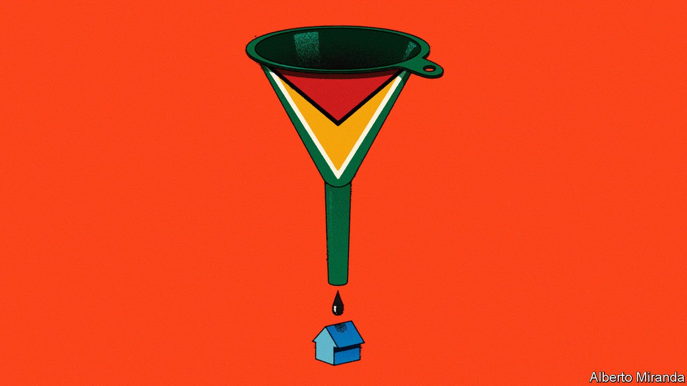
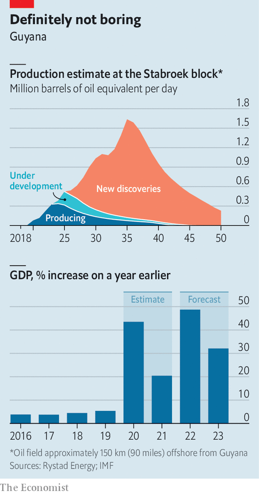

###### Invest or squander?

# Guyana’s tiny population braces for a gusher of petrodollars 

##### Other countries blessed with oil have not always made good use of it 

 

> Mar 26th 2022 

IT USED TO be a disused sawmill surrounded by fields of sugar cane. But since oil was discovered off Guyana’s coast in 2015 the 52-hectare site in Georgetown, the capital, has been transformed into the biggest logistics hub in the country. From this waterfront spot, Guyana Shore Base serves ExxonMobil, an American oil giant, and other foreign firms drilling for oil off the Caribbean coast. At two big berths along the Demerara river ships pull up to offload equipment for maintenance and pick up supplies for hundreds of workers toiling away on offshore rigs.

The buzz at the shore base hints at how a rush of petrodollars could transform one of South America’s poorest countries. Autarkic policies introduced under socialist rule in the 1970s left Guyana struggling with unsustainable debts and sluggish growth. Many of the country’s 800,000 people make ends meet doing the same things their grandparents did: farming rice, chopping timber or mining gold.


But since the discovery of light, sweet crude in its waters, Guyana’s fortunes have begun to turn. The country has received a surge of foreign investment and built a sovereign-wealth fund to store its share of the oil money. As a result, it was the world’s fastest-growing economy during the covid-19 pandemic. Now it stands to gain as the war in Ukraine sends oil prices soaring past $100 per barrel and countries that rely on Russian fuel scramble for alternatives.

I’ll oil wells need you

The rising price of oil comes at an important moment for Guyana. The government could get its hands on the oil money for the first time in the coming weeks: it can withdraw a total of $600m from the sovereign-wealth fund this year. But it is unclear how the bonanza will affect the country. Will a sudden injection of petrodollars boost much-needed infrastructure and pull thousands out of poverty? Or will it be squandered or stolen?

ExxonMobil has found over 10bn barrels of recoverable resources in Guyana. Exploration could soon begin in other areas of the seabed. Even if all the new wells turn out to be dry holes, more than 1m barrels of oil per day will be gushing out of Guyanese seas by the end of the decade, says Schreiner Parker of Rystad Energy, a consultancy. That would make it one of the world’s largest offshore producers. Relative to its population, its output will be colossal. Whereas Saudi Arabia pumps less than a third of a barrel, per person, per day, Guyana could be pumping nearly four times that by the end of the decade. The speed at which production has started is “unprecedented”, says Alistair Routledge, president of ExxonMobil Guyana.

 


Oil has already boosted Guyana’s tiny economy. Multinationals are setting up shop. Local workers are making money driving taxis, working as waiters or toiling on building sites. The economy grew 20% last year and 44% in 2020 (see chart). The current-account balance, which reflects whether a country is a net borrower or lender to the rest of the world, is expected to turn positive this year.

The government is talking big about channelling petrodollars into development. The latest budget, announced in January, promised to raise government spending 44% this year. There are plans to build roads, schools and hospitals. With a new pipeline and 300MW power plant, Guyana could use the gas produced offshore to reduce the cost of electricity and jumpstart manufacturing. New call centres promise to create jobs in the region’s only English-speaking country.

However, Guyanese people need not look far to see how things could go wrong. To the west is Venezuela, where oil has bankrolled a corrupt socialist dictatorship that has impoverished its people. (Indeed, oil exploration in Guyana was delayed for years by a territorial dispute with Venezuela, and anxious types still mutter that its despot might one day try to invade.) To the north, in Trinidad &amp; Tobago, an oil boom brought social discontent and crime. Indeed studies show that, if a country has strong institutions, oil can foster growth, as in Norway and Canada. But a “resource curse” often blights countries with weak institutions, where rent-seekers gobble up the proceeds.

Ashni Singh, Guyana’s finance minister, talks about economic “diversification”. But there is no doubt the country is growing dependent on one industry. By the government’s own estimates, the economy will expand 48% this year. Take out oil, and it will grow by less than 8%.

It is far from clear how much of the oil money will reach ordinary people. Offshore oil rigs do not hire many workers. The drilling happens thousands of metres underwater; machines do most of it. The small number of maintenance staff on the oil platforms need special training. ExxonMobil employs just over 180 people in the country. The company reckons its operations have created jobs indirectly for about 6,000 more. About 60% of them are Guyanese. But not many Guyanese have the skills needed to run an offshore oil operation safely. High-skilled workers are being brought in from other oil-producing countries instead.

Local firms are not winning many big contracts. Only a few companies in the world can produce the pipes or widgets used on high-tech oil platforms. New rules pushed through parliament in December require energy companies to buy certain basic goods and services from Guyanese businesses, such as laundry and catering. But it is an uphill struggle. Multinational oil companies require internationally recognised quality and safety certifications, which few local firms have. ExxonMobil says it spent $220m with local suppliers last year—a large sum relative to Guyana’s GDP, which in 2021 was $6bn. But it is small relative to the company’s overall expenditure on the project in the period, which Rystad Energy reckons was over $900m.

Meanwhile the economy may be overheating. Georgetown Chamber of Commerce and Industry, a business lobby, says local firms are losing their best workers to the oil industry and struggling to get hold of basic goods, like sand for construction. Global supply-chain problems and geopolitical instability have not helped. Consumer prices in Georgetown rose 1.5% in January alone, taking annual inflation to 5.8%, its highest in 20 years.

Perhaps the biggest risk is corruption. The two largest ethnic groups in Guyana are those of African and Indian descent. They do not trust each other much. Successive governments, under the largely Indo-Guyanese People’s Progressive Party and the Afro-Guyanese People’s National Congress Reform, have favoured their own. Cronyism is rife. Local businessmen complain it is only those with friends in high places who win big deals and top jobs in the oil industry. (Presumably this is not true of jobs requiring technical skills that are hard to fake.) Analysts worry there is little transparency surrounding the sovereign-wealth fund, the rules that dictate how much the government can withdraw and where the money is spent. In February Vice News, a website, accused the vice-president of accepting kickbacks from Chinese businessmen. He denies this.

Outside the capital some remain sceptical of black gold’s potential. Gary Grant, the 55-year-old estate manager at the Pomeroon Trading coconut farm, has been alive almost exactly as long as Guyana has been independent, and seen ethnic and political divisions repeatedly hold his country back. He is enraged by rising inflation and glaring inequality. “When Guyana found oil I was optimistic,” he says. “But I’m not so optimistic any more.” ■

