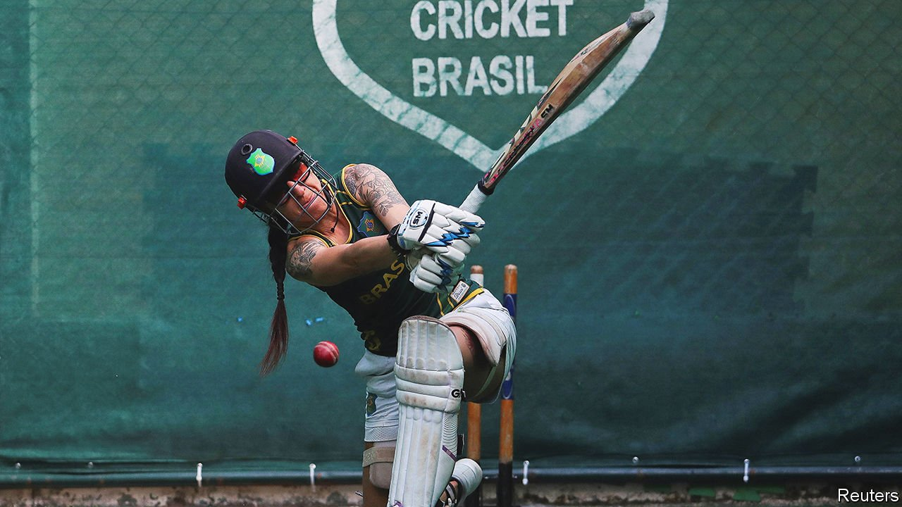

###### Bowling maidens over

# Why cricket is gaining popularity in Brazil 

##### Particularly among women 

 

> Mar 26th 2022 

A SPA TOWN in the foothills of coffee country may not be the likeliest place to find a cricket revolution. But at a crumbling country club in Poços de Caldas, a city of 170,000 people, the Brazilian national team is in full swing. Funk music blasts as women in brightly coloured shirts spin balls into nets. They stop only to laugh, to check on a teammate’s baby and, when the clouds start to swell, to duck out of the summer rains. It is a far cry from the kind of cricket first played in Brazil in the 1850s. Then it was the pastime of British railway workers. Today it is for Brazilians.

Brazil’s embrace of cricket began two decades ago, when Matt Featherstone, a club player from Britain, noticed that there was a street version of cricket called taco. He began swapping bottles for stumps, and encouraging kids to bowl overarm not under. By 2009 it had become a regular programme under the banner of Cricket Brasil, which is partly funded by the International Cricket Council.


It was not an instant hit. “I’m not going to play that shit,” was Renata de Sousa’s response when invited to play as a teenager. But the camaraderie of the game won her and others over. Today a scholarship scheme puts the best players through university and into coaching. There are teams for the blind and disabled. In Poços more children now hit balls with bats than boots, with over 5,000 playing in total.

This is remarkable not only because they are playing cricket, but because they are playing anything at all. Brazil may be known the world over for football and beach bodies, but a lot of Brazilians are conspicuously unsporty. In a recent survey of exercise habits, Brazilians puffed in last out of 29 countries, devoting half the global average time to physical activity. A study in 2016 found that six in ten state schools had no exercise area. In Poços the cricketers are allowed to use a few of the town’s derelict sport centres. But the rest has been done, quite literally, off their own bats—made by a local carpenter. The balls are imported from Bangladesh.

Unusual too is that women are in the vanguard. Brazil remains cleft by gender stereotypes, but they never infiltrated the pavilion. Today all 14 of the country’s professional cricketers are women, including Ms Sousa. In Poços they are local celebrities. Brazil’s team dream of becoming “the next Thailand”, says Ms Sousa. It too is not a traditional cricketing country, but has rapidly improved and now boasts the world’s tenth-best women’s team in the one-day format (Brazil lags behind at 28th). The hope is that cricket one day becomes an Olympic sport, for then the flow of money and interest would increase.

Within the next five years, Cricket Brasil wants to have 30,000 players in the region around Poços. It is building a federation of teams playing in Salvador, Brasília and São Paulo. “I have no doubt that soon it will arrive in the whole of Brazil,” says Sérgio Azevedo, the mayor of Poços. He sometimes cuts ribbons in a cricket jersey.

Cricket may never receive as much money or adoration as the Seleção, Brazil’s famous football team. But in Poços, at least, it has already hit football for six. ■

