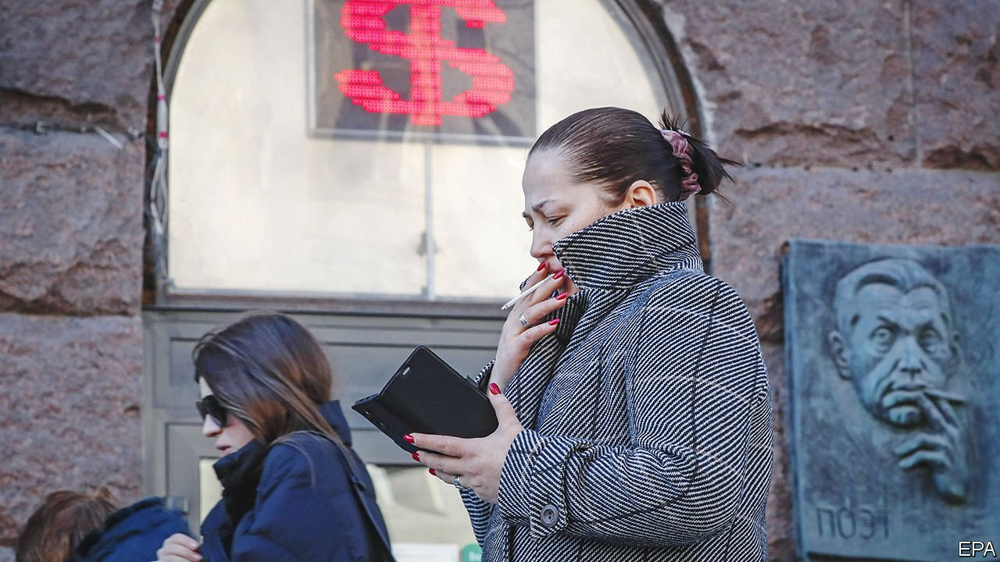

###### The world this week

# Business 

#####  

 

> Mar 24th 2022 

Moscow’s stock exchange resumed partial trading nearly a month after it closed. The phased reopening began with trading in local bonds, followed by 33 equities including state lenders Sberbank and VTB. Russia’s central bank said foreigners would be barred from selling local stocks or rouble treasury bonds until April 1st. It also banned short selling.

Western companies continued to cut ties with Russia. Nestlé, the world’s biggest food company, pulled brands such as KitKat and Nesquik from Russia but said it would continue to sell essential items. BNP Paribas and Crédit Agricole became the latest banks to pull out. Renault, a carmaker, suspended operations at its Moscow plant and unveiled plans to exit its Russian venture, AvtoVaz. TotalEnergies said it would stop buying oil from Russia by the end of this year, though it stopped short of joining its peers in divesting its oil and gas assets in the country.


Big oil’s comeback

, the world’s biggest oil producer, said it would invest up to $50bn a year to boost production after more than doubling its annual net income in 2021 to $110bn. Aramco and its peers have profited from a sharp rise in oil prices, which topped $120 a barrel on March 23rd.

Gas prices surged by nearly a third after President Vladimir Putin ordered Russia’s central bank to push for rouble payments for natural-gas purchases from countries it deems hostile, including America, Britain and members of the European Union. The decision comes as the Biden administration and European Union explore a  Europe’s dependency on Russian gas.

The Securities and Exchange Commission (SEC), a financial regulator, proposed new rules forcing public companies in America to disclose climate-related risks and greenhouse gas emissions. If finalised, the rules would mark the first mandatory disclosures required by the SEC on climate risk.

Inflation in Britain rose to a 30-year high, pushed up by soaring global prices for energy, petrol, food and durable goods. Consumer prices were 6.2% higher in February compared with a year earlier, making it the fastest annual increase since 1992.

The International Monetary Fund said Egypt has asked for support as the war in Ukraine pushes wheat and oil prices higher. Egypt, the world’s biggest wheat importer, is heavily reliant on supplies from Russia.

Evergrande, an indebted Chinese developer, delayed the publication of its annual results following a disclosure that lenders had seized around 13.4bn yuan ($2.1bn) of deposits from the group. The property giant, which has more than 1.97 trillion yuan ($305bn) in liabilities, said it had launched an independent investigation into the matter.

Share prices in Boeing, an American aircraft manufacturer, fell after one of its 737-800 jets crashed in southern China with 132 people on board, renewing concerns about the company’s safety record. China Eastern Airlines said it would ground its 737 aircraft and India’s aviation regulator placed the country’s entire fleet of 737 jets under enhanced surveillance.

Credit Suisse, a Swiss bank, said it could be forced to pay more than $500m in damages in a lawsuit brought by the former Georgia prime minister, Bidzina Ivanishvili. The ruling will be decided in a Bermudan court. Credit Suisse will announce its first-quarter results on April 27th.

Alibaba, a Chinese e-commerce giant, increased its share buyback programme to a record $25bn after slowing growth and a crackdown by Beijing on the tech sector. China’s tech stocks have been weighed down by volatile trading. Alibaba’s share price has fallen by around half in the past year.

Warren Buffett sent Berkshire Hathaway’s share prices soaring following an $11.6bn cash acquisition of Alleghany, an insurer, in the conglomerate’s largest deal in six years. The purchase will dip into Berkshire’s $147bn cash pile.

Ferretti Group, an Italian yacht maker, launched an initial public offering on the Hong Kong stock exchange to raise up to $300m. The company downplayed the potential fallout from sanctions against Russian oligarchs.

Kohl’s, one of America’s largest department stores, said it was reviewing offers from potential buyers following activist pressure to sell itself. The company previously rejected bids from investment firms that valued it at $9bn.

Two private islands that were owned by the late, disgraced financier, Jeffrey Epstein, went on sale for $125m. Proceeds will go towards resolving outstanding lawsuits and other costs incurred by the Epstein estate.

