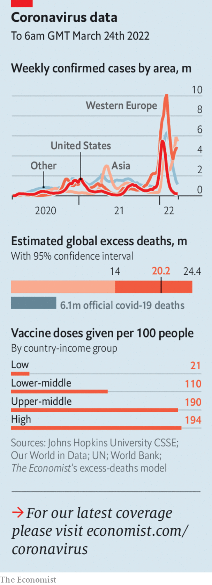

###### The world this week

# Politics 

#####  

 

> Mar 26th 2022 

Volodymyr Zelensky, Ukraine’s president, said there was “nothing left” of  after three weeks of indiscriminate Russian shelling. The 100,000 remaining residents are desperately short of food. The Pentagon said that Russian soldiers had entered part of the port city. But defenders continued to resist. More than 3.5m people have fled Ukraine since Vladimir Putin’s invasion began.


Elsewhere Russia struggled. NATO estimated that it had lost more than 7,000 soldiers in a month. Ukrainian troops went on the offensive in parts of the country, attempting to retake Kherson, a southern city. Russian forces near Kyiv, the capital, have not advanced for two weeks, though missiles continue to strike the city.

Mr Zelensky said that any peace deal with Russia would have to be approved by a nationwide referendum. He has also insisted on a meeting between himself and Mr Putin. Talks have so far made little progress. Russia wants Ukraine to declare itself neutral, give up Crimea and Donbas and largely disarm. It also wants the West to end sanctions. Ukraine fears such a deal would leave it nearly defenceless, and notes that Russia has broken previous promises to pull back its troops.

Jens Stoltenberg, NATO’s secretary-general, said the alliance would send four new battle groups to eastern Europe, doubling its military presence there. NATO currently has around 40,000 troops stationed on its eastern flank between the Baltic Sea and the Black Sea.

North Korea test-launched what appeared to be its largest intercontinental ballistic missile ever, according to South Korean officials. Japan called the launch “reckless”.

Rishi Sunak, Britain’s chancellor,  including a cut in fuel duty, a higher threshold at which people pay national insurance (a payroll tax) and a lower standard rate of income tax from 2024. But living costs are soaring and Mr Sunak’s new measures offset only around a sixth of previously announced tax increases as a share of GDP.

Madeleine Albright, the first woman to serve as America’s secretary of state, . An immigrant from Czecho slovakia, she served in the post from 1997 to 2001 during Bill Clinton’s presidency. In 1999 she led calls for the NATO bombing campaign that helped end ethnic cleansing in Kosovo.

Canada’s prime minister, Justin Trudeau, looks likely to stay in power until 2025, after his Liberal party struck a “supply and confidence” deal with the New Democratic Party. The Liberals will continue to govern as a minority, with support from the other left-leaning party, whose goals on social issues, the environment and housing the Liberals promise to advance.

Judge dread

Erika Aifán, a Guatemalan judge, resigned and fled to the United States after attempts to strip her of immunity appeared close to success. Ms Aifán, who also faced death threats and lawsuits, was overseeing a case involving alleged corruption by the president.

Brazil’s Supreme Court blocked Telegram, a messaging app, for several days. The court argued that the app had ignored its orders over battling disinformation ahead of October’s presidential election. Separately YouTube said it would remove videos peddling lies about fraud in the 2018 election. President Jair Bolsonaro has claimed his margin of victory would have been bigger were it not for vote-rigging.

A trip to the Caribbean by the Duke and Duchess of Cambridge, intended to strengthen the British monarchy’s links with Commonwealth countries after Barbados removed the queen as head of state, sparked protests. A group of Jamaican politicians, business leaders and activists called on the royal family to apologise for colonialism, and demanded reparations for slavery. The couple cancelled another engagement in Belize, which also saw demonstrations.

On March 23rd, when Afghan girls were supposed to go back to school, the Taliban said that female secondary-school pupils would have to stay at home. Officials said the girls’ uniforms were immodest, and so violated Islamic law. When the Taliban previously ran the country, girls’ education was entirely banned.

Imran Khan, Pakistan’s prime minister, is facing a no confidence motion as early as next week. Coalition partners as well as lawmakers from his party say they have lost faith in Mr Khan, owing to his economic mismanagement. His relationship with the armed forces, without whose blessing no Pakistani leader can survive, has deteriorated.

At least eight people were killed in Mogadishu, Somalia’s capital, in an attack by suspected jihadists near the international airport complex. The complex houses foreign embassies and the headquarters of an African peacekeeping force.

 


After a decade of isolation from his fellow Arab rulers, President Bashar al-Assad of Syria came in from the diplomatic cold by visiting the United Arab Emirates. America expressed “profound disappointment” at his reception.

Spain shifted its position on Western Sahara, its former possession, by backing Morocco’s plan to give the territory limited autonomy. Algeria, which backs Polisario, the indigenous guerrilla movement that has been seeking independence for nearly half a century, was furious. Polisario said Spain had made “a grave error”.

China  to keep a wave of the Omicron variant of covid-19 under control. The country reported its first two covid deaths in over a year. Shenyang, a north-eastern city of some 9m people, has locked down and Shanghai Disneyland has closed until further notice.

New Zealand will scrap some vaccine mandates and ease other covid-19 restrictions. Jacinda Ardern, the prime minister, called it “a new beginning”. Meanwhile New York’s mayor, Eric Adams, announced plans to end a school mask mandate for children under the age of five.

