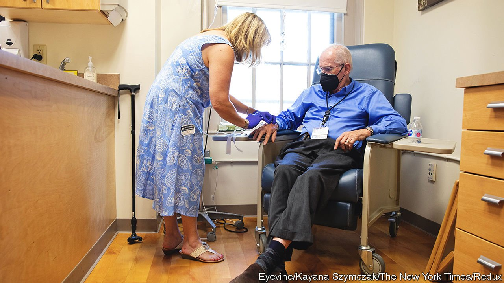

###### Drug pricing

# A new drug for Alzheimer’s is struggling to justify its price 

##### The government is put off by Adulhelm’s $28,200-a-year cost 

 

> Mar 26th 2022 

JAY REINSTEIN remembers where he was when he heard that the Food and Drug Administration (FDA) had approved Aduhelm (aducanumab), a new Alzheimer’s drug. It was last June, and he was at Kohl’s, a department store, when he started getting news alerts on his phone. He asked a stranger outside the shop to take a picture of him jumping into the air, which he promptly posted on Facebook to share the news with family and friends. “It was an awesome feeling because it really felt like there was hope for me and so many others,” he says. “I remember going home, and my wife was crying.”

After being diagnosed with Alzheimer’s disease four years ago at the age of 56, Mr Reinstein thought the wait for treatment was finally over. “I was all ready to roll,” he recalls. Alzheimer’s is a brutal and relentless degenerative disease that gradually robs patients of their memories—and devastates families. But in January the Centres for Medicare &amp; Medicaid Services (CMS) proposed that only patients who are enrolled in clinical trials would have their drug costs covered. If the CMS confirms this decision in April, it will greatly limit who can have the drug.


Despite Aduhelm being billed as the first treatment to modify the course of Alzheimer’s, payers of all kinds have been cool on the drug. Weak evidence of efficacy, problematic side-effects and a sky-high price are all to blame. The drug has also had a chequered history. In early 2019 Biogen, the biotech firm behind it, halted its development, saying that it did not work. Months later, the firm did a U-turn and said a new analysis showed that the drug did work after all.

Scientists disapproved of the way the data had been reanalysed. And sceptics pointed out the massive financial gains approval would bring the company. A scientific advisory panel to the FDA said the drug should not be approved. But the agency overruled its committee.

To complicate matters further, the firm then slapped a price of $56,000 a year on the drug. The Institute for Clinical and Economic Review calculates the drug should be priced at somewhere between $3,000 and $8,400 a year if it works (something that has not been proved). Although the list price has since been cut to $28,200 a year, so far payers have been extremely reluctant to meet it. Many private health insurers have said they want more proof of efficacy before paying for it, and there are concerns about adverse effects such as brain swelling and bleeding.

Biogen badly needs the government to buy the drug. It emerged recently that the struggling company is cutting about 1,000 jobs (more than 10% of its workforce). In January, during a call with investors, Biogen’s boss, Michel Vounatsos, pressed Aduhelm’s supporters to fight the CMS’s decision. And UsAgainstAlzheimer’s, an advocacy group that receives funding from Biogen, recently launched a large advertising campaign with the aim of swaying the final decision.

“When we got the CMS’s decision, we were really sort of shocked. I used a lot of curse words,” Mr Reinstein says. Like most patients, he cannot afford to pay for the drug out of his own pocket. Patients argue that the CMS has overstepped its authority by denying coverage for an FDA-approved drug. Some also worry that the decision will restrict the market for other drugs in development that work in the same way but might prove to be more effective.

Patients argue that Aduhelm is far cheaper than costly cancer or gene therapies. However, the prevalence of Alzheimer’s, which afflicts 6m people in America, means that the use of such an expensive drug on a yearly basis will quickly become unaffordable. One study calculated that if 1m patients were to be given Aduhelm, the annual cost would be $73bn by 2028. Although Biogen has cut its price since this analysis was done, broad use of this drug presents a profound challenge to Medicaid and Medicare.

While the arguments continue, those who are missing out on the treatment worry that it may become too late for them to benefit from the drug. “I’m 60. I want to spend time with my grandkids and my family,” explains Mr Reinstein. “And the more they delay, the more time that this [disease] can progress. I’m the perfect candidate for this. You wait another two years, I may not be.” ■

For exclusive insight and reading recommendations from our correspondents in America, , our weekly newsletter.

